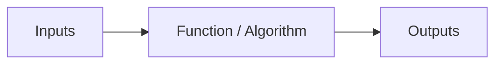
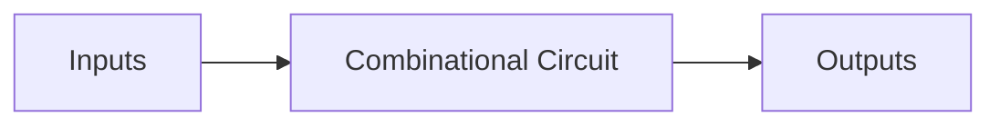
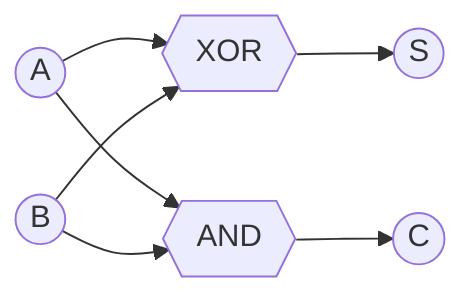
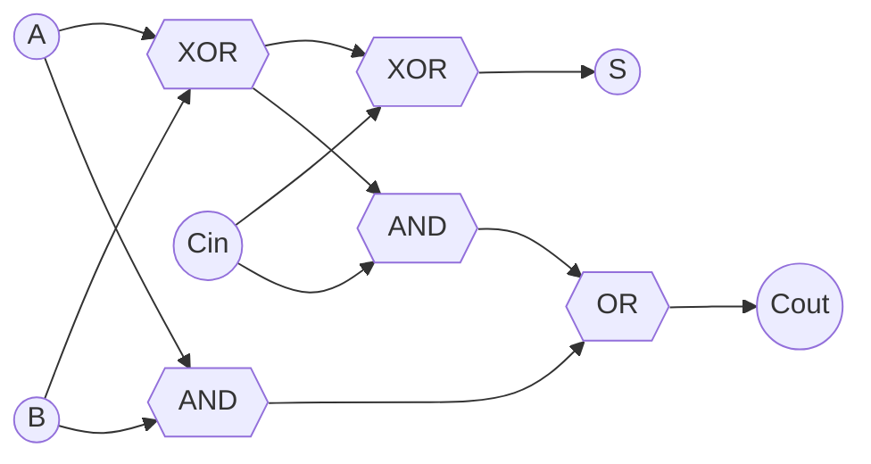
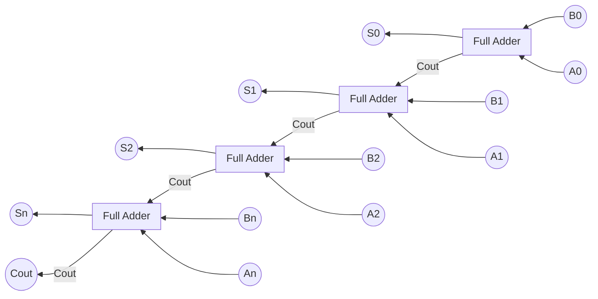
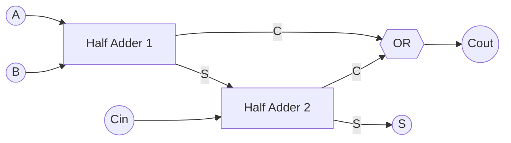
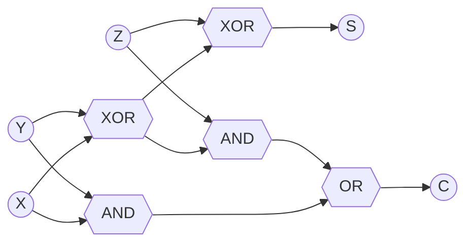

# Lecture 1.1 — What is a System?

> Prepared By - Mohsena Ashraf

##  What is a System?

A **system** is a set of related components working as a whole to achieve a definite goal.

A system contains:
- **a.** Inputs
- **b.** A function that converts the inputs to outputs
- **c.** Outputs

> **Design** = Noun → *Plan*, Verb → *Process*

---

## What is a Digital System?

A system in which signals have a **finite number of discrete values**.

| Signal Type | Description |
|---|---|
| **Analog** | Continuous, complex waveform |
| **Discrete** | Finite set of distinct values |
| **Digital** | $n \times 2^n$ style discrete-valued signals |

### Advantages
1. Easy to design
2. Low cost, automated design and fabrication

###  Disadvantages
1. Physical world is analog
2. Less precision

### Examples
- Calculator
- Digital Voltmeter

---

## Combinational vs Sequential Circuits

### A Combinational Circuit
Consists of logic gates whose outputs **at any time** are determined directly from the *present* combination of inputs, without regard to previous inputs.

> **Example:** Half Adder, Full Adder

### A Sequential Circuit
The outputs depend not only on **present inputs**, but also on **past inputs**. The circuit behavior (function) must be specified by a time sequence of inputs and internal states.

> **Example:** Flip-Flop

---

## Adders

| Adder | Inputs | Operation | Outputs |
|---|---|---|---|
| **Half Adder** | 2 (A, B) | A + B | Sum, Carry |
| **Full Adder** | 3 (A, B, Cin) | A + B + Cin | Sum, Carry-out |

###  Half Adder

The half adder accepts two binary digits as input and produces two binary digits as output — a **sum** bit and a **carry** bit.

**Truth Table:**

| A | B | S | C |
|---|---|---|---|
| 0 | 0 | 0 | 0 |
| 0 | 1 | 1 | 0 |
| 1 | 0 | 1 | 0 |
| 1 | 1 | 0 | 1 |

**Output Function:**

$$S = A'B + AB' = A \oplus B$$
$$C = AB$$

**Logic Circuit:**

---

###  Full Adder

The full adder accepts three binary digits as input and produces two binary digits as output — a **sum** bit and a **carry** bit.

**Truth Table:**

| A | B | Cin | S | Cout |
|---|---|---|---|---|
| 0 | 0 | 0 | 0 | 0 |
| 0 | 0 | 1 | 1 | 0 |
| 0 | 1 | 0 | 1 | 0 |
| 0 | 1 | 1 | 0 | 1 |
| 1 | 0 | 0 | 1 | 0 |
| 1 | 0 | 1 | 0 | 1 |
| 1 | 1 | 0 | 0 | 1 |
| 1 | 1 | 1 | 1 | 1 |

**Output Function:**

$$S = A \oplus B \oplus C_{in}$$
$$C_{out} = AB + (A \oplus B)C_{in}$$

**Logic Circuit:**

#### Full Adder — Carry Recurrence (Generate/Propagate form)

Let $C_{in} = C_i$. Then:

$$S_i = A_i \oplus B_i \oplus C_i$$

$C_{out}$ becomes the $C_{in}$ for the next stage:

$$C_{i+1} = A_iB_i + (A_i \oplus B_i)C_i$$

Let $P_i = A_i \oplus B_i$ (**propagate**) and $G_i = A_iB_i$ (**generate**). Then:

$$C_{i+1} = G_i + P_iC_i$$

Substituting $i = 1, 2, \dots$:

$$C_2 = G_1 + P_1C_1$$
$$C_3 = G_2 + P_2C_2 = G_2 + P_2(G_1 + P_1C_1)$$

$$\vdots$$

---

##  Binary Adder (Ripple Carry Adder)

A chain of Full Adders, where the carry-out of one stage feeds the carry-in of the next.

---

## Full Adder using Half Adders

A Full Adder can be built by cascading **two Half Adders** and an OR gate.

**Block Diagram:**

**Circuit Diagram (Gate Level):**

> **Note:** X, Y, Z correspond to A, B, Cin — each of the two half-adders computes Sum (⊕) and Carry (AND), and a final OR combines the two carry terms into C = Cout.

---

## 🗂 Related Notes
- [[Lecture3]] — Decoders, Encoders, and Sequential Circuits

## ✍️ Handwritten Reference (18/06/26)
- Book: *Digital Logic and Computer Design (Indian Edition)* — M. Morris Mano, Ch. 9.1–9.18
- Sketch: Analog vs Discrete vs Digital signal → Function/Algorithm block → Output
- Adder section mirrors slide content: Half Adder (2 no./digit add → sum, cout), Full Adder (3 no./digit add → sum, cout)
- Binary Adder ripple chain sketch: $B_3A_3 \to B_2A_2 \to B_1A_1 \to B_0A_0$ through cascaded Full Adders producing $S_3S_2S_1S_0$
