# Lecture 3.1 — Decoders & Encoders

> Prepared By - Mohsena Ashraf

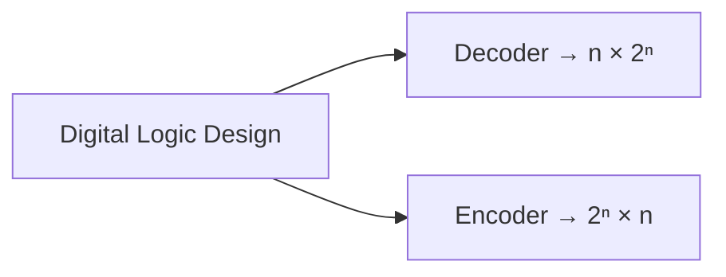

##  Decoder

A combinational circuit that converts binary information from **n input lines** to a maximum of **2ⁿ unique output lines**.

- Called **n-to-m line decoders**, where $m \le 2^n$
- Purpose: generate the $2^n$ (or fewer) **minterms** of n input variables
- **Application:** Binary to Octal conversion
- A 3-to-8 line decoder decodes any 3-bit code into 8 outputs
- Examples: 3:8, 2:4, 4:16 Decoder

### 3-to-8 Decoder

**Truth Table:**

| X | Y | Z | D0 | D1 | D2 | D3 | D4 | D5 | D6 | D7 |
|---|---|---|---|---|---|---|---|---|---|---|
| 0 | 0 | 0 | **1** | 0 | 0 | 0 | 0 | 0 | 0 | 0 |
| 0 | 0 | 1 | 0 | **1** | 0 | 0 | 0 | 0 | 0 | 0 |
| 0 | 1 | 0 | 0 | 0 | **1** | 0 | 0 | 0 | 0 | 0 |
| 0 | 1 | 1 | 0 | 0 | 0 | **1** | 0 | 0 | 0 | 0 |
| 1 | 0 | 0 | 0 | 0 | 0 | 0 | **1** | 0 | 0 | 0 |
| 1 | 0 | 1 | 0 | 0 | 0 | 0 | 0 | **1** | 0 | 0 |
| 1 | 1 | 0 | 0 | 0 | 0 | 0 | 0 | 0 | **1** | 0 |
| 1 | 1 | 1 | 0 | 0 | 0 | 0 | 0 | 0 | 0 | **1** |

**Block Diagram:**

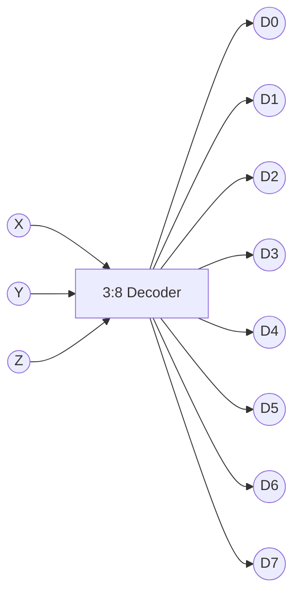

**Minterm equations (each output = one AND gate of complemented/uncomplemented inputs):**

$$D_0 = x'y'z' \quad D_1 = x'y'z \quad D_2 = x'yz' \quad D_3 = x'yz$$
$$D_4 = xy'z' \quad D_5 = xy'z \quad D_6 = xyz' \quad D_7 = xyz$$

> **Practice Work:** Design a BCD-to-decimal decoder with the help of don't-care conditions.

---

###  Implementation Using a Decoder

Any combinational function can be implemented by OR-ing the minterms (decoder outputs) that appear in its sum-of-minterms expression.

**Example — Full Adder implemented with a decoder:**

| x | y | z | S | C |
|---|---|---|---|---|
| 0 | 0 | 0 | 0 | 0 |
| 0 | 0 | 1 | 1 | 0 |
| 0 | 1 | 0 | 1 | 0 |
| 0 | 1 | 1 | 0 | 1 |
| 1 | 0 | 0 | 1 | 0 |
| 1 | 0 | 1 | 0 | 1 |
| 1 | 1 | 0 | 0 | 1 |
| 1 | 1 | 1 | 1 | 1 |

$$S(x,y,z) = \sum(1,2,4,7)$$
$$C(x,y,z) = \sum(3,5,6,7)$$

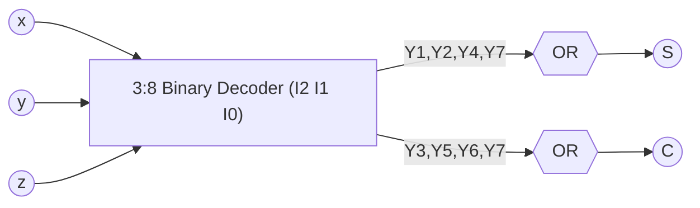

#### Worked derivation (handwritten, from Practice Problem I)

$$F_1 = x'y'z' + xz$$
$$= x'y'z' + x(y+y')z$$
$$= x'y'z' + xyz + xy'z$$
$$= \sum(0,5,7)$$

*(minterms: $x'y'z' = 000 = 0$, $xy'z = 101 = 5$, $xyz = 111 = 7$)*

**Practice Problem (Implementation Using Decoder, contd.):**

$$F_1 = x'y'z' + xz = \sum(0,5,7)$$
$$F_2 = xy'z' + x'y = \sum(2,3,4)$$
$$F_3 = x'y'z + xy = \sum(1,6,7)$$

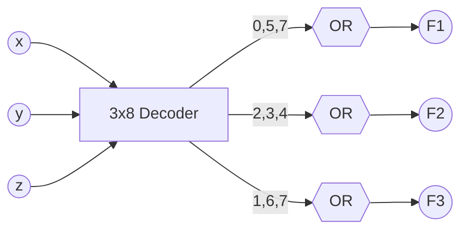

---

##  Encoder

A combinational circuit that performs the **reverse operation** of a decoder.

- Encodes **2ⁿ input lines** to **n output lines**
- Produces a binary code equivalent to the input
- Called **m-to-n line encoders**, where $m = 2^n$
- Only one input is "high" (logic 1) at a time
- **Application:** Octal to Binary conversion
- Examples: 4:2, 8:3, 16:4 Encoder

### 8-to-3 Encoder

**Truth Table:**

| D0 | D1 | D2 | D3 | D4 | D5 | D6 | D7 | X | Y | Z |
|---|---|---|---|---|---|---|---|---|---|---|
| 1 | 0 | 0 | 0 | 0 | 0 | 0 | 0 | 0 | 0 | 0 |
| 0 | 1 | 0 | 0 | 0 | 0 | 0 | 0 | 0 | 0 | 1 |
| 0 | 0 | 1 | 0 | 0 | 0 | 0 | 0 | 0 | 1 | 0 |
| 0 | 0 | 0 | 1 | 0 | 0 | 0 | 0 | 0 | 1 | 1 |
| 0 | 0 | 0 | 0 | 1 | 0 | 0 | 0 | 1 | 0 | 0 |
| 0 | 0 | 0 | 0 | 0 | 1 | 0 | 0 | 1 | 0 | 1 |
| 0 | 0 | 0 | 0 | 0 | 0 | 1 | 0 | 1 | 1 | 0 |
| 0 | 0 | 0 | 0 | 0 | 0 | 0 | 1 | 1 | 1 | 1 |

**Block Diagram:**

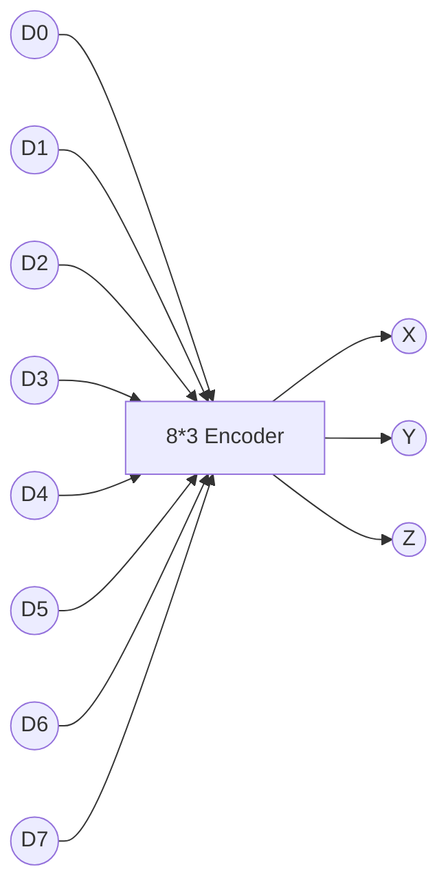

**Circuit Equations:**

$$X = D_4 + D_5 + D_6 + D_7$$
$$Y = D_2 + D_3 + D_6 + D_7$$
$$Z = D_1 + D_3 + D_5 + D_7$$

> **Practice Work:** Design a Decimal-to-BCD Encoder.

---

### Priority Encoder

An encoder with a **priority function**:
- Multiple inputs may be true simultaneously
- The **higher priority input** takes precedence
- Output = binary code corresponding to the highest-priority active input

**4-Input Priority Encoder Truth Table** (priority high→low: $I_3, I_2, I_1, I_0$):

| I3 | I2 | I1 | I0 | Y1 | Y0 | V |
|---|---|---|---|---|---|---|
| 0 | 0 | 0 | 0 | x | x | 0 |
| 0 | 0 | 0 | 1 | 0 | 0 | 1 |
| 0 | 0 | 1 | x | 0 | 1 | 1 |
| 0 | 1 | x | x | 1 | 0 | 1 |
| 1 | x | x | x | 1 | 1 | 1 |

**Equations:**

$$Y_1 = I_3 + I_2$$
$$Y_0 = I_3 + \bar{I_2}\,I_1$$
$$V = I_3 + I_2 + I_1 + I_0$$

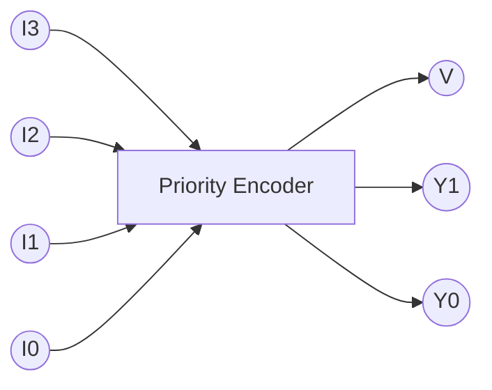

---

## Practice Problems (Lecture 3.1)

1. A combinational circuit is specified by:
   $$F_1(A,B,C) = \sum(2,4,7) \qquad F_2(A,B,C) = \sum(0,3) \qquad F_3(A,B,C) = \sum(0,2,3,4,7)$$
   Implement the circuit with a decoder constructed with NAND/AND gates. Minimize the number of inputs in the external gates.
2. Implement a full adder with a decoder and NAND gates.
3. Design a combinational circuit that compares two 4-bit numbers to check if they are equal. Output = 1 if equal, 0 otherwise. State the equation.

### Handwritten Practice (from notes)
- Design a Full Adder using **2 Half Adders**, built using a **Decoder**.

---
---

# Lecture 3.2 — Sequential Circuits

## Sequential Circuits

Systems in practice include memory elements. A sequential circuit consists of a **combinational circuit** to which **storage elements** are connected to form a feedback path.

- Binary information stored in memory elements at any time defines the **state**
- Inputs + present state → outputs and next-state conditions
- Specified by a time sequence of inputs, outputs, and internal states

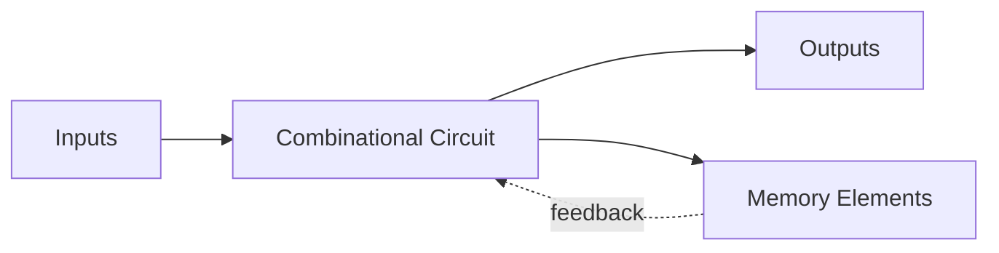

### Two Types (by timing)

| Type | Description |
|---|---|
| **Asynchronous** | Time-independent; depends on input signal order at any instant; better performance but hard to design; uses time-delay devices instead of a clock |
| **Synchronous** | Time-dependent; defined at discrete time instants; much easier to design (preferred style); synchronized by periodic clock pulses; memory elements = flip-flops |

---

## Register

A **register** = a group of binary storage cells (flip-flops) suitable for holding binary information.

$$n\text{-bit register} = n \text{ flip-flops}$$

- Register is enabled while $cp = 1$
- When $cp = 1$: input info is loaded into the register
- When $cp = 0$: register content is unchanged

**4-Bit Register:**

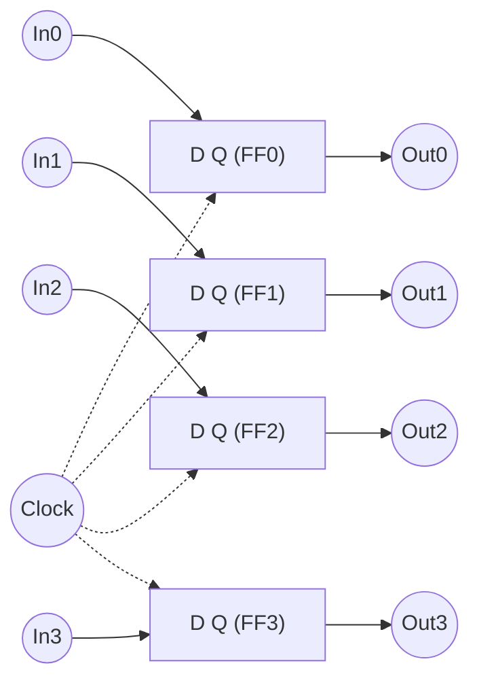

---

## 📌 Shift Register

A register capable of shifting its binary info left or right. Consists of a chain of flip-flops in cascade — output of one FF feeds the input of the next. All FFs share a common clock pulse (CP), which shifts data from one stage to the next.

**4-Bit Shift Register (SISO):**

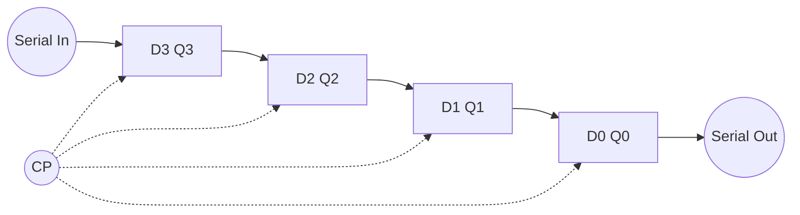

### Worked Example (handwritten): loading `1011`

| CLK | Q3 | Q2 | Q1 | Q0 |
|---|---|---|---|---|
| Initial | 0 | 0 | 0 | 0 |
| T1 | 1 | 0 | 0 | 0 |
| T2 | 1 | 1 | 0 | 0 |
| T3 | 0 | 1 | 1 | 0 |
| T4 | 1 | 0 | 1 | 1 |

**Timing Diagram (conceptual):**

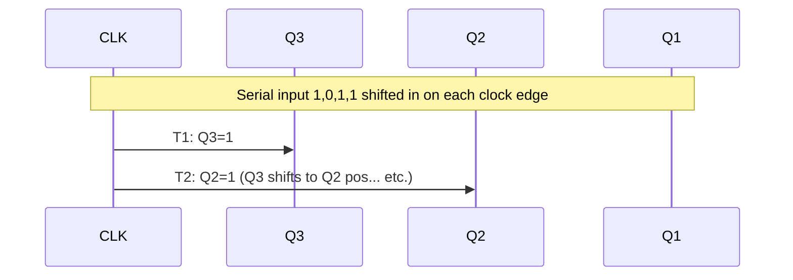

---

## 📌 Serial Transfer Using Shift Register

A digital system operates in **serial mode** when information is transferred/manipulated **one bit at a time** — bits are shifted out of the source register into the destination register.

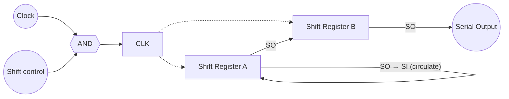

- Suppose each shift register has 4 bits.
- The **shift control** input determines *when* and *how many times* the registers are shifted.

**Example (4-bit registers, shift A → B):**

| Timing Pulse | Shift Register A | Shift Register B | Serial Output of B |
|---|---|---|---|
| Initial Value | 1 0 1 1 | 0 0 1 0 | 0 |
| After T1 | 1 1 0 1 | 1 0 0 1 | 1 |
| After T2 | 1 1 1 0 | 1 1 0 0 | 0 |
| After T3 | 0 1 1 1 | 0 1 1 0 | 0 |
| After T4 | 1 0 1 1 | 1 0 1 1 | 1 |

> After the 4th shift, the shift control goes to 0, and both registers A and B hold the same value **1011** (register A's content circulates back via SO→SI).

### ✍️ Handwritten follow-up example

$$A = 10111 \qquad B = 01101$$

After the **5th shift**, the last shift will make both registers equal to the same value $(A \mid B)$ — i.e., register A's circulated content is now shared by both A and B.

---

## 📌 Serial Adder Implementation with Shift Register

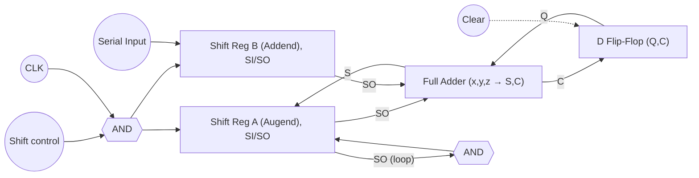

> **Question:** In which aspects is a serial adder different compared to a parallel adder? *(Ans. involves speed vs. hardware trade-off — serial adder reuses one Full Adder + a D-FF for carry storage, one bit at a time, while parallel adder uses n Full Adders simultaneously — see book.)*

---

## 📌 Practice Questions (Lecture 3.2, from slides)

1. Differences between Asynchronous and Synchronous Sequential Circuits
2. Design a 3-bit binary counter using J-K flip-flops
3. Design a 4-bit BCD/binary counter
4. Design a synchronous counter using different types of flip-flops
5. Design a mod-5 counter using different types of flip-flops
6. Design a counter with a repeated binary sequence using different types of flip-flops
7. Design an n-bit Up/Down counter using different types of flip-flops
8. Design an odd/even counter using different types of flip-flops

---

## ✍️ Handwritten Worked Solutions (25/06/26 onward)

### 🔹 3-bit Binary Counter using T Flip-Flops

**Excitation Table for T Flip-Flop** (0 → Hold, 1 → Toggle):

| PS | NS | T |
|---|---|---|
| 0 | 0 | 0 |
| 0 | 1 | 1 |
| 1 | 0 | 1 |
| 1 | 1 | 0 |

> Rule: **T = PS ⊕ NS** — 0 → Hold, 1 → Toggle

**State Diagram** (counts 000 → 111 → wraps to 000):

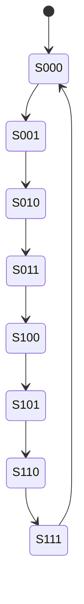

**State Table (Present State → Next State → FF Inputs):**

| Q2 | Q1 | Q0 | Q2' | Q1' | Q0' | T2 | T1 | T0 |
|---|---|---|---|---|---|---|---|---|
| 0 | 0 | 0 | 0 | 0 | 1 | 0 | 0 | 1 |
| 0 | 0 | 1 | 0 | 1 | 0 | 0 | 1 | 1 |
| 0 | 1 | 0 | 0 | 1 | 1 | 0 | 0 | 1 |
| 0 | 1 | 1 | 1 | 0 | 0 | 1 | 1 | 1 |
| 1 | 0 | 0 | 1 | 0 | 1 | 0 | 0 | 1 |
| 1 | 0 | 1 | 1 | 1 | 0 | 0 | 1 | 1 |
| 1 | 1 | 0 | 1 | 1 | 1 | 0 | 0 | 1 |
| 1 | 1 | 1 | 0 | 0 | 0 | 1 | 1 | 1 |

**K-Map results (standard 3-bit binary up-counter):**

$$T_0 = 1$$
$$T_1 = Q_0$$
$$T_2 = Q_1 Q_0$$

**Circuit Diagram:**

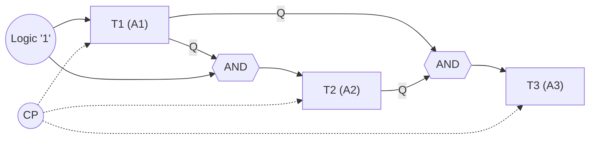

---

### 🔹 D Flip-Flop

**Excitation Table:**

| PS | NS | D |
|---|---|---|
| 0 | 0 | 0 |
| 0 | 1 | 1 |
| 1 | 0 | 0 |
| 1 | 1 | 1 |

> Rule: **D = NS** (Next State value directly)

---

### 🔹 J-K Flip-Flop

**Truth Table:**

| J | K | Operation | PS | NS |
|---|---|---|---|---|
| 0 | 0 | Hold | 0 | 0 |
| | | | 1 | 1 |
| 0 | 1 | Reset | 0 | 0 |
| | | | 1 | 0 |
| 1 | 0 | Set | 0 | 1 |
| | | | 1 | 1 |
| 1 | 1 | Toggle | 0 | 1 |
| | | | 1 | 0 |

**Excitation Table:**

| PS | NS | J | K |
|---|---|---|---|
| 0 | 0 | 0 | x |
| 0 | 1 | 1 | x |
| 1 | 0 | x | 1 |
| 1 | 1 | x | 0 |

---

### 🔹 Additional Sequential Design Exercise (2-bit, input x)

**State Diagram:**

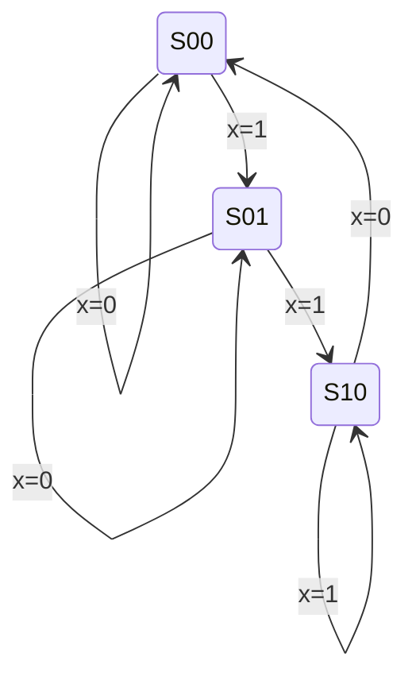

**State Table (PS, Input → NS → FF Inputs, using J-K flip-flops):**

| A | B (PS) | x (Input) | A' | B' (NS) | JA | KA | JB | KB |
|---|---|---|---|---|---|---|---|---|
| 0 | 0 | 0 | 0 | 0 | 0 | x | 0 | x |
| 0 | 0 | 1 | 0 | 1 | 0 | x | 1 | x |
| 0 | 1 | 0 | 0 | 1 | 0 | x | x | 0 |
| 0 | 1 | 1 | 1 | 0 | 1 | x | x | 1 |
| 1 | 0 | 0 | 0 | 0 | x | 1 | 0 | x |
| 1 | 0 | 1 | 1 | 0 | x | 0 | 0 | x |

**Derived Excitation Equations:**

$$J_A = B$$
$$K_A = Bx'$$
$$J_B = x'$$
$$K_B = A \oplus x$$

**Circuit Diagram:**

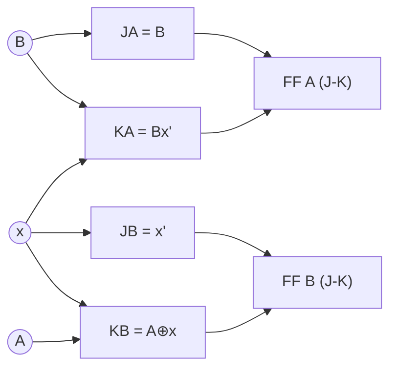

---

## 🗂 Related Notes
- [[Lecture1]] — Introduction, Half/Full Adders, Binary Adder

## 📚 Sources
- Lecture 3.1 & 3.2 slides — Prepared by Mohsena Ashraf
- Handwritten class notes dated 18/06/26, 21/06/26, 25/06/26
- Reference book: *Digital Logic and Computer Design (Indian Edition)*, M. Morris Mano — Ch. 9.1–9.18

> 📝 **Note:** The handwritten notes also contain Lecture 4 material (Booth's Algorithm / Modified Booth's UV method for signed multiplication, dated 02/07/26). That content is outside the scope of Lecture 1 & Lecture 3 and has been left out of this note — let me know if you'd like a separate `Lecture4.md` for it.
