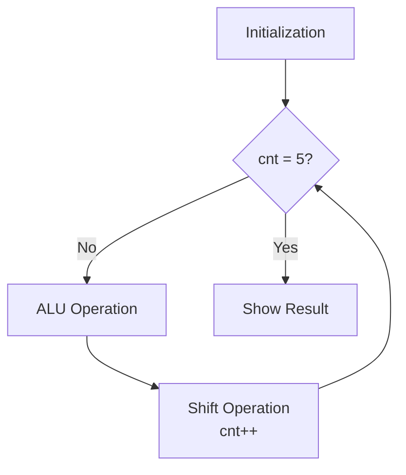
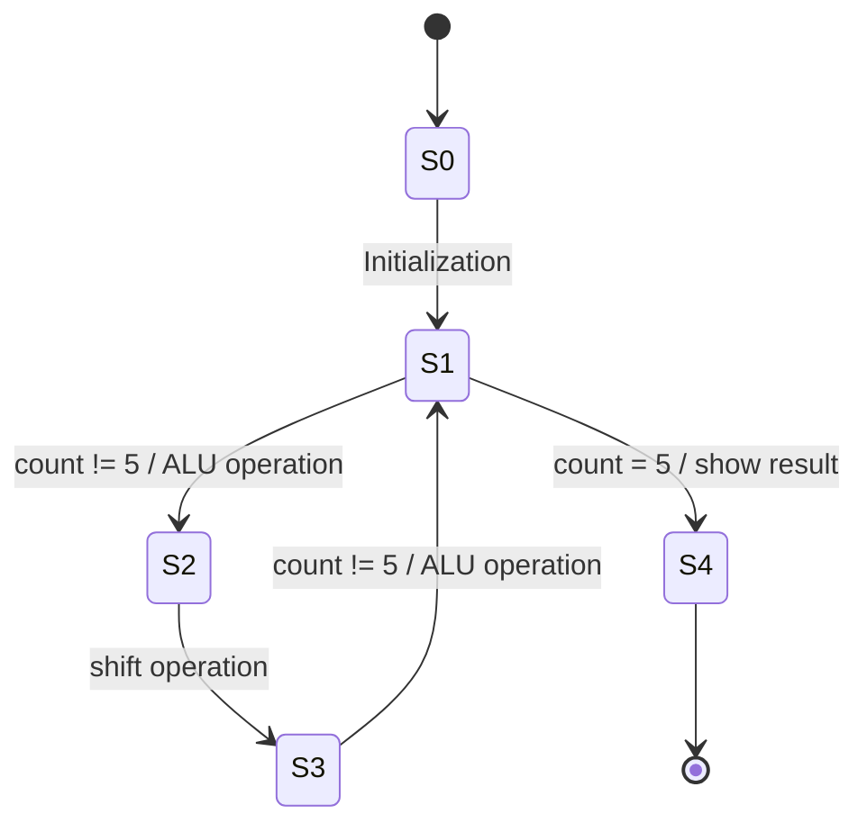
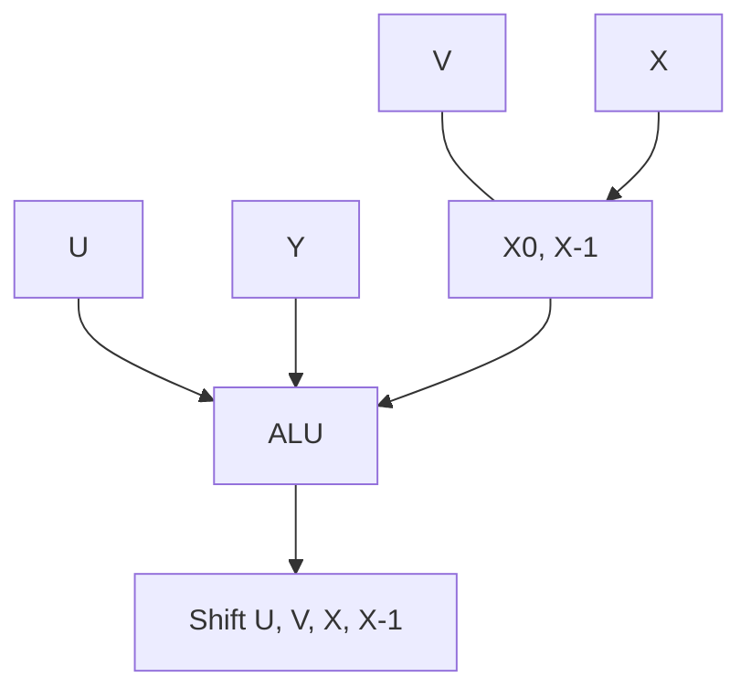

# Booth's Multiplication Algorithm

> [!abstract] Overview Booth's multiplication algorithm is a method used to multiply **signed binary numbers** efficiently using **2's complement representation**. Instead of performing repeated addition for every bit, the algorithm reduces the number of operations by examining **pairs of bits** in the multiplier.

The algorithm works by:

- Repeatedly adding a predetermined value.
- Then performing an **arithmetic right shift** on the product register.

## Notation

|Symbol|Meaning|
|---|---|
|$m$|Multiplicand|
|$r$|Multiplier|
|$x$|Number of bits in the multiplicand ($m$)|
|$y$|Number of bits in the multiplier ($r$)|

> [!info] All registers are $(x + y + 1)$ bits wide.

## Registers

### A — Add Register

- Most significant (leftmost) bits contain the value of $m$.
- Remaining $(y+1)$ bits are filled with zeros.

### S — Subtract Register

- Most significant bits contain the value of $-m$, represented in 2's complement.
- Remaining $(y+1)$ bits are filled with zeros.

### P — Product Register

- Most significant $x$ bits are filled with zeros.
- Then the value of $r$ is appended.
- The LSB is set to $0$.

## Procedure

1. **Initialize registers**
    
    - Compute $A$, $S$, $P$.
    - Ensure all are of size $(x+y+1)$ bits.
2. **Check the two least significant bits of $P$** and follow the rule below:
    
    |Last 2 bits of P|Operation performed|
    |:-:|:--|
    |`00`|Do nothing|
    |`11`|Do nothing|
    |`01`|$P = P + A$ (ignore overflow)|
    |`10`|$P = P + S$ (ignore overflow)|
    
3. **Arithmetic right shift**
    
    - Perform an arithmetic right shift on $P$ by one bit.
    - Preserve the sign bit.
    - Assign the shifted value back to $P$.
4. **Repeat the process**
    
    - Repeat steps 2 & 3.
    - Perform this loop $y$ times (number of bits in the multiplier).
5. **Final result**
    
    - After completing all iterations, drop the LSB of $P$.
    - The remaining bits represent the final product of $m \times r$.

---

## Worked Example — Booth's Algorithm

> [!example] Problem Find the product of $13 \times (-6)$, where the multiplier and multiplicand both have $5$ bits ($x = 5$, $y = 5$).

**Setup**

$$m = 13 = 01101 \quad \xrightarrow{\text{2's complement}} \quad -m = -13 = 10011$$

$$r = -6 = 11010$$

$$A = \underbrace{01101}_{m}\ \underbrace{000000}_{(y+1)\text{ zeros}} \qquad S = \underbrace{10011}_{-m}\ \underbrace{000000}_{(y+1)\text{ zeros}}$$

$$P = \underbrace{00000}_{x \text{ zeros}}\ \underbrace{11010}_{r}\ 0$$

**Iteration table**

|Step|Last 2 bits|Operation|Result (before shift)|After arithmetic right shift|
|:-:|:-:|:--|---|---|
|Initial|—|—|`00000 110100`|—|
|1|`00`|Do nothing|`00000 110100`|`00000 011010`|
|2|`10`|$P = P+S$|`00000 11010`<br>`+10011 000000`<br>`=10011 011010`|`11001 101101`|
|3|`01`|$P = P+A$|`11001 101101`<br>`+01101 000000`<br>`=(1)00110 101101` (ignore overflow)|`00011 010110`|
|4|`10`|$P = P+S$|`00011 010110`<br>`+10011 000000`<br>`=10110 010110`|`11011 001011`|
|5|`11`|Do nothing|`11011 001011`|`11101 100101`|

$$\therefore \text{Final product (drop LSB)} = 1110110\underline{10}$$

$$\boxed{13 \times (-6) = 111011010}$$

---

# UV Method (Alternate Register Convention)

> [!abstract] Overview A variant hardware realization of Booth's algorithm using registers $U$, $V$, $X$, and an extra bit $X_{-1}$, instead of the $A$/$S$/$P$ convention.

> [!example] Problem Design a $5 \times 5$ Booth's multiplier where $x = 13$, $y = -6$.

**Setup**

$$\text{Multiplicand } X = 01101\ (13)$$ $$\text{Multiplier } Y = 11010\ (-6) \xrightarrow{\text{2's complement}} -Y = 00110\ (6)$$ $$\text{Number of bits} = 5\ [\text{No. of steps}]$$

## Procedure

1. **Initialize registers**
    
    - $U$ register = all zeros [number of bits in $x$ or $y$]
    - $V$ register = multiplier
    - $X$ register = multiplicand
    - $X_{-1}$ (extra bit) = initialized with a single zero
2. **Decision rule**
    
    |$X_0$|$X_{-1}$|Operation|
    |:-:|:-:|:--|
    |0|0|$U + 0$|
    |0|1|$U + Y$|
    |1|0|$U + (-Y)$|
    |1|1|$U + 0$|
    
3. Arithmetic right shift (1 bit) on $U$, $V$, $X$, $X_{-1}$ together.
    
4. Repeat these steps "number of bits" times.
    

## Iteration Table

|$U$|$V$|$X$|$X_{-1}$|Step|
|---|---|---|---|:-:|
|`00000` → (+(−Y) `00110`) → `00110`|`00000`|`01101`|`0`|init|
|`00110` → shift → `00011`|`00000`|`01101` → shift → `00110`|`0`→`1`|Step 1|
|`11101` (+(−Y) `00110`) → `11110`? see below → shift → `11110`→`11110`?|`00000`→`10000`|`00110`→shift→`00011`|`1`→`0`|Step 2|
|`00100` (ignore overflow) → shift → `00010`|`10000`→`01000`|`00011`→shift→`00001`|`0`→`1`|Step 3|
|`00010` (+Y `11010`) → shift → `11011`|`01000`→`00100`|`00001`→shift→`00000`|`1`→`1`|Step 4|
|`11011` → shift → `11101`|`00100`→`10010`|`00000`|`1`→`0`|Step 5|

> [!tip] Reading the handwritten table Your original notes track each step as _pre-shift value → post-shift value_, with the operation noted in the leftmost `U` column (e.g. `(-y) 00110`, `(+y) 11010`). Re-copy the raw table below verbatim if you want an exact match to your notebook:

```
u          v        x        x-1
00000      00000    01101    0
(-y)00110
00110      00000    01101    0
00011      00000    00110    1   → Step 01
(+y)11010
11101      00000    00110    1
11110      10000    00011    0   → Step 02
(-y)00110
00100 (ignore overflow)
00010      10000    00011    0
00001      01000    00001    1   → Step 03
(+0)00000
00010      01000    00001    1
00001      00100    00000    1   → Step 04
(+y)11010
11011      00100    00000    1
11101      10010    00000    0   → Step 05
```

$$\text{Final product} = U \cdot V = 111011\ 00010$$

$$\boxed{13 \times (-6) = 1110110010}$$

---

## Hardware Design (UV Method)

### 1. Initialization

$$U \leftarrow 0 \qquad X_{-1} \leftarrow 0$$ $$V \leftarrow 0 \qquad \text{count} \leftarrow 0$$ $$X \leftarrow \text{input} \qquad Y \leftarrow \text{input}$$

### 2. Flowchart



> [!note] Flowchart legend
> 
> - **Initialization** — load $U=0$, $V=0$, $X=$ input, $X_{-1}=0$, $\text{cnt}=0$.
> - **cnt = 5?** — decision box; loop exits once the counter reaches the number of bits (5, matching $y$).
> - **ALU Operation** — reads $X_0$ and $X_{-1}$, decides whether to compute $U+0$, $U+Y$, $U+(-Y)$, or leave $U$ unchanged (see the decision table above).
> - **Shift Operation / cnt++** — arithmetic right shift of $U,V,X,X_{-1}$ by one bit, then increment the counter.
> - **Show Result** — final product is read out as $U \cdot V$.

### 3. State Diagram



> [!note] State diagram legend
> 
> - **S0** — reset / idle state, before initialization.
> - **S1** — "ready" state; checks whether $\text{count} = 5$.
> - **S2** — ALU operation state (conditional add/subtract into $U$).
> - **S3** — shift operation state (right-shifts $U,V,X,X_{-1}$).
> - **S4** — final state; result is displayed and the FSM halts.
> - The loop **S1 → S2 → S3 → S1** repeats while $\text{count} \neq 5$; once $\text{count} = 5$, **S1 → S4** fires instead.

### 4. Architecture



> [!note] Architecture legend
> 
> - **U** — accumulator / upper half of the running product.
> - **V** — lower half of the product; initially holds the multiplier bits and gradually fills with product bits as they shift in.
> - **X** — holds the multiplicand-side operand feeding the ALU's decision logic.
> - **$X_0, X_{-1}$** — the two control bits (current LSB and the "previous" bit) that the ALU reads to pick the operation from the decision table.
> - **ALU** — computes $U+0$, $U+Y$, or $U+(-Y)$ depending on $X_0,X_{-1}$.
> - **Shift block** — performs the combined arithmetic right shift across $U$, $V$, $X$, $X_{-1}$ at the end of every cycle.

---

# Modified Booth's Algorithm (Radix-4)

> [!abstract] Overview Modified Booth's algorithm examines **3 bits at a time** (radix-4 encoding), roughly halving the number of iterations compared to standard Booth's algorithm.

## Notation

|Symbol|Meaning|
|---|---|
|$M$|Multiplicand|
|$Q$|Multiplier|
|$n$|Number of bits|
|$SC$|Step counter, $SC = n/2$|

## Procedure

1. **Initialize registers**
    
    - $A$ = all $0$s ($n$ bits)
    - $Q$ = multiplier
    - $Q_{-1} = 0$
    - $SC = n/2$
2. **Encoding rule** (examine $Q_{i+1}, Q_i, Q_{i-1}$)
    
| Qi+1​ | QiQi​ | Qi−1Qi−1​ | Operation                  |
| ----- | ----- | --------- | -------------------------- |
| 0     | 0     | 0         | A = A + (0×M)A = A + (0×M) |
| 0     | 0     | 1         | A = A + (1×M)A = A + (1×M) |
| 0     | 1     | 0         | A = A + (1×M)A = A + (1×M) |
| 0     | 1     | 1         | A = A + (2×M)A = A + (2×M) |
| 1     | 0     | 0         | A = A + (−2×M)A=A+(−2×M)   |
| 1     | 0     | 1         | A = A + (−1×M)A=A+(−1×M)   |
| 1     | 1     | 0         | A = A + (−1×M)A=A+(−1×M)   |
| 1     | 1     | 1         | A = A + (0×M)A=A+(0×M)     |
1. **Arithmetic right shift**
    
    - Perform **two** arithmetic right shifts by one bit each.
2. Repeat the above steps while $SC > 0$.
    
3. **Final product** is $(A) + (Q)$.
    

---

## Worked Example — Modified Booth's Algorithm

> [!example] Problem Determine the product of `1110011011` × `0000101001` using the modified Booth's algorithm.

**Setup**

$$M = 1110011011\ (-101) \qquad 2M = 1100110110$$ $$-M = 0001100101 \qquad -2M = 0011001010$$ $$Q = 0000101001\ (41) \qquad n = 10 \qquad SC = n/2 = 5$$

**Iteration table**

|Operation|$A$|$Q$|$Q_{-1}$|$SC$|
|---|---|---|:-:|:-:|
|— (init)|`0000000000`|`0000101001`|`0`|`5`|
|$+(1 \times M)$|`1110011011`||||
|Right shift 1|`1111001101`|`0000101001`→`1000010100`|`0`→`1`|`4`|
|Right shift 2|`1111100110`|`1000010100`→`1100001010`|`1`→`0`||
|$+(-2 \times M)$|`0011001010`||||
|(ignore overflow) `0010110000`||`1100001010`|`0`|`3`|
|Right shift 1|`0001011000`|`1100001010`→`0110000101`|`0`→`0`||
|Right shift 2|`0000101100`|`0110000101`→`0011000010`|`0`→`1`||
|$+(-1 \times M)$|`0001100101`||||
|=|`0010010001`|`0011000010`|`1`|`2`|
|Right shift 1|`0001001000`|`0011000010`→`1001100001`|`1`→`0`||
|Right shift 2|`0000100100`|`1001100001`→`0100110000`|`0`→`1`||
|$+(1 \times M)$|`1110011011`||||
|=|`1110111111`|`0100110000`|`1`|`1`|
|Right shift 1|`1111011111`|`0100110000`→`1010011000`|`1`→`0`||
|Right shift 2|`1111101111`|`1010011000`→`1101001100`|`0`→`0`||
|$+(0 \times M)$|`0000000000`||||
|=|`1111101111`|`1101001100`|`0`|`0`|
|Right shift 1|`1111110111`|`1101001100`→`1110100110`|`0`→`0`||
|Right shift 2|`1111111011`|`1110100110`→`1111010011`|`0`→`0`||

$$\text{Final result} = A \cdot Q = 1111111011\ 1111010011$$

> [!success] Final Answer $$\boxed{1110011011 \times 0000101001 = 11111110111111010011}$$

---

---

# Extra Practice — Same Numbers, All Three Methods

> [!example] Problem Find the product of $9 \times (-5)$ using the **ASP method**, the **UV method**, and the **Modified (radix-4) Booth's method**. Solving one problem three ways makes it easy to see how the methods relate.
> 
> Expected result: $9 \times (-5) = -45$.

## A) ASP Method ($A$, $S$, $P$ registers)

$m = 9 = 01001,\quad -m = 10111,\quad r = -5 = 11011 \quad (x=y=5)$

$$A = 01001,000000 \qquad S = 10111,000000 \qquad P = 00000,110110$$

|Step|Last 2 bits of P|Operation|Before shift|After shift|
|:-:|:-:|:--|---|---|
|1|`10`|$P=P+S$|`10111110110`|`11011111011`|
|2|`11`|do nothing|`11011111011`|`11101111101`|
|3|`01`|$P=P+A$|`00110111101`|`00011011110`|
|4|`10`|$P=P+S$|`11010011110`|`11101001111`|
|5|`11`|do nothing|`11101001111`|`11110100111`|

$$\text{Final } P = 11110100111 \ \xrightarrow{\text{drop LSB}}\ 1111010011$$

$$\boxed{9 \times (-5) = -45} \quad\checkmark$$

## B) UV Method ($U$, $V$, extra bit)

$M = 01001\ (9),\quad -M = 10111,\quad V(\text{init}) = 11011\ (-5),\quad U(\text{init})=00000,\ X_{-1}=0$

|Step|$V_0$|$X_{-1}$|Operation|$U$ · $V$ · $X_{-1}$ before shift|after shift|
|:-:|:-:|:-:|:--|---|---|
|1|1|0|$U+(-M)$|`10111 · 11011 · 0`|`11011 · 11101 · 1`|
|2|1|1|$U+0$|`11011 · 11101 · 1`|`11101 · 11110 · 1`|
|3|0|1|$U+M$|`00110 · 11110 · 1`|`00011 · 01111 · 0`|
|4|1|0|$U+(-M)$|`11010 · 01111 · 0`|`11101 · 00111 · 1`|
|5|1|1|$U+0$|`11101 · 00111 · 1`|`11110 · 10011 · 1`|

$$\text{Final } U \cdot V = 11110\ 10011$$

$$\boxed{9 \times (-5) = -45} \quad\checkmark$$

> [!tip] Decision rule used here This table decides on **$V_0$ (current LSB of the multiplier register) and $X_{-1}$ (the previous bit shifted out)** — the same logic as the $X_0, X_{-1}$ rule earlier, just applied to whichever register is actively holding/shifting the multiplier bits. If your course defines $X$ as the shifting multiplier register (rather than a static copy of the multiplicand), this table matches that definition directly.

## C) Modified Booth's Method (radix-4, "UV+")

$M = 001001\ (9),\quad Q(\text{init}) = 111011\ (-5),\quad n=6,\ SC = n/2 = 3,\ Q_{-1}=0$

|Step|$Q_1 Q_0 Q_{-1}$|Operation|$A$ after add|$A \cdot Q \cdot Q_{-1}$ after 2 shifts|
|:-:|:-:|:--|---|---|
|1|`110`|$A = A + (-1 \times M)$|`110111`|`111101 · 111110 · 1`|
|2|`101`|$A = A + (-1 \times M)$|`110100`|`111101 · 001111 · 1`|
|3|`111`|$A = A + (0 \times M)$|`111101`|`111111 · 010011 · 1`|

$$\text{Final } A \cdot Q = 111111\ 010011$$

$$\boxed{9 \times (-5) = -45} \quad\checkmark$$

> [!success] All three methods agree ASP, UV, and Modified Booth's algorithm all correctly yield $9 \times (-5) = -45$ — they're the same underlying idea (recode the multiplier, conditionally add/subtract the multiplicand, shift), just with different register bookkeeping and different amounts of speed-up.

---

## Summary Comparison

|Method|Bits examined per step|Shifts per step|Registers used|
|---|:-:|:-:|---|
|Booth's Algorithm|2|1|$A$, $S$, $P$|
|UV Method|2|1|$U$, $V$, $X$, $X_{-1}$|
|Modified Booth's Algorithm|3|2|$A$, $Q$, $Q_{-1}$|

## Related

- [[Computer Arithmetic]]
- [[2's Complement Representation]]
- [[ALU Design]]

#computer-architecture #booth-algorithm #binary-multiplication