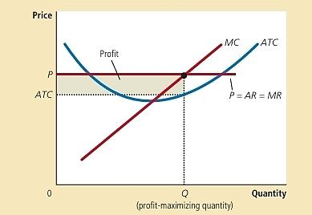
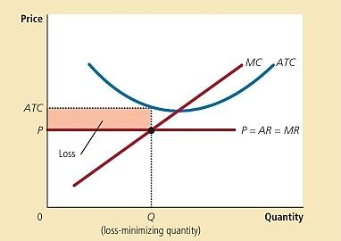

# Profit Maximization — Detailed Explanation (Questions 1, 5 & 6)

This note walks through **Question 1**, **Question 5**, and **Question 6** from the *Mathematical Applications* problem set. All three questions are about a firm trying to find the output level that gives it the **maximum profit** (or smallest possible loss), using calculus and the standard microeconomic cost/revenue relationships.

---

## Part A — All Formulas Used (with every symbol explained)

Before going through the questions, here is every formula that gets used, broken down term by term.

### 1. Total Cost (TC) and its parts

```
TC = Total Fixed Cost (TFC) + Total Variable Cost (TVC)
```

| Symbol | Meaning |
|---|---|
| **TC** | Total Cost — everything the firm spends to produce Q units |
| **TFC** | Total Fixed Cost — the part of TC that does **not** change with output (rent, machinery, licenses). Found by setting Q = 0 in the TC equation, since at zero output the only cost left is the fixed part. |
| **TVC** | Total Variable Cost — the part of TC that **does** change with output (raw materials, labor, electricity). It is whatever remains of TC after removing TFC. |

**Why this matters:** if a cost function has a constant term (a number with no Q attached), that constant is TFC — and a fixed cost can only exist in the **short run** (long run = all inputs variable, so no fixed cost).

### 2. Average cost measures (cost *per unit*)

```
AFC = TFC / Q        (Average Fixed Cost)
AVC = TVC / Q         (Average Variable Cost)
ATC (or AC) = TC / Q  (Average Total Cost)
```

| Symbol | Meaning |
|---|---|
| **AFC** | Fixed cost spread over each unit produced. Always falls as Q rises (same fixed cost divided among more units). |
| **AVC** | Variable cost per unit. |
| **ATC / AC** | Total cost per unit. Note: **ATC = AFC + AVC** always. |
| **Q** | Quantity produced (the output level). |

### 3. Marginal Cost (MC)

```
MC = d(TC) / dQ
```

| Symbol | Meaning |
|---|---|
| **MC** | Marginal Cost — the extra cost of producing **one more unit**. Found by taking the derivative of TC with respect to Q (calculus slope of the TC curve). |
| **d(TC)/dQ** | "Derivative of TC with respect to Q" — mechanically, if TC has a term like `aQ^n`, its derivative is `n·a·Q^(n−1)`. |

### 4. Revenue formulas

```
TR = P × Q                (Total Revenue, general case)
MR = d(TR) / dQ            (Marginal Revenue)
```

| Symbol | Meaning |
|---|---|
| **TR** | Total Revenue — total money earned from selling Q units at price P. |
| **P** | Price per unit. |
| **MR** | Marginal Revenue — the extra revenue from selling **one more unit**. Derivative of TR with respect to Q. |

**Special case — Perfectly Competitive Firm:** In a perfectly competitive market, the firm is a "price taker" — it's so small it cannot influence the market price. It faces a flat (horizontal) demand curve at the market price. This has one crucial consequence used in Q1, Q5, and Q6:

```
P = MR   (for a perfectly competitive firm only)
```

Since every extra unit sells at the same fixed market price, each additional unit adds exactly P to revenue, so MR = P.

### 5. The profit-maximizing rule

```
Profit is maximized where:  MR = MC
```

**Why:** As long as MR > MC, producing one more unit adds more revenue than it costs — profit keeps rising. As soon as MR < MC, that unit costs more than it earns — profit falls. The turning point, where MR = MC exactly, is where profit stops rising and starts falling — the peak of profit, or (in a loss situation) the point of *smallest possible loss*.

### 6. Profit formula

```
Profit (π) = TR − TC
```

| Symbol | Meaning |
|---|---|
| **π (Profit)** | What's left after subtracting total cost from total revenue. Positive = profit, negative = loss. |

### 7. The shutdown rule (short-run decision)

```
If  P  >  AVC   →  firm should keep operating (even if making a loss)
If  P  <  AVC   →  firm should shut down immediately
```

**Why:** In the short run, fixed costs must be paid whether the firm produces or not (they're sunk). So the real question isn't "am I profitable?" but "am I covering my variable costs?"
- If **P > AVC**: each unit sold covers its own variable cost *and* contributes something toward the fixed cost. Operating loses **less** money than shutting down (where you'd still owe all of TFC with zero revenue).
- If **P < AVC**: every unit sold loses money even before touching fixed costs. It's cheaper to shut down and only lose the fixed cost, rather than lose the fixed cost *plus* extra money on every unit made.

---

## Part B — Question 1: Perfectly Competitive Firm (USB-C Cables)

**Setup given:** `TC = 160 + 4Q + Q²` — many identical firms sell an unbranded, identical product (classic sign of a perfectly competitive market).

### (a) Short run or long run?

**Question asks:** Is the firm operating in the short run or long run?

**Explanation:** The short run is defined as the period where at least one input (e.g., factory space, machinery) is fixed and can't be adjusted. This shows up mathematically as a **fixed cost** — a constant term in TC that exists even when Q = 0.

Plug in Q = 0:
```
TC = 160 + 4(0) + (0)² = 160
```
Since a positive cost (160) remains even with **zero output**, this must be a fixed cost (TFC = 160). A fixed cost can only exist in the short run — in the long run, every input is adjustable, so a firm producing zero output would have zero cost. **Conclusion: short run.**

### (b) Find AFC, AVC, AC, MC at Q = 10

**Question asks:** Compute four different cost-per-unit / marginal measures at a specific output level.

Break TC into its fixed and variable pieces:
- TFC = 160 (the constant)
- TVC = 4Q + Q² (everything with a Q in it)

| Measure | Formula | Calculation at Q=10 | Result |
|---|---|---|---|
| AFC | TFC/Q | 160/10 | **16** |
| AVC | TVC/Q = (4Q+Q²)/Q = 4+Q | 4+10 | **14** |
| AC (ATC) | TC/Q = 160/Q + 4 + Q | 16+4+10 | **30** |
| MC | d(TC)/dQ = 4+2Q | 4+2(10) | **24** |

Sanity check: AFC + AVC = 16+14 = 30 = AC ✓ (this identity always holds).

### (c) Profit-maximizing output, given MR = 180

**Question asks:** Find the output (Q\*) and price (P\*) that maximize profit, told that MR = 180.

**Step 1 — find P\*:** Since this is a perfectly competitive firm, P = MR always. So **P\* = 180**.

**Step 2 — apply the profit-max rule MR = MC:**
Using MC = 4+2Q from part (b):
```
180 = 4 + 2Q
2Q = 176
Q* = 88
```

### (d) Maximum profit + diagram

**Question asks:** Calculate the actual profit number, and show it visually.

```
TR = P × Q = 180 × 88 = 15,840
TC = 160 + 4(88) + 88² = 8,256
Profit = TR − TC = 15,840 − 8,256 = 7,584
```

Also computed: ATC(88) = 160/88 + 4 + 88 ≈ **93.82**

**Diagram explanation** (`q1_perfect_competition_profit.png`):



- The **flat horizontal line** labeled `P = AR = MR` represents the price the competitive firm faces — flat because the firm can't change the market price no matter how much it sells (that's what "price taker" means). Average Revenue (AR) and MR both equal this same flat line here.
- The **U-shaped ATC curve** is Average Total Cost — it falls at first (spreading fixed costs) then rises (diminishing returns).
- The **upward-sloping MC curve** crosses ATC exactly at ATC's minimum point (a standard calculus/geometry result).
- Where the flat price line crosses MC — that intersection point is **Q\* = 88**, the profit-maximizing quantity.
- The **shaded rectangle** between the price line (P=180, top) and the ATC curve (≈93.82, bottom), stretching from Q=0 to Q=88, is the **profit area**. Its area = (P − ATC) × Q = (180−93.82) × 88 ≈ 7,584 — matching the calculated profit.

---

## Part C — Question 5: Perfectly Competitive Firm (Loss Case)

**Setup given:** `TR = 20Q`, `TC = Q² + 8Q + 100`. This is a firm whose costs turn out to be too high relative to price — it will make a **loss**, not a profit. This question tests whether the student understands that MR=MC finds the *best possible outcome*, even when that outcome is a loss.

### (a) Find P\* and Q\*

**Step 1 — find MR:**
```
MR = d(TR)/dQ = d/dQ(20Q) = 20
```
Since it's perfectly competitive, P = MR, so **P\* = 20**.

**Step 2 — find MC:**
```
MC = d(TC)/dQ = d/dQ(Q² + 8Q + 100) = 2Q + 8
```

**Step 3 — set MR = MC:**
```
20 = 2Q + 8
2Q = 12
Q* = 6
```

### (b) Maximum profit (actually a loss) + diagram

```
TR = 20 × 6 = 120
TC = 6² + 8(6) + 100 = 36 + 48 + 100 = 184
Profit = TR − TC = 120 − 184 = −64
```

This negative number means the firm is **losing 64** at its best possible output level. This is called "maximum profit" in the formula sense, but really it's the **minimum possible loss** — no other output level would lose less money.

Also computed:
```
ATC = TC/Q = Q + 8 + 100/Q
ATC(6) = 6 + 8 + 100/6 = 14 + 16.67 = 30.67
```

**Diagram explanation** (`q5_perfect_competition_loss.png`):



- Same basic shape as Question 1's diagram (U-shaped ATC, rising MC, flat price line) — but this time the **flat price line (P=20) sits below the ATC curve (≈30.67)** at the optimal quantity, instead of above it.
- The intersection of the price line with MC still marks Q\* = 6 — the rule "produce where MR=MC" doesn't change.
- The **shaded rectangle**, now labeled "Loss," sits between ATC (top) and P (bottom) — the opposite orientation from Question 1's profit rectangle. Its area = (ATC − P) × Q = (30.67 − 20) × 6 ≈ 64, matching the loss.

### (c) Shut down or continue operating?

**Question asks:** Given this loss, should the firm stay open or close?

This is exactly the shutdown rule from Part A, section 7. It compares **price to AVC**, not price to ATC (ATC includes the sunk fixed cost, which doesn't matter for this decision).

```
TVC = Q² + 8Q
AVC = TVC/Q = Q + 8
AVC(6) = 6 + 8 = 14
```

Compare: **P (20) > AVC (14)**. Since price still exceeds average variable cost, every unit sold brings in more than it costs to make (variable-cost-wise), and that surplus (20−14=6 per unit) helps pay down part of the fixed cost of 100. **Conclusion: keep operating** — shutting down would mean losing the entire fixed cost (100) with zero revenue, which is worse than losing only 64 by staying open.

---

## Part D — Question 6: Price-Taking Firm (Shutdown Case)

**Setup given:** `TR = 12Q`, `TC = Q³ − 6Q² + 24Q + 30`. Note the TC function is now **cubic** (has a Q³ term) — this is a more realistic cost curve shape than the simple quadratic ones in earlier questions, and it leads to a firm that should actually **shut down**.

### (a) Find profit-maximizing price and output

**Step 1 — find MR (=P, since competitive):**
```
P* = MR = d(TR)/dQ = d/dQ(12Q) = 12
```

**Step 2 — find MC:**
```
MC = d(TC)/dQ = d/dQ(Q³ − 6Q² + 24Q + 30) = 3Q² − 12Q + 24
```
(Reminder on the calculus here: derivative of Q³ is 3Q², derivative of −6Q² is −12Q, derivative of 24Q is 24, derivative of a constant (30) is 0.)

**Step 3 — set MR = MC and solve the quadratic:**
```
3Q² − 12Q + 24 = 12
3Q² − 12Q + 12 = 0
Q² − 4Q + 4 = 0        (divided everything by 3)
(Q − 2)² = 0            (this is a perfect square)
Q* = 2
```
The fact that this factors into a perfect square `(Q−2)²` means there's only **one repeating solution**, Q=2 — the MC curve just touches the MR line at a single point rather than crossing it at two separate points.

### (b) Maximum profit or minimum loss

```
TR = 12(2) = 24
TC = 2³ − 6(2)² + 24(2) + 30 = 8 − 24 + 48 + 30 = 62
Profit = TR − TC = 24 − 62 = −38
```

Also computed (for reference):
```
ATC = TC/Q = Q² − 6Q + 24 + 30/Q
ATC(2) = 4 − 12 + 24 + 15 = 31
```

*(The original material leaves this diagram as a practice exercise — it would follow the same shape logic as Question 5's diagram: a loss rectangle between ATC and P at Q=2.)*

### (c) Shut down or continue?

```
TVC = Q³ − 6Q² + 24Q
AVC = TVC/Q = Q² − 6Q + 24
AVC(2) = 4 − 12 + 24 = 16
```

Compare: **P (12) < AVC (16)**. Here, price doesn't even cover the average variable cost — every unit sold loses money on its variable costs alone, even before considering fixed costs. **Conclusion: shut down immediately.** Continuing to operate would mean losing the entire fixed cost of 30 *plus* extra money on every unit produced, which is strictly worse than shutting down and only losing the fixed cost.

---

## Quick Comparison of the Three Outcomes

| | Question 1 | Question 5 | Question 6 |
|---|---|---|---|
| Result at Q* | Profit = 7,584 | Loss = −64 | Loss = −38 |
| P vs AVC test | (profitable, test not needed) | P(20) > AVC(14) | P(12) < AVC(16) |
| Decision | Operate profitably | Operate despite loss | **Shut down** |

This progression (profit → survivable loss → unsurvivable loss) is exactly why the shutdown rule exists: **not every loss means "close the business" — only a loss where price can't even cover variable costs does.**
