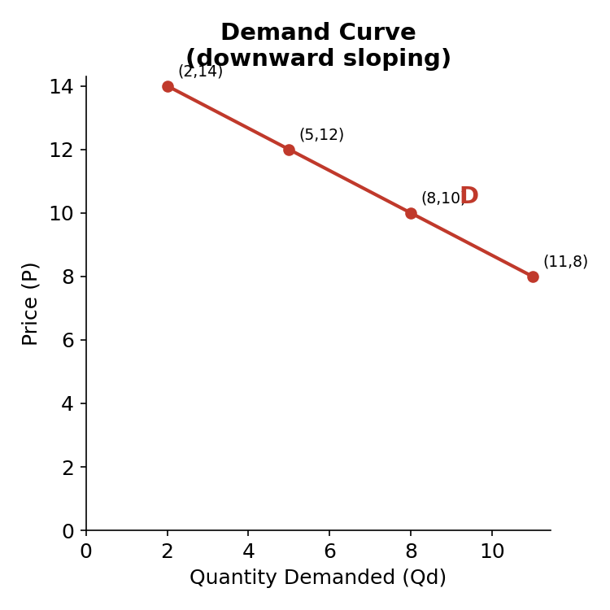
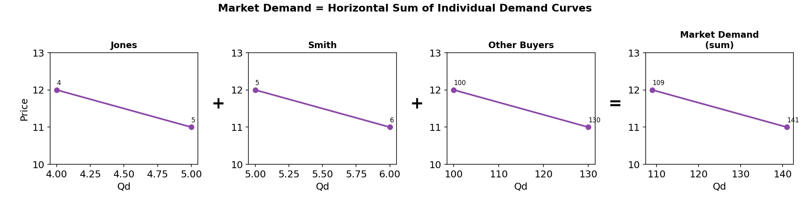
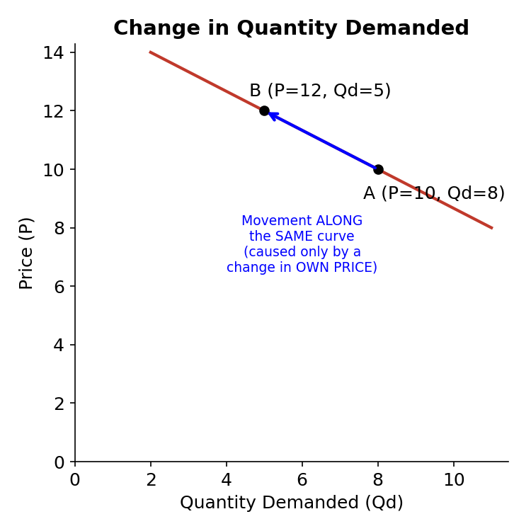
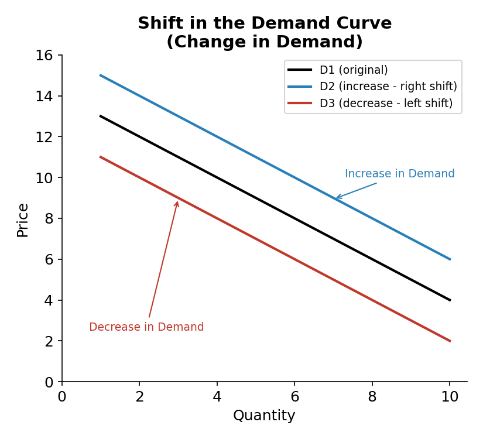
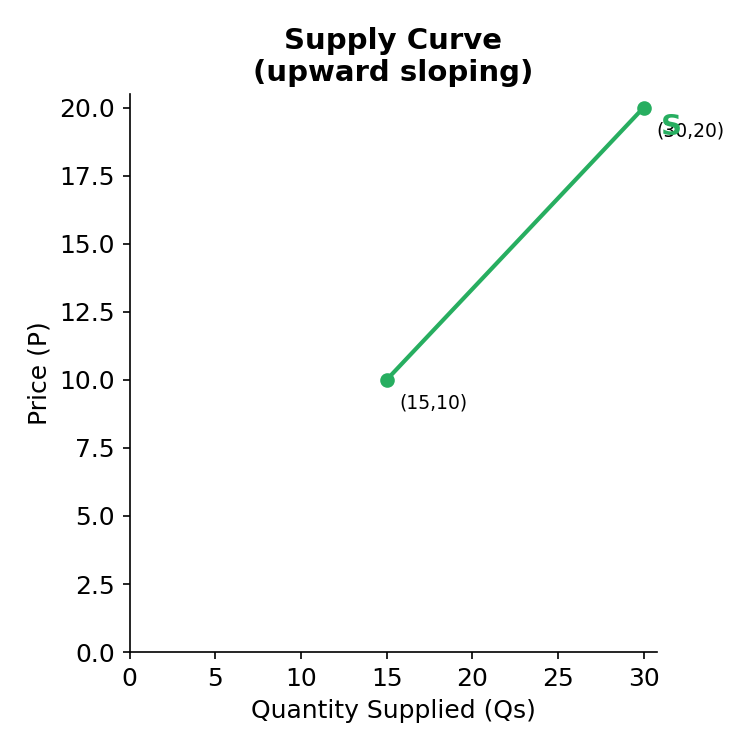
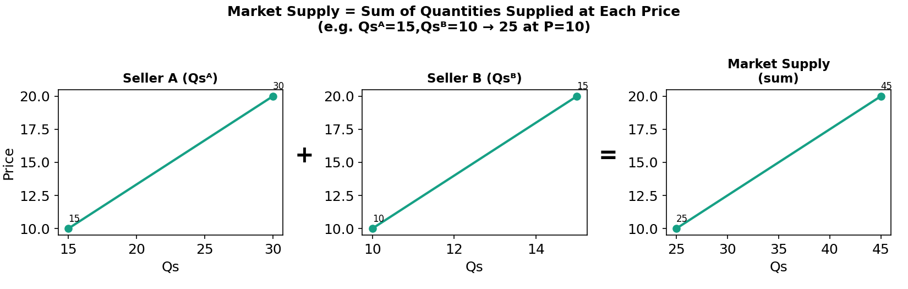
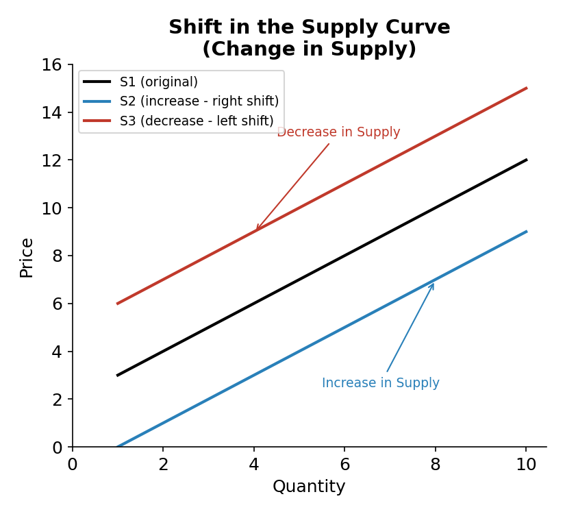
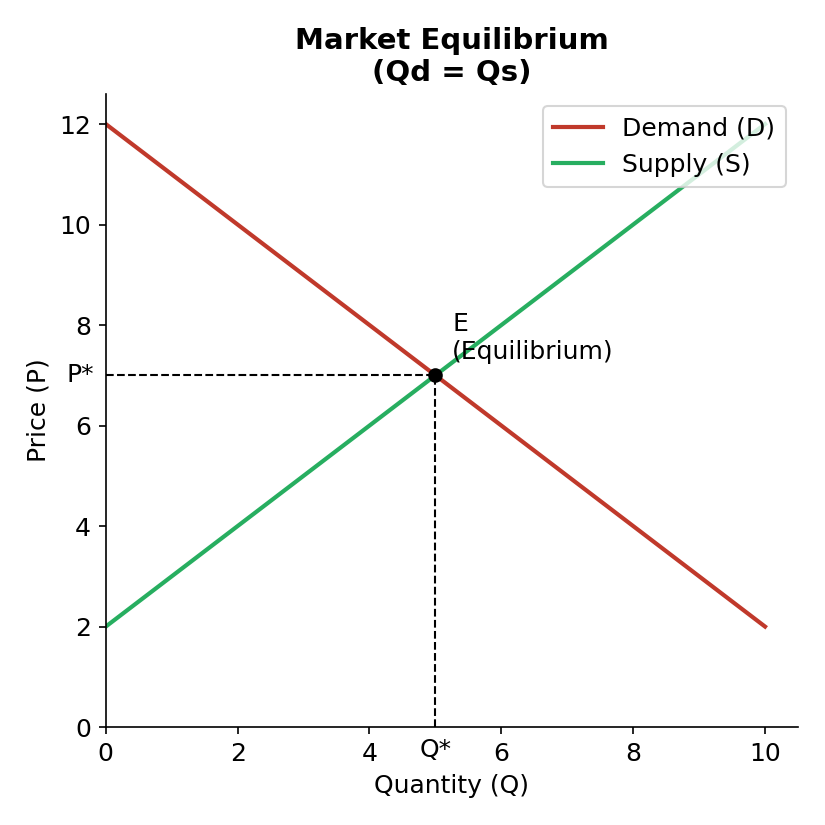
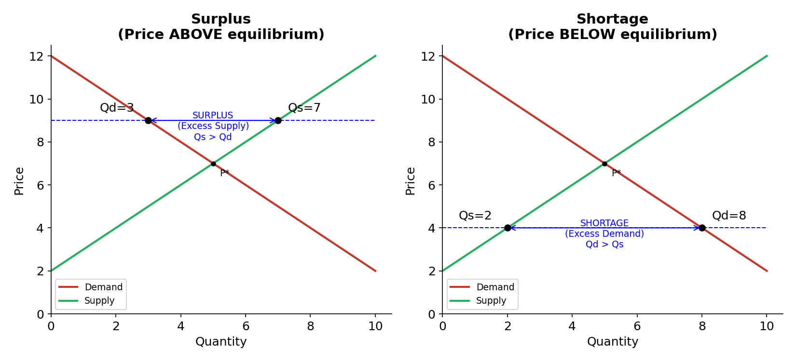
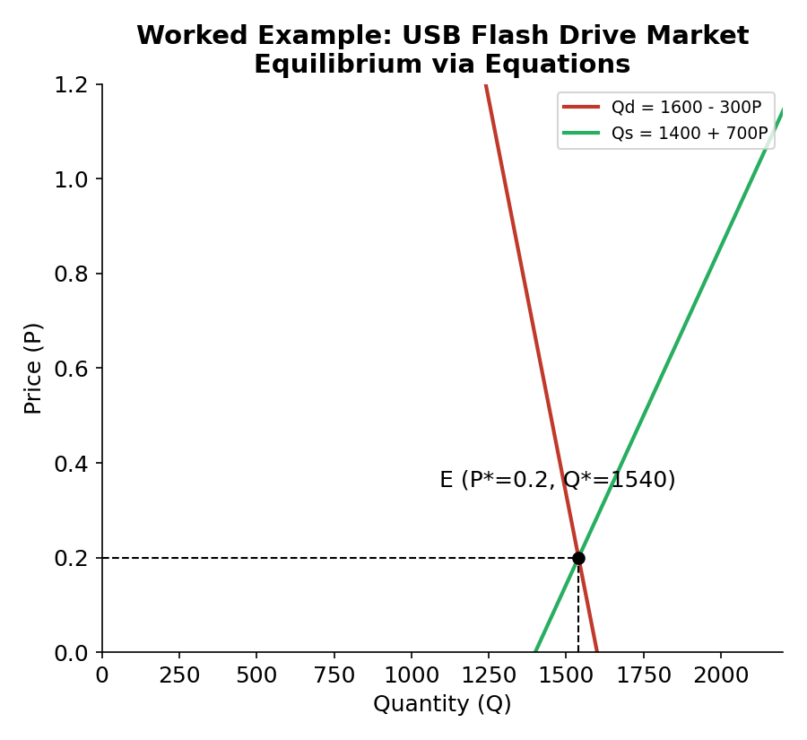

# Demand & Supply Analysis

> Grading breakdown (from class notes): **CP → 7 | Quiz → 10 | Mid → 14 | Final → 35**

## 0. What is Economics?

**Economics** comes from the Greek word ***Oikonomos***.

Economics is divided into two branches:

| Branch | Focus |
|---|---|
| **Microeconomics** | Individual entities (a single household, firm, or market) |
| **Macroeconomics** | The aggregate / overall economy |

**Topics covered in this course (overview map):**

- Basic concepts → Scarce resources, opportunity cost, efficiency
- Demand & Supply
- Utility
- Elasticity
- Production & Cost
- Market
- GNP, GDP
- Aggregate Demand–Supply
- Money, Inflation
- Unemployment
- International Trade

### Core Basic Concepts

- **Scarcity** → Resources < Wants (resources are limited, wants are unlimited)
- **Good** → gives **utility / satisfaction**
- **Bad** → gives **disutility**
- **Opportunity cost** → the value of the **best foregone alternative** (what you give up to get something)
- **Efficiency** → the **most effective use of resources**

---

## 1. The Market

A **market** is any place where people come together to trade.

Every market has **two sides**:

| Side | Who | Determines |
|---|---|---|
| Buying side | Buyers | **Demand** |
| Selling side | Sellers | **Supply** |

---

## 2. Demand

### 2.1 Definition

**Demand** = the **willingness** *and* **ability** of buyers to purchase different quantities of a good at different prices during a specific period.

> ⚠️ Important: Both **willingness** *and* **ability to pay** must be present. If either is missing, there is no real demand.
> *Example: Josie may be willing to buy a computer but unable to afford it → not demand.*

### 2.2 The Law of Demand

> As the **price** of a good **rises**, the **quantity demanded falls**.
> As the **price** of a good **falls**, the **quantity demanded rises**.
> — *ceteris paribus* (all else constant)

$$P \uparrow \Rightarrow Q_d \downarrow \qquad P \downarrow \Rightarrow Q_d \uparrow \quad (\text{ceteris paribus})$$

- **Ceteris paribus** = "all other things constant / nothing else changes"
- **Quantity demanded (Qd)** = the *number* of units buyers are willing & able to buy at a **particular price** (it's a single number, e.g. 8, 20, 200 units)

**Demand Schedule** = numerical/tabular representation of the law of demand
**Demand Curve** = graphical (downward-sloping) representation of the law of demand

**Example demand schedule (from notes):**

| Price (P) | Qd |
|---|---|
| 10 | 8 |
| 12 | 5 |

### 2.3 Why is the Demand Curve Downward Sloping?

Two reasons:

1. **Substitution Effect** — People switch to lower-priced substitute goods when a good's price rises.
   *Example: Google Drive and Dropbox both cost 300 TK/month. Dropbox raises its price to 500 TK — people switch to Google Drive. A rise in Dropbox's price → fall in quantity demanded of Dropbox.*

2. **Law of Diminishing Marginal Utility** — The additional (marginal) satisfaction from each extra unit of a good declines as consumption increases. Since extra units give less satisfaction, people will only buy more at a **lower price**.

### 2.4 Market Demand vs Individual Demand

- **Individual demand curve** → price–quantity combination for **one single buyer**
- **Market demand curve** → price–quantity combination for **all buyers combined**

**Market demand curve = horizontal sum of individual demand curves** (add up quantities demanded *at each price*).

*(e.g., at P=12: 4 + 5 + 100 = 109; at P=11: 5 + 6 + 130 = 141)*

### 2.5 Change in Quantity Demanded vs Change in Demand

These sound similar but are **NOT the same thing**.

#### (a) Change in Quantity Demanded
- A **movement** from one point to another **on the same demand curve**
- Caused **only** by a change in the **price of the good itself** (its "own price")

#### (b) Change in Demand
- A **shift of the entire demand curve**
- Caused by factors **other than** the good's own price

$$\text{Change in Demand} = \text{Shift in the Demand Curve}$$

- **Increase in Demand** → curve shifts **RIGHT** → buyers willing/able to buy **more** at every price
- **Decrease in Demand** → curve shifts **LEFT** → buyers willing/able to buy **less** at every price

### 2.6 Factors that Shift the Demand Curve (Change in Demand)

The 5 demand shifters:

1. **Income**
2. **Preferences / Taste**
3. **Prices of Related Goods**
4. **Number of Buyers**
5. **Expected Future Price**

#### (1) Income

| Good type | Effect of Income (Y) rising | Effect of Income falling |
|---|---|---|
| **Normal good** | Demand ↑ | Demand ↓ |
| **Inferior good** | Demand ↓ | Demand ↑ |
| **Neutral good** | Demand unchanged (D̄) | Demand unchanged (D̄) |

- *Normal good example:* premium electronics (phones, laptops) — demand rises as income rises
- *Inferior good example:* standing fans — demand falls as income rises (people switch to AC)
- *Neutral good example:* prescribed medicine — demand doesn't change with income

#### (2) Preferences / Taste
- Preference **toward** a good → demand curve shifts **right**
- Preference **away from** a good → demand curve shifts **left**

#### (3) Prices of Related Goods

- **Substitutes (X, Y)** — satisfy similar needs. If price of X rises, demand for Y rises (and vice versa):
$$P_X \uparrow \Rightarrow D_Y \uparrow \qquad P_X \downarrow \Rightarrow D_Y \downarrow$$
  *Example: Uber price rises → demand for Pathao rises.*

- **Complements (X, Y)** — consumed together. If price of X rises, demand for Y falls (and vice versa):
$$P_X \uparrow \Rightarrow D_Y \downarrow \qquad P_X \downarrow \Rightarrow D_Y \uparrow$$
  *Example: iPad price rises → demand for iPads falls → demand for Apple Pencils (complement) also falls.*

#### (4) Number of Buyers
- More buyers → demand ↑ (rightward shift)
- Fewer buyers → demand ↓ (leftward shift)
- Affected by migration, birth rate, death rate changes

#### (5) Expected Future Price
- Expect price to **rise** later → buy **now** → current demand **increases**
- Expect price to **fall** later → wait to buy → current demand **decreases**

---

## 3. Supply

### 3.1 Definition

**Supply** = the **willingness** *and* **ability** of sellers to produce and offer to sell different quantities of a good at different prices during a specific period.

### 3.2 The Law of Supply

> As the price of a good **rises**, quantity supplied **rises**.
> As the price of a good **falls**, quantity supplied **falls**.
> — *ceteris paribus*

$$P \uparrow \Rightarrow Q_s \uparrow \qquad P \downarrow \Rightarrow Q_s \downarrow \quad (\text{ceteris paribus})$$

Price and quantity supplied are **directly (positively) related**.

**Supply Schedule** = numerical tabulation of Qs at different prices
**Supply Curve** = graphical, **upward-sloping** representation of the law of supply

**Example supply schedule (from notes):**

| Price (P) | Qs |
|---|---|
| 10 | 15 |
| 20 | 30 |

### 3.3 Deriving the Market Supply Curve

- **Individual supply curve** → price–quantity combos for **one seller**
- **Market supply curve** → price–quantity combos for **all sellers** of a good
- Market supply curve = **sum of quantities supplied by every seller at each price**

### 3.4 Change in Supply (Shift in Supply Curve)

$$\text{Change in Supply} = \text{Shift in the Supply Curve}$$

- **Increase in Supply** → curve shifts **RIGHT** → sellers willing/able to sell **more** at every price
- **Decrease in Supply** → curve shifts **LEFT** → sellers willing/able to sell **less** at every price

### 3.5 Factors that Shift the Supply Curve

The 5 supply shifters:

1. **Input (resource) prices**
2. **Technology**
3. **Number of sellers**
4. **Expected future price**
5. **Tax & Subsidies**

#### (1) Input Prices
- Input cost ↓ → production cost ↓ → profit ↑ → **Supply ↑** (shift right)
- Input cost ↑ → production cost ↑ → profit ↓ → **Supply ↓** (shift left)
  *Example: lithium-ion battery price ↑ → cost of making smartphones ↑ → profit ↓ → phone supply ↓*

#### (2) Technology
- Better technology → more output from same resources → cost per unit ↓ → profit ↑ → **Supply ↑**

$$\text{e.g. } 50\text{ tk} \to 50\text{ units} \implies \text{later } 50\text{ tk} \to 100\text{ units (tech improved)}$$

#### (3) Number of Sellers
- More sellers enter (e.g. due to high profits) → **Supply ↑**
- Sellers exit (e.g. due to losses) → **Supply ↓**

#### (4) Expected Future Price
- Expect price to be **higher** in future → hold back stock today → **current Supply ↓**
- Expect price to be **lower** in future → sell more now → **current Supply ↑**

#### (5) Tax & Subsidies
- **Tax ↑** → cost per unit ↑ → **Supply ↓** (leftward shift)
- **Subsidy ↑** → effectively lowers cost → **Supply ↑** (rightward shift)

> Rule of thumb: *We get more of what we subsidize, and less of what we tax.*

---

## 4. Equilibrium

**Equilibrium** = the situation where the market price has reached the level where **Quantity Supplied = Quantity Demanded**.

- **Equilibrium Price (P\*)** → also called the **market-clearing price**; the price that balances Qs and Qd
- **Equilibrium Quantity (Q\*)** → the quantity bought and sold at P\*
- Found graphically at the **intersection of the Supply and Demand curves**

---

## 5. Disequilibrium

**Disequilibrium** = a state of either **surplus** or **shortage** — price is NOT at the equilibrium level.

### 5.1 Surplus (Excess Supply)

- Occurs when **P > P\*** (price above equilibrium)
- Condition: **Qs > Qd**
- Sellers cannot sell everything they want to at the going price

$$\text{Excess Supply} = Q_s - Q_d \quad \text{at } P > P^{*}$$

### 5.2 Shortage (Excess Demand)

- Occurs when **P < P\*** (price below equilibrium)
- Condition: **Qd > Qs**
- Buyers cannot buy everything they want at the going price

$$\text{Excess Demand} = Q_d - Q_s \quad \text{at } P < P^{*}$$

---

## 6. Mathematical Applications (Solving for Equilibrium)

### 6.1 Method

Given demand and supply **equations**, set:
$$Q_d = Q_s$$
Solve for **P\*** (equilibrium price), then substitute back into either equation to get **Q\*** (equilibrium quantity).

### 6.2 Worked Example (from Quiz 1)

**Market for 32GB USB Flash Drives:**

$$Q_d = 1600 - 300P \qquad (1)$$
$$Q_s = 1400 + 700P \qquad (2)$$

**Step 1 — Set Qd = Qs:**
$$1600 - 300P = 1400 + 700P$$
$$700P + 300P = 1600 - 1400$$
$$1000P = 200$$
$$P^{*} = \frac{200}{1000} = 0.2$$

**Step 2 — Substitute P\* = 0.2 into equation (1):**
$$Q_d = 1600 - 300(0.2) = 1600 - 60$$
$$Q^{*} = 1540$$

**Answer: P\* = 0.2, Q\* = 1540**

### 6.3 Practice Problems (with solutions)

**a)** $Q_s = -20 + 3P$, $\;Q_d = 220 - 5P$
$$-20+3P = 220-5P \;\Rightarrow\; 8P = 240 \;\Rightarrow\; P^{*}=30$$
$$Q^{*} = -20 + 3(30) = 70$$
**→ P\* = 30, Q\* = 70**

**b)** $Q_s = -45 + 8P$, $\;Q_d = 125 - 2P$
$$-45+8P = 125-2P \;\Rightarrow\; 10P = 170 \;\Rightarrow\; P^{*}=17$$
$$Q^{*} = -45 + 8(17) = 91$$
**→ P\* = 17, Q\* = 91**

**c)** $Q_s + 32 - 7P = 0 \Rightarrow Q_s = 7P-32$, $\;\;Q_d - 128 + 9P = 0 \Rightarrow Q_d = 128-9P$
$$7P-32 = 128-9P \;\Rightarrow\; 16P = 160 \;\Rightarrow\; P^{*}=10$$
$$Q^{*} = 7(10)-32 = 38$$
**→ P\* = 10, Q\* = 38**

**d)** $13P - Q_s = 27 \Rightarrow Q_s = 13P-27$, $\;\;Q_d + 4P - 24 = 0 \Rightarrow Q_d = 24-4P$
$$13P-27 = 24-4P \;\Rightarrow\; 17P = 51 \;\Rightarrow\; P^{*}=3$$
$$Q^{*} = 24 - 4(3) = 12$$
**→ P\* = 3, Q\* = 12**

---

## 7. Self-Test Conceptual Questions (from class handout)

Use the rules above (Section 2.6 for demand, Section 3.5 for supply) to work through these — decide **which factor** is at play and whether the curve shifts **left** or **right**.

### Demand-side scenarios
1. New job at 80k/month → demand for noise-cancelling headphones (**normal good**)
2. Promotion 60k→85k → demand for instant noodles (**inferior good**)
3. Layoff from 50k/month job → demand for table salt (**neutral good**)
4. Global boycott of Coca-Cola → change in **preferences**
5. EU regulations push BD garment factories toward sustainability → demand for rooftop solar (**preferences**)
6. Google Cloud price hike, easy switch to AWS → demand for AWS (**substitutes**)
7. Price of graphic tablets drops → demand for stylus pens (**complements**)
8. 15,000 students return to a college town → demand for groceries (**number of buyers**)
9. Rural BD gains internet access → demand for mobile banking apps (**number of buyers**)
10. Store announces a sale *next week* → demand for smartphones *today* (**expected future price**)

### Supply-side scenarios
1. Microcontroller import prices rise → supply of motherboards/IoT devices (**input prices**)
2. SSD wholesale prices fall → supply of cloud storage services (**input prices**)
3. AI barcode scanning speeds up checkout at Agora → supply of grocery services (**technology**)
4. New startups open in Karwan Bazar → supply of app development services (**number of sellers**)
5. Laptop import prices expected to drop next month → today's supply of laptops (**expected future price**)
6. Rent hikes force freelance software offices to close → supply of web dev services (**number of sellers**)
7. New 15% digital services tax on routers → supply of routers (**tax**)
8. Government removes software exporters' subsidy → supply of export software services (**subsidies**)

---

## Quick-Reference Summary Table

| Concept | Definition | Curve Movement |
|---|---|---|
| Change in **Qd** / **Qs** | Caused by change in the good's **own price** | **Movement along** the same curve |
| Change in **Demand** / **Supply** | Caused by non-price factors | **Shift** of the entire curve |
| Increase in Demand/Supply | — | Shift **right** |
| Decrease in Demand/Supply | — | Shift **left** |
| Equilibrium | Qd = Qs | Intersection of D & S |
| Surplus | Qs > Qd, P > P\* | — |
| Shortage | Qd > Qs, P < P\* | — |
