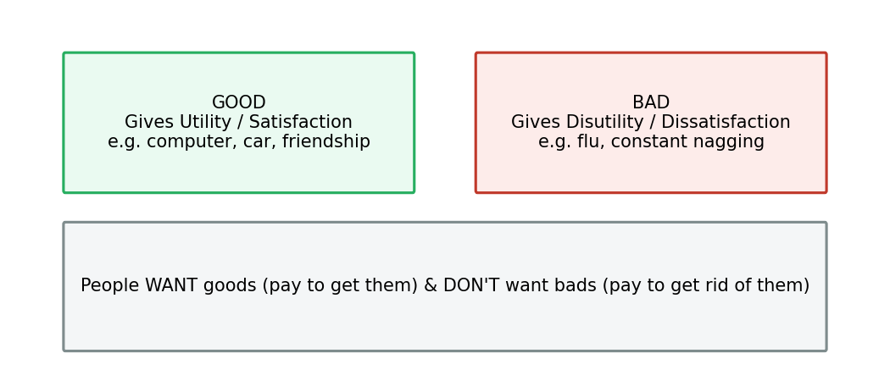
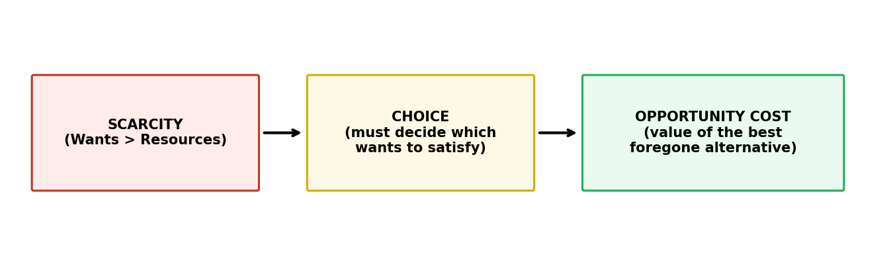
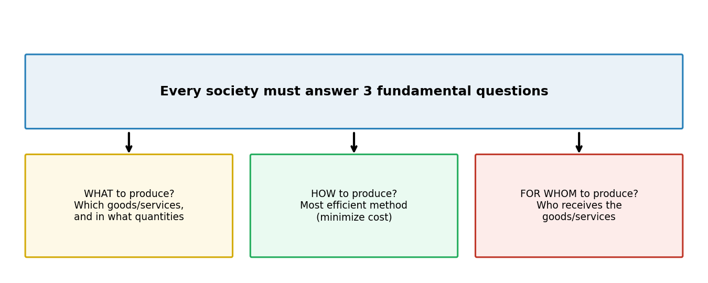

# Economics — Introduction

## 1. What is Economics?

The word **economy** comes from the Greek word ***oikonomos***, meaning **"one who manages a household."**

> **Economics** is the study of how societies use **scarce** resources to **produce** valuable goods and services and **distribute** them among different individuals.

---

## 2. Key Concepts

### 2.1 Scarcity

**Scarcity** = the condition in which our **wants** (for goods) are **greater than** the limited **resources** (land, labor, capital, entrepreneurship) available to satisfy those wants.

> We want goods, but there aren't enough resources to provide us with **all** the goods we want.

### 2.2 Goods vs Bads

| | Definition | Examples |
|---|---|---|
| **Good** | Gives a person **utility / satisfaction** | Computer, car, watch, TV, friendship, love |
| **Bad** | Gives a person **disutility / dissatisfaction** | The flu, constant nagging |

- A good can be **tangible** (a computer) or **intangible** (friendship).
- People **want** goods → will pay to **get** them ("Here is 50,000 TK for the computer")
- People **don't want** bads → will pay to **get rid of** them ("I'd pay you, doctor, to shorten my flu")

### 2.3 Choice & Opportunity Cost

Because **scarcity exists**, people must make **choices** — deciding which wants will be satisfied and which will not.

> **Opportunity cost** of an item = what you **give up** to get that item = the **most highly valued alternative forfeited** when a choice is made.

- Every choice has an opportunity cost.
- *Example:* You chose to attend this class instead of watching TV, texting a friend, napping, eating pizza, reading a novel, or shopping. If watching TV was your **next best alternative**, then the opportunity cost of attending class = watching television.

### 2.4 Efficiency

**Efficiency** = the **most effective use** of a society's resources in satisfying people's wants and needs.

**Economic efficiency** requires an economy to produce the **highest combination of quantity and quality** of goods & services, given its technology and scarce resources.

> An economy is producing efficiently when **no individual's economic welfare can be improved unless someone else is made worse off** *(this is the concept of "Pareto efficiency")*.

---

## 3. Divisions of Economics

Economics is divided into **two major subfields**:

| | Microeconomics | Macroeconomics |
|---|---|---|
| **Focus** | Behavior of **individual entities** — an individual, a single market, a firm, or a household | **Highly aggregate markets** or the **overall performance of the economy** |
| **Typical Questions** | • How does a market work? • What level of output does a firm produce? • What price does a firm charge? • How does a consumer decide how much to buy? • Can government policy affect business/consumer behavior? | • How does the economy work? • Why is unemployment sometimes high/low? • What causes inflation? • Why do some economies grow faster? • What causes interest rates to rise/fall? • How does the money supply affect the economy? • How do government spending & taxes affect the economy? |

### 3.1 Real-World Policy Examples

**Microeconomic policies (Bangladesh):**
- Expanding use of **Taxpayer Identification Numbers (TIN)** and **Business Identification Numbers (BIN)** → improves tax compliance at the **firm level**.
- FY 2026–27 budget: sweeping **tax exemptions for digital creators** — full income tax & VAT relief on income from YouTube, Facebook, TikTok, etc.

**Macroeconomic policies (Bangladesh):**
- Government increased **development expenditure by ~47%**, with major allocations to infrastructure, education, health, agriculture, and transport.
- Bangladesh adopted **greater exchange rate flexibility** to strengthen foreign exchange reserves and improve external stability.

> 💡 **Why these are Micro vs Macro:** TIN/BIN compliance and creator tax exemptions target **individual firms/individuals** → Microeconomics. Development budget and exchange rate policy affect the **entire national economy** → Macroeconomics.

---

## 4. Three Fundamental Questions of Economics

Every society must answer:

### (i) What to produce?
Deciding **which goods/services** to produce and in **what quantities**. Since resources are limited, producing more of one product means producing less of another.

> *Example:* A software company's developer team can build either a **mobile banking app** or a **hospital management system** — not both at once. It must choose based on customer demand and business objectives.

### (ii) How to produce?
Choosing the **most efficient method of production** — minimizing cost while maintaining desired quality and productivity.

> *Example:* Having decided to build the mobile banking app, the company must choose between **traditional development methods** vs **AI-assisted coding tools and automation**.

### (iii) For whom to produce?
Deciding **who will receive** the goods/services — since resources are limited, firms must identify which customers/market segments to serve.

> *Example:* A company building a project management app may choose to offer a **free version for students** or a **premium version for large businesses**.

---

## Quick-Reference Summary

| Concept | One-line definition |
|---|---|
| **Scarcity** | Wants > Resources |
| **Good** | Gives utility/satisfaction |
| **Bad** | Gives disutility/dissatisfaction |
| **Opportunity Cost** | Value of the best foregone alternative |
| **Efficiency** | Most effective use of resources (no one can gain without someone losing) |
| **Microeconomics** | Individual entities (market, firm, household) |
| **Macroeconomics** | The economy as a whole (aggregate) |
| **3 Fundamental Questions** | What / How / For Whom to produce |
