# The 8086 Microprocessor — Maximum Mode, Bus Controller, Clock/Reset System, and Bus Cycles

**Source:** *The Hardware Structure of 8086* — Prof. Dr. Shamim Akhter (Lecture 5), based on *The x86 Microprocessors: Architecture, Programming, and Interfacing (8086 to Pentium)*.
**Scope of this document:** Slide 27 to the end of the deck — i.e., everything from the **8086 Maximum Mode** system through the **8288 Bus Controller**, the **8284A Clock Generator**, **RESET**, the **Schmitt trigger**, **Bus Cycles (Read/Write)**, the **READY/WAIT state**, and the closing **RC-charging numerical problems**.

All original diagrams are preserved as images in the `attachments/` folder next to this file, referenced inline below.

---

## Table of Contents

1. [8086 Maximum Mode — System Overview](#1-8086-maximum-mode--system-overview)
2. [The 8288 Bus Controller](#2-the-8288-bus-controller)
3. [Interfacing the 8284A Clock Generator with the 8086](#3-interfacing-the-8284a-clock-generator-with-the-8086)
4. [The 8284A Clock Generator — Detailed Internal Operation](#4-the-8284a-clock-generator--detailed-internal-operation)
5. [RESET Operation](#5-reset-operation)
6. [The Schmitt Trigger](#6-the-schmitt-trigger)
7. [Capacitor Charging Behaviour (RC Curve)](#7-capacitor-charging-behaviour-rc-curve)
8. [READY Synchronization Circuitry](#8-ready-synchronization-circuitry)
9. [Bus Cycles — Read and Write](#9-bus-cycles--read-and-write)
10. [READY and WAIT States](#10-ready-and-wait-states)
11. [Wait-State Generation Circuit](#11-wait-state-generation-circuit)
12. [Review Questions (from the slide deck)](#12-review-questions-from-the-slide-deck)
13. [Worked Numerical Problems — RC Charging Circuit](#13-worked-numerical-problems--rc-charging-circuit)
14. [Consolidated Glossary of Terms](#14-consolidated-glossary-of-terms)

---

## 1. 8086 Maximum Mode — System Overview

### 1.1 Definition
**Maximum Mode** is one of the two operating modes of the 8086 microprocessor (the other being **Minimum Mode**). It is selected by tying the **MN/MX̄** (Minimum/Maximum) pin to **logic 0 (ground)**. In this mode, the 8086 does **not** generate its own bus-control signals directly; instead, it outputs encoded **status signals (S̄0, S̄1, S̄2)** that an external chip — the **8288 Bus Controller** — decodes into the actual read/write/interrupt-acknowledge control signals.

### 1.2 Why Maximum Mode exists
- **Minimum Mode** is designed for a **single-processor system**: the 8086 itself issues all control signals (RD̄, WR̄, etc.) directly to memory and I/O.
- **Maximum Mode** is designed for a **multiprocessor (coprocessor) environment**. Instead of the CPU driving control lines by itself, an external **bus controller (8288)** decodes the CPU's status lines and drives the control bus, freeing the 8086's pins for status/request signals needed to coordinate with other bus masters.
- A **multiprocessor environment** is necessary to support **coprocessors**, such as:
  - **8087** — the numeric (floating-point) coprocessor, used for complex mathematical operations.
  - **8089** — the I/O coprocessor, which offloads I/O-channel management from the CPU.

### 1.3 Key architectural differences from Minimum Mode

| Aspect | Minimum Mode | Maximum Mode |
|---|---|---|
| MN/MX̄ pin | Tied to **+5 V (logic 1)** | Tied to **ground (logic 0)** |
| Who generates control signals | 8086 CPU itself | External **8288 Bus Controller**, decoding S̄0–S̄2 |
| Number of processors | Only **one** processor | **Multiple** co-processors (e.g., 8087, 8089) |
| Circuit complexity | Simple | More complex (needs 8288, latches, transceivers) |
| System performance | Lower | **Very high** — supports parallel numeric/IO processing |
| Typical pins repurposed | HOLD, HLDA, WR̄, M/IO, DT/R̄, DEN, ALE, INTĀ | RQ̄/GT̄0, RQ̄/GT̄1, LOCK̄, S̄0, S̄1, S̄2, QS0, QS1 |

### 1.4 The 8086 Maximum Mode circuit

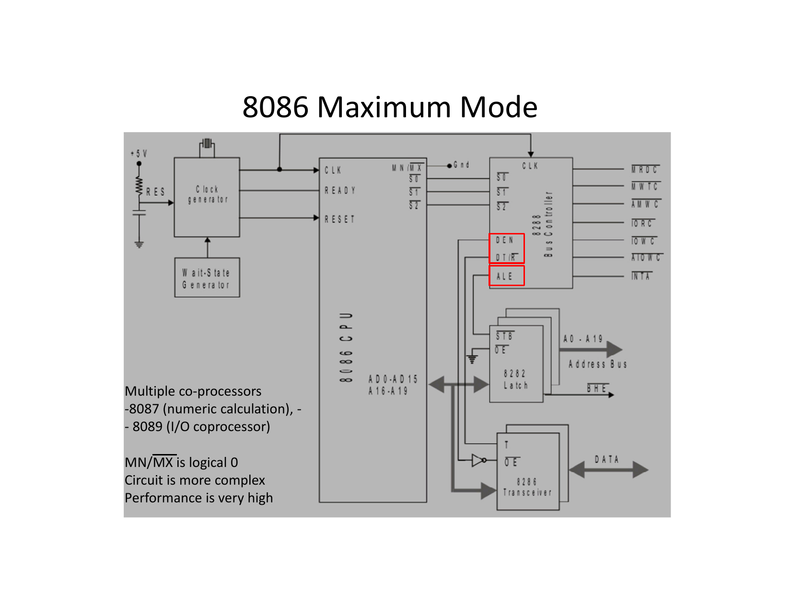

**How the circuit is wired:**
- The **Clock Generator (8284A)** feeds `CLK`, `READY`, and `RESET` to the 8086 CPU, exactly as in Minimum Mode.
- `MN/MX̄` is tied to **ground (logic 0)**, telling the 8086 to operate in Maximum Mode and to output **S̄0, S̄1, S̄2** on what would otherwise be the WR̄/M-IO/DT-R̄ pins.
- The **8288 Bus Controller** takes those status lines (S̄0–S̄2) plus `CLK`, and generates the real memory/IO command signals: `MRDC̄` (Memory Read), `MWTC̄` (Memory Write), `AMWC̄` (Advanced Memory Write), `IORC̄` (I/O Read), `IOWC̄` (I/O Write), `AIOWC̄` (Advanced I/O Write), and `INTĀ` (Interrupt Acknowledge).
- The 8288 also generates `DEN`, `DT/R̄`, and `ALE` — the same three signals that the 8086 itself generated directly in Minimum Mode — because in Maximum Mode these are now the bus controller's responsibility.
- The **8282 Latch** demultiplexes the address from the AD0–AD15/A16–A19 lines to give a clean, stable **Address Bus (A0–A19)** and **BHĒ**.
- The **8286 Transceiver** buffers the bidirectional **Data Bus (D0–D15)**.

**Summary in one line:** *Maximum Mode = 8086 CPU (status only) + 8288 Bus Controller (control signal generation) + latches/transceivers (bus demultiplexing) → supports multiple co-processors and much higher performance, at the cost of extra chips and circuit complexity.*

### 1.5 Maximum Mode Pins — full reference table

| Pin(s)                 | Function                                                                                                                                                                                                                                                                                                                                                                                                       |
| ---------------------- | -------------------------------------------------------------------------------------------------------------------------------------------------------------------------------------------------------------------------------------------------------------------------------------------------------------------------------------------------------------------------------------------------------------- |
| **S̄2, S̄1, S̄0**      | Status bits that indicate the function of the current bus cycle. These are decoded by the 8288 Bus Controller (see next table).                                                                                                                                                                                                                                                                                |
| **RQ̄/GT̄0, RQ̄/GT̄1** | Request/Grant pins used for **DMA** (Direct Memory Access). These lines are **bidirectional** and are used both to *request* and to *grant* control of the bus to another bus master.                                                                                                                                                                                                                          |
| **LOCK̄**              | Indicates that other system bus masters (DMA controllers, peripherals) are **not allowed** to gain control of the system bus while LOCK̄ is active **low (0)**. The LOCK̄ signal stays active until the completion of the *next* instruction. It is typically used around a **BTS (Bit Test and Set)** instruction, i.e., a **Read-Modify-Write** operation on a memory location that must not be interrupted. |
| **QS1, QS0**           | **Queue Status** bits — they report the status of the internal **instruction queue**, primarily for use by the numeric coprocessor (8087) so that it can track which byte the CPU is fetching/executing.                                                                                                                                                                                                       |

**Queue Status (QS1, QS0) decode table:**

| QS1 | QS0 | Function |
|---|---|---|
| 0 | 0 | Queue is idle / no operation |
| 0 | 1 | First byte of opcode |
| 1 | 0 | Queue is empty |
| 1 | 1 | Subsequent byte of opcode |

**HLDA (Hold Acknowledge)** — an **output** signal indicating that the processor has entered the **hold state** (surrendered the bus, typically to a DMA controller).

---

## 2. The 8288 Bus Controller

### 2.1 Purpose
The **8288 Bus Controller** is the chip that makes Maximum Mode possible. Because the 8086, in Maximum Mode, only outputs *encoded status* (S̄0, S̄1, S̄2) rather than direct control signals, the 8288 exists purely to **decode that status into usable bus-command and bus-control signals**.

### 2.2 Status decode table (S̄2 S̄1 S̄0 → Function)

| S̄2 | S̄1 | S̄0 | Function |
|---|---|---|---|
| 0 | 0 | 0 | Interrupt Acknowledge |
| 0 | 0 | 1 | I/O Read |
| 0 | 1 | 0 | I/O Write |
| 0 | 1 | 1 | Halt |
| 1 | 0 | 0 | Opcode Fetch |
| 1 | 0 | 1 | Memory Read |
| 1 | 1 | 0 | Memory Write |
| 1 | 1 | 1 | Passive (no bus activity) |

These status pins are **active during T4, T1, and T2** states of a bus cycle and return to the passive state (1,1,1) during T3 or Tw (the wait state, when READY is inactive). **Any change** in S̄2 S̄1 S̄0 during T4 signals the **beginning of a new bus cycle** — this is exactly the trigger the 8288 uses to start generating the next set of command signals.

### 2.3 Block diagram and pin-out

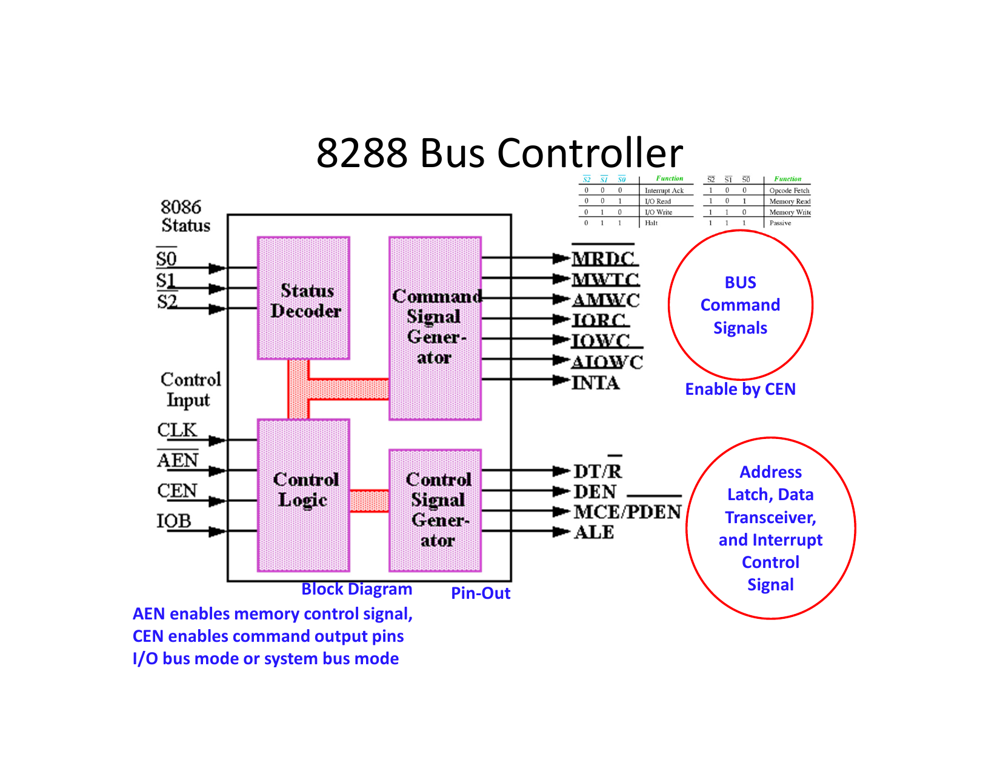

Internally the 8288 is organized into four functional blocks:
- **Status Decoder** — reads S̄0, S̄1, S̄2 from the CPU.
- **Command Signal Generator** — produces the **BUS Command Signals**: `MRDC̄`, `MWTC̄`, `AMWC̄`, `IORC̄`, `IOWC̄`, `AIOWC̄`, `INTĀ`. These are gated **on/off by the CEN pin**.
- **Control Logic** — takes `CLK`, `AEN̄`, `CEN`, and `IOB` as inputs.
- **Control Signal Generator** — produces the **Address Latch, Data Transceiver, and Interrupt Control signals**: `DT/R̄`, `DEN`, `MCE/PDEN̄`, `ALE`.

### 2.4 8288 Pin Functions — full reference table

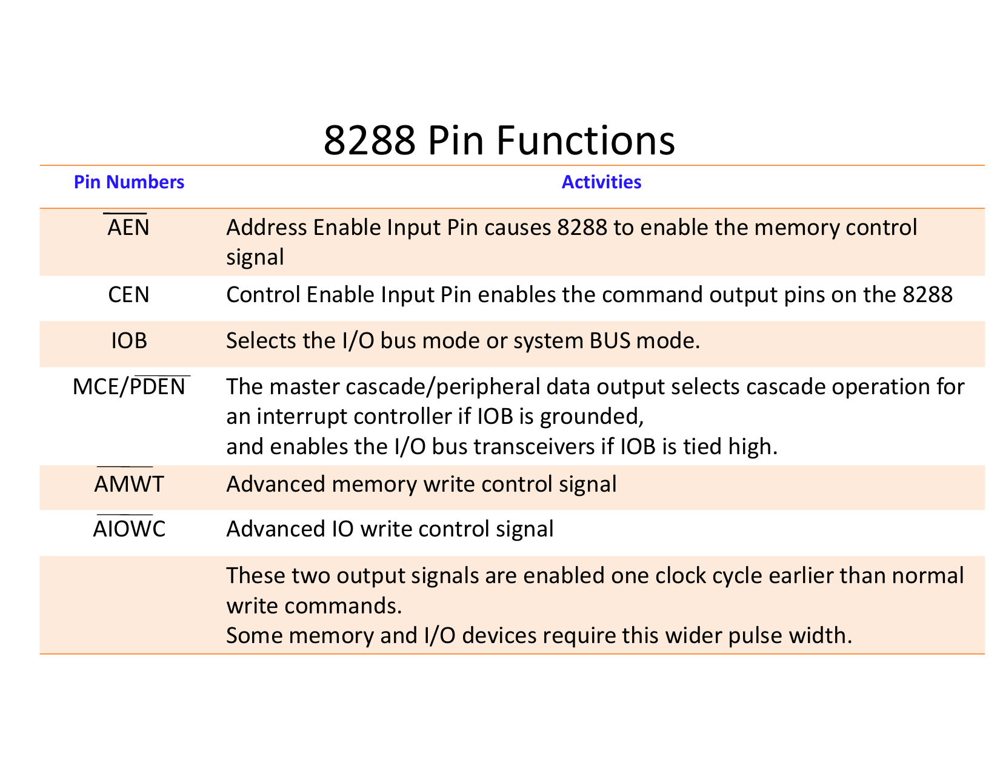

| Pin | Activity |
|---|---|
| **AEN̄** (Address Enable) | Input pin that causes the 8288 to **enable the memory control signal**. |
| **CEN** (Control Enable) | Input pin that **enables the command output pins** on the 8288. |
| **IOB** | Selects **I/O bus mode** or **system bus mode**. |
| **MCE/PDEN̄** | Master Cascade / Peripheral Data Enable. Selects **cascade operation** for an interrupt controller if IOB is grounded, or **enables the I/O bus transceivers** if IOB is tied high. |
| **AMWT̄** | **Advanced Memory Write** control signal. |
| **AIOWC̄** | **Advanced I/O Write** control signal. |

**Why "advanced" signals exist:** `AMWT̄` and `AIOWC̄` are enabled **one clock cycle earlier** than the normal write commands (`MWTC̄`/`IOWC̄`). Some memory and I/O devices are slower and require this **wider pulse width** to latch data reliably.

---

## 3. Interfacing the 8284A Clock Generator with the 8086

### 3.1 Purpose
The **8284A** is a support chip whose entire job is **synchronization**: it produces the three timing-critical signals every 8086/8088 system needs —
1. **Clock (CLK)**
2. **Reset (RESET)**
3. **Ready (READY)**

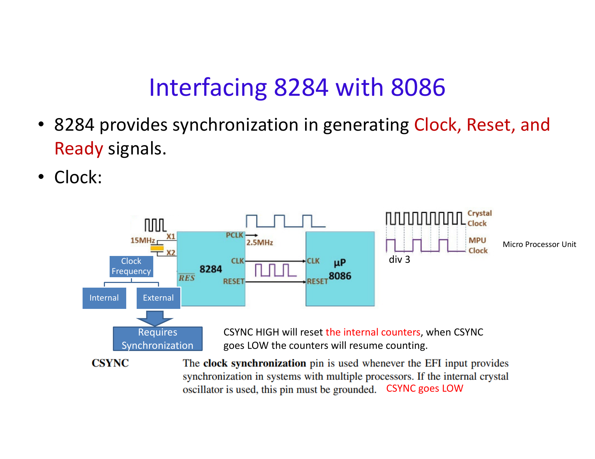

### 3.2 Clock generation, step by step
- A **15 MHz crystal** (or external frequency source) is connected across pins **X1/X2** of the 8284A.
- Internally, the 8284A divides this frequency by **3**, using a **divide-by-3 counter**, to produce the **CLK** signal that actually drives the 8086's `CLK` input. (15 MHz ÷ 3 = **5 MHz** — the microprocessor's operating clock.)
- A second internally divided output, **PCLK** (Peripheral Clock), runs at a different division — the slide shows a **2.5 MHz** output derived via a **divide-by-2** counter from the divided signal, intended for peripheral chips that need a slower clock.
- The **crystal clock** waveform (very fast) is divided down to produce the actual **MPU clock** waveform used by the CPU — the slide illustrates this relationship as "div 3" turning a dense crystal waveform into a much lower-frequency, evenly spaced microprocessor clock.

### 3.3 Two clock-source options

| Clock Frequency source | Description |
|---|---|
| **Internal** | Crystal connected directly to X1/X2; the 8284A's own oscillator generates the clock. |
| **External** | An externally generated frequency (EFI) is fed in instead of using the crystal. **Requires synchronization**, because an external, asynchronous source cannot be trusted to line up with the 8284A's internal counters without extra logic. |

### 3.4 The CSYNC (Clock Synchronization) pin
- Used whenever the **EFI (External Frequency Input)** provides the timing source in systems with **multiple processors**, so that all processors' clocks stay aligned.
- If the internal crystal oscillator is used instead, **CSYNC must be grounded**.
- Behaviour: **CSYNC HIGH** resets the internal counters; when **CSYNC goes LOW**, the counters **resume counting** — this is how multiple 8284A chips across a multiprocessor system can be forced to start counting from the same instant.

---

## 4. The 8284A Clock Generator — Detailed Internal Operation

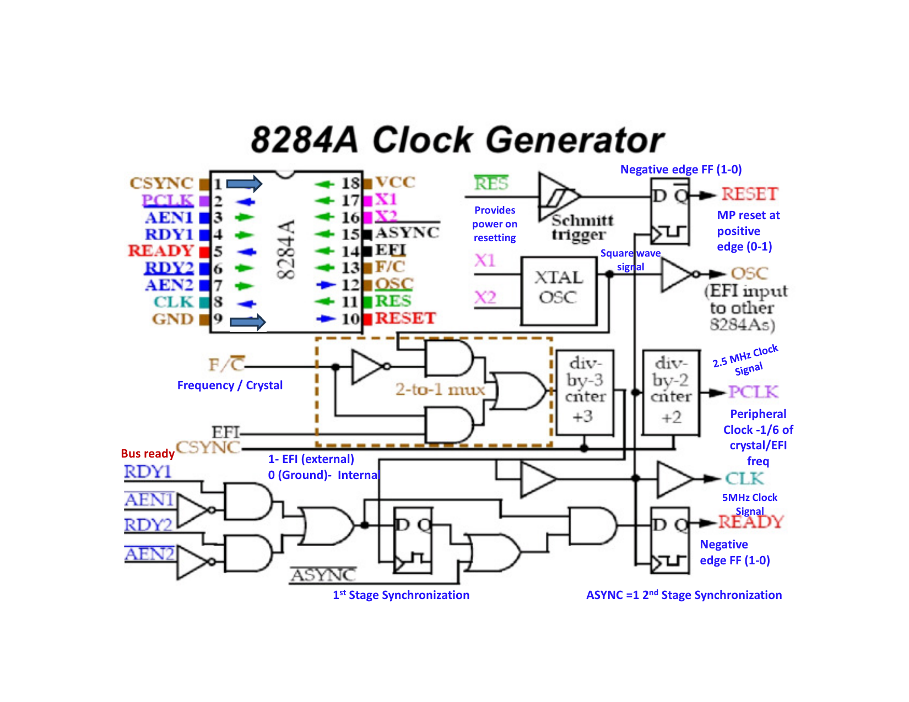

### 4.1 Complete pin list (18-pin dual purpose chip)

| Pin | Role |
|---|---|
| CSYNC | Clock Synchronization input (see §3.4) |
| PCLK | Peripheral Clock output (crystal/EFI frequency ÷ 6) |
| AEN1, AEN2 | Address Enable inputs — qualify RDY1/RDY2 respectively |
| RDY1, RDY2 | Bus-ready inputs from up to **two** multi-master system buses |
| READY | The synchronized Ready **output** fed to the 8086/8088 |
| CLK | The synchronized 5 MHz clock **output** fed to the CPU |
| GND | Ground |
| X1, X2 | Crystal oscillator connections |
| ASYNC | Selects normal vs. fast (single-stage) READY synchronization mode |
| EFI | External Frequency Input (used instead of a crystal) |
| F/C̄ | **Frequency/Crystal select** — chooses between internal crystal oscillator and EFI |
| OSC | Buffered crystal-oscillator output (can feed other 8284As, e.g., as their EFI) |
| RES̄ | Manual **Reset** input (active low), typically driven by an RC-diode network |
| RESET | The synchronized Reset **output** fed to the CPU |

### 4.2 Internal functional blocks

1. **Crystal oscillator section (X1/X2 + XTAL OSC):** Generates a stable, high-frequency **square-wave signal** directly from the crystal.
2. **2-to-1 multiplexer (Frequency/Crystal select):** Chooses between the internal crystal path and the external EFI path, based on **F/C̄**.
3. **Divide-by-3 counter (÷3):** Produces the main **CLK** signal (5 MHz from a 15 MHz source) — this is the **Peripheral Clock generation path** as well, feeding a further **divide-by-2 counter (÷2)** to make **PCLK** (2.5 MHz) — described on the slide as **PCLK = 1/6 of crystal/EFI frequency**.
4. **Reset section:** A **Schmitt trigger** conditions the noisy analog `RES̄` input, and a **negative-edge-triggered D flip-flop**, clocked by CLK, produces a clean, synchronized `RESET` output. This ensures the microprocessor is **reset on a positive clock edge (0→1 transition)** rather than at some arbitrary, unsynchronized instant.
5. **READY synchronization section:** Combines `RDY1`/`AEN1` and `RDY2`/`AEN2` (each pair handling one of two possible multi-master buses) through gating logic, a **1st-stage synchronization** D flip-flop, and (when `ASYNC = 1`) a **2nd-stage synchronization** negative-edge D flip-flop, to produce a clean `READY` output free of **metastability** issues.

### 4.3 Why two-stage synchronization is needed
`RDY1`/`RDY2` come from external memory or I/O devices and can change **asynchronously** relative to the CPU clock. Feeding a signal that changes at an unpredictable moment directly into synchronous logic risks **metastability** (an unstable, unpredictable output state). The 8284A solves this the standard way: it passes the raw ready signal through **two cascaded flip-flop stages**, each clocked by `CLK`, so that by the time `READY` reaches the CPU it is guaranteed to be stable and properly aligned to the clock edges the CPU expects.

---

## 5. RESET Operation

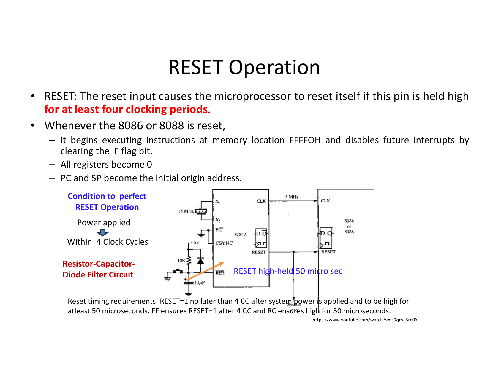

### 5.1 Definition
**RESET** is the input that forces the microprocessor into a known, initial state. The 8086/8088 requires this pin to be held **HIGH for at least four clock periods** for the reset to take effect properly.

### 5.2 What happens when the 8086/8088 is reset
- It begins executing instructions starting at memory location **FFFF0H** (the very top of the 1 MB address space, reserved for the boot/startup routine).
- It **disables future interrupts** by clearing the **IF (Interrupt Flag)** bit.
- **All registers become 0.**
- The **Program Counter (PC/IP)** and **Stack Pointer (SP)** are set to their **initial origin address**.

### 5.3 Two methods to trigger RESET
1. **Power-on RESET (Initial RESET)** — happens automatically when the system is powered up.
2. **Manual RESET** — a user-operated reset button/switch.

### 5.4 Conditions for a "perfect" RESET operation
- **Power applied → RESET=1 must occur within 4 clock cycles** of power being applied.
- **RESET must be held HIGH for at least 50 microseconds.**

### 5.5 The Resistor-Capacitor-Diode (RC-Diode) Filter Circuit

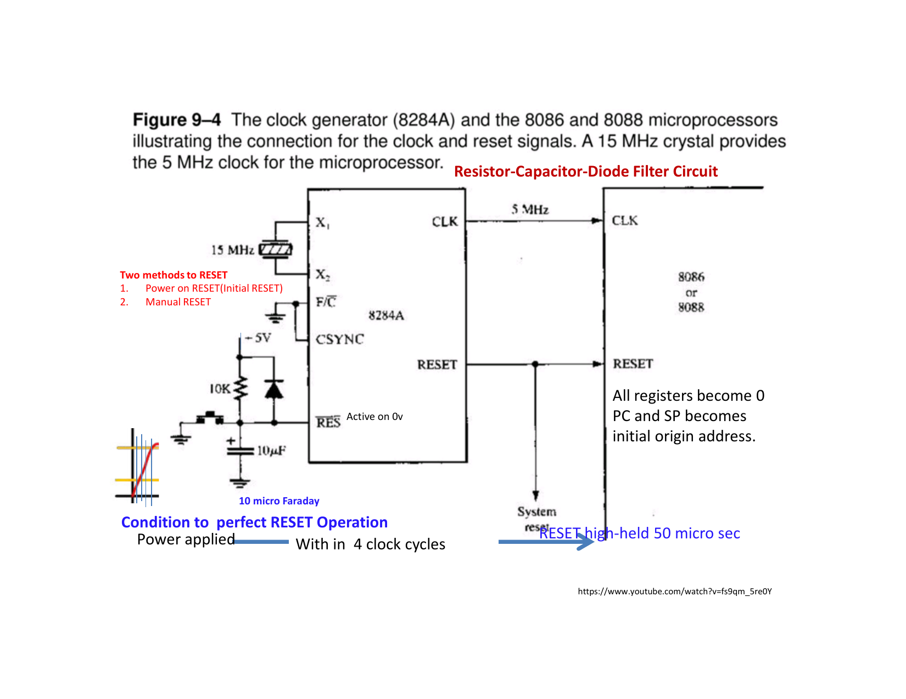

This is the classic analog circuit used to generate a clean **power-on reset pulse**:
- **+5 V** charges a **10 µF capacitor** through a **10 kΩ resistor**.
- A **diode** is placed to allow the capacitor to **discharge quickly** (e.g., on power-down) while charging **slowly** through the resistor on power-up — this asymmetric charge/discharge behaviour is exactly what produces a usable reset pulse shape.
- The RC network's slowly-rising voltage is fed to the **RES̄** pin of the 8284A, which is **active on 0 V** (i.e., RES̄ is treated as "reset requested" when it reads low/near 0 V, and the internal Schmitt trigger converts that ramping analog voltage into a clean digital transition).
- The 8284A's internal reset logic (Schmitt trigger + negative-edge flip-flop, described in §4.2 and §6) then produces a properly synchronized **RESET** output that is held high for the required duration and delivered to the 8086/8088's `RESET` pin.
- **Reset timing requirement, stated formally:** `RESET = 1` no later than **4 clock cycles** after system power is applied, and must remain high for **at least 50 microseconds**. The internal flip-flop (FF) ensures `RESET = 1` occurs after 4 clock cycles, and the RC network's time constant ensures the high state is sustained for the full 50 microseconds.

---

## 6. The Schmitt Trigger

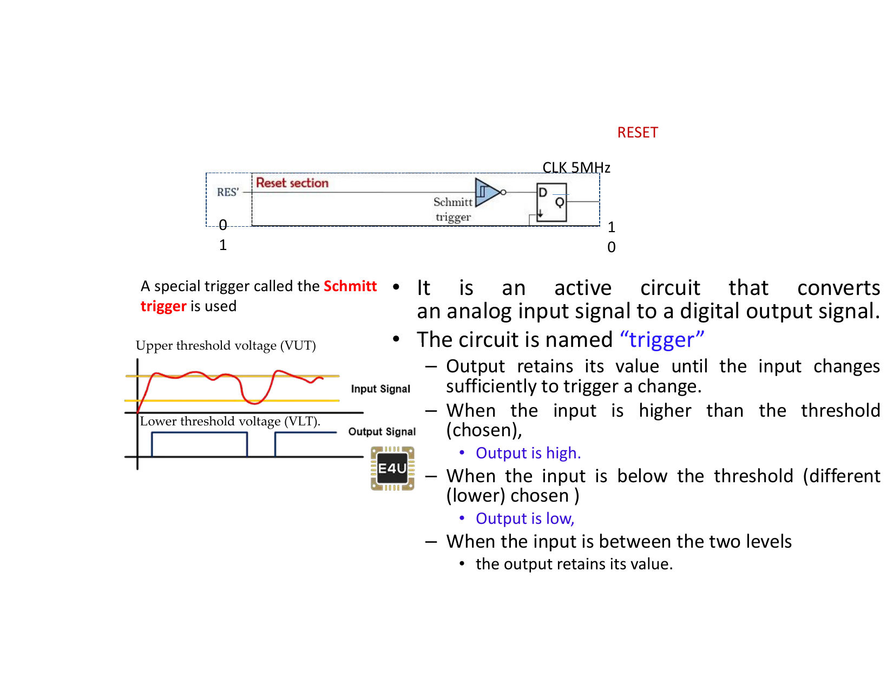

### 6.1 Definition
A **Schmitt trigger** is an **active circuit that converts an analog input signal into a clean digital (binary) output signal**. It is used inside the 8284A's reset section specifically because the RC-diode network produces a **slowly-varying analog voltage**, not a sharp digital edge — and digital logic (like the flip-flop that follows it) needs a sharp, unambiguous transition to work correctly.

### 6.2 Why it's called a "trigger"
- The circuit's output **retains its previous value** until the input changes **enough** to *trigger* a change — this "enough" is defined by two distinct threshold voltages, not one.
- **Upper Threshold Voltage (VUT):** if the input rises **above** this level, the output goes/ stays **HIGH**.
- **Lower Threshold Voltage (VLT):** if the input falls **below** this level, the output goes/stays **LOW**.
- **Hysteresis band:** when the input is *between* VUT and VLT, the output simply **retains whatever value it last had** — it does not respond to small fluctuations in that middle zone.

### 6.3 Why this matters (noise immunity)
This hysteresis behaviour makes the Schmitt trigger extremely resistant to noise: a noisy, slowly-rising signal (exactly the shape produced by an RC charging circuit) that might otherwise cause multiple spurious transitions near a single fixed threshold instead produces **one single, clean transition**, because the signal has to cross the *entire* gap between VLT and VUT before the output changes again.

### 6.4 Role in the 8284A
In the 8284A's internal reset path:
`RES̄ (analog, RC-shaped) → Schmitt Trigger (clean digital edge) → Negative-edge D flip-flop (clocked by CLK, 5 MHz) → RESET output (clean, synchronized to the clock, causes MPU reset on the positive edge 0→1)`

---

## 7. Capacitor Charging Behaviour (RC Curve)

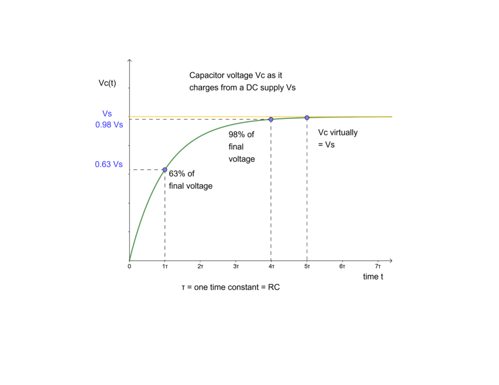

This slide underlies *both* the RESET circuit (§5.5) and the closing numerical problems (§13) — it is the general theory of how a capacitor charges through a resistor from a DC source.

### 7.1 Key definition
**τ (tau), the time constant, is defined as:**

```
τ = R × C
```

where **R** is resistance (ohms) and **C** is capacitance (farads). τ has units of **seconds**.

### 7.2 Charging milestones (universal RC-charging behaviour)

| Time elapsed | Capacitor voltage Vc reaches |
|---|---|
| **1τ** | **63%** of the final (supply) voltage |
| **4τ** | **98%** of the final voltage |
| **5τ** | Vc is considered **virtually equal to Vs** (charging is essentially complete) |

This is a **universal exponential charging curve** — it looks the same shape regardless of the actual values of R, C, or Vs; only the *time scale* (in units of τ) changes.

---

## 8. READY Synchronization Circuitry

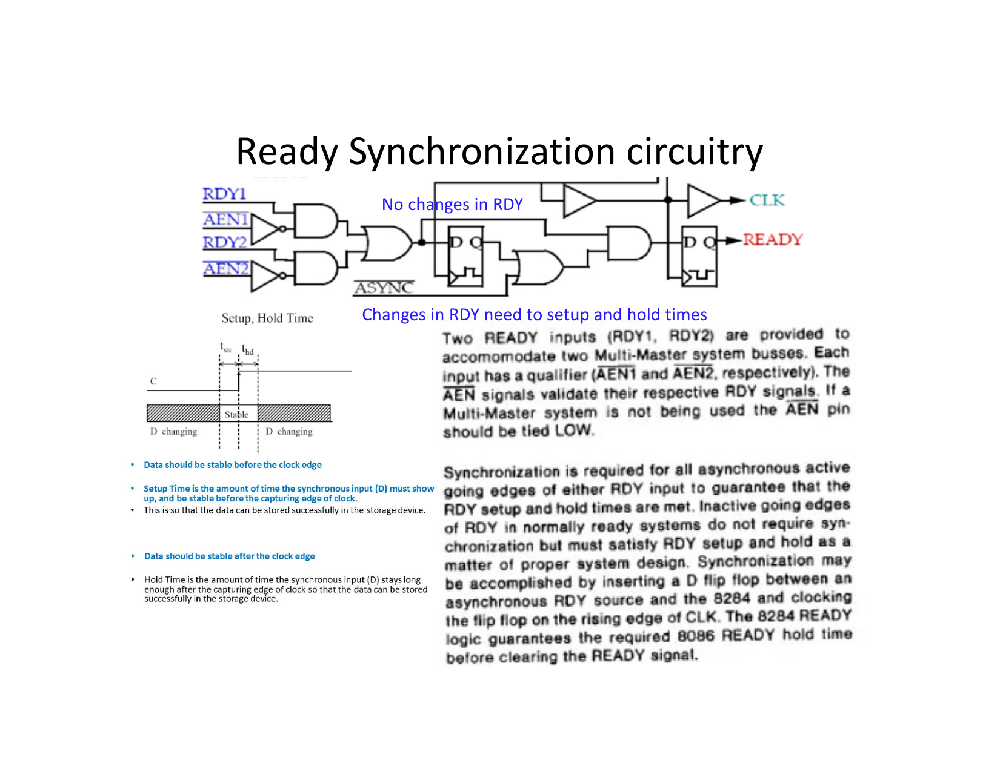

### 8.1 Why two READY inputs exist
**Two READY inputs (RDY1, RDY2)** are provided to accommodate **two Multi-Master system busses**. Each input has a corresponding **qualifier** — **AEN1̄** and **AEN2̄** respectively — which **validates** its matching RDY signal. If a multi-master system is *not* being used, the corresponding **AEN̄ pin should be tied LOW**.

### 8.2 Setup and Hold Time — core digital design definitions
- **Data should be stable *before* the clock edge.**
  - **Setup Time (t_su):** the amount of time the synchronous input (D) must be present and **stable before** the capturing (active) edge of the clock, so that the data can be **reliably stored** in the storage device.
- **Data should be stable *after* the clock edge.**
  - **Hold Time (t_hd):** the amount of time the synchronous input (D) must **remain stable after** the capturing clock edge, again so that the data is stored successfully.

### 8.3 Why synchronization is required
Synchronization is required for **all asynchronous active-going edges** of either RDY input, to **guarantee that RDY setup and hold times are met**. (Inactive-going edges of RDY, in "normally-ready" systems, do not strictly require synchronization — but they must still satisfy the setup/hold requirement as a matter of good system design.)

**Method:** synchronization is accomplished by inserting a **D flip-flop** between the asynchronous RDY source and the 8284A, clocking that flip-flop on the **rising edge of CLK**. The 8284A's internal READY logic then guarantees that the required 8086 READY **hold time** is met, before eventually **clearing** the READY signal.

---

## 9. Bus Cycles — Read and Write

### 9.1 General structure of a bus cycle
There are **at least four clock periods** in a bus cycle of the 8086 microprocessor, labeled **T1, T2, T3, and T4**. In a 5 MHz 8086 system, each clock period is **200 ns**, so a normal 4-state bus cycle lasts:

```
T = 200 ns × 4 = 800 ns
```

### 9.2 Read Cycle

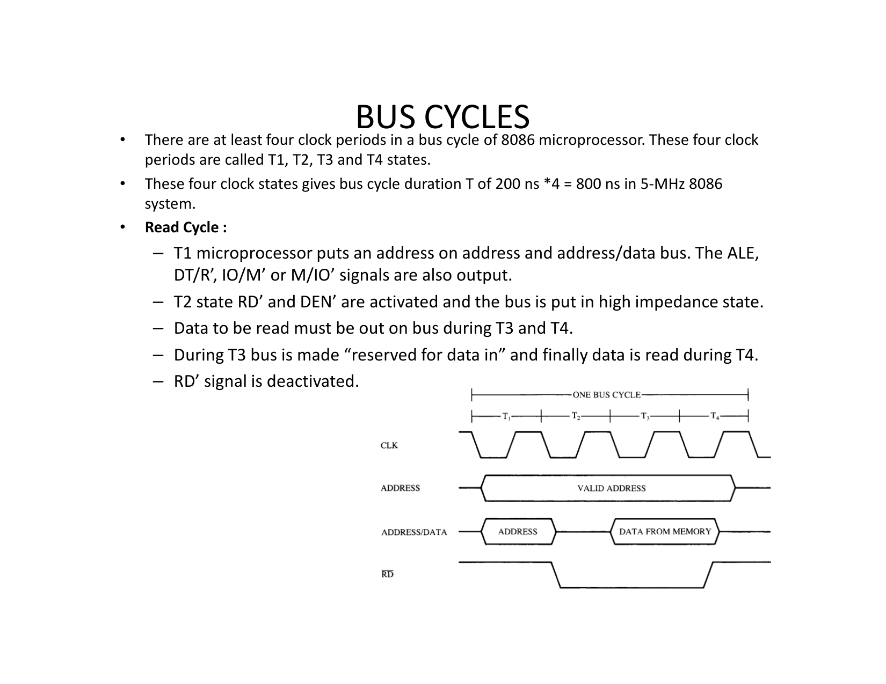

| State | What happens |
|---|---|
| **T1** | The microprocessor puts an **address** on the address and address/data bus. The **ALE**, **DT/R̄**, and **IO/M̄** (or **M/IŌ**) signals are also output during this state. |
| **T2** | **RD̄** and **DEN̄** are activated, and the bus is put into a **high-impedance state** to allow the addressed device to drive the bus. |
| **T3** | The bus is placed in the **"reserved for data in"** condition — the addressed memory/IO device is expected to have valid data ready on the bus by the end of T3/into T4. |
| **T4** | The data is actually **read** by the CPU, and the **RD̄** signal is **deactivated**. |

### 9.3 Write Cycle

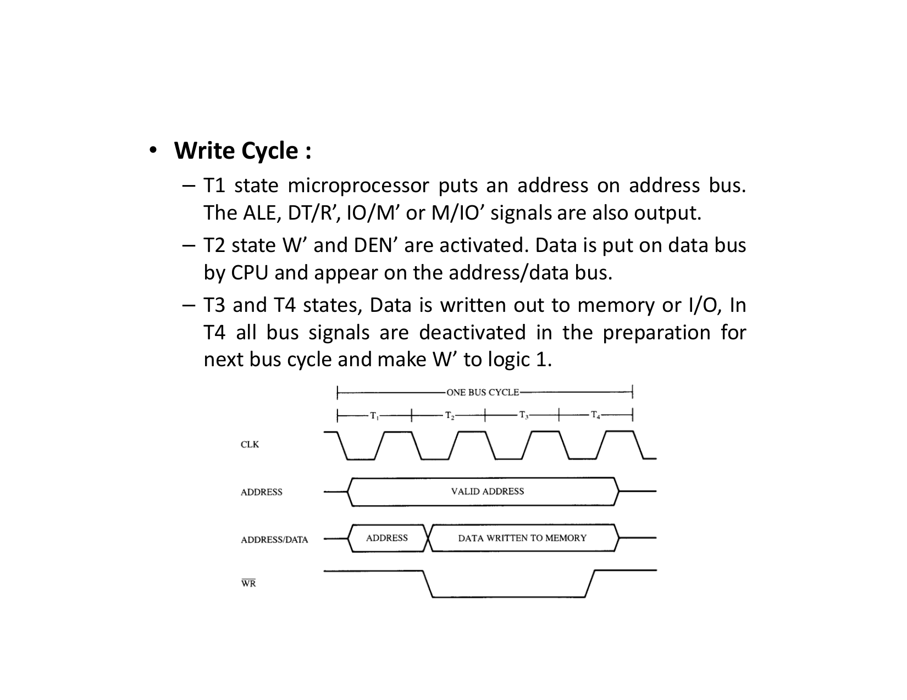

| State | What happens |
|---|---|
| **T1** | The microprocessor puts an **address** on the address bus. **ALE**, **DT/R̄**, and **IO/M̄** (or **M/IŌ**) are output. |
| **T2** | **WR̄** and **DEN̄** are activated. The CPU places **data** onto the data bus, and it appears on the address/data bus. |
| **T3 and T4** | Data is actually **written out** to memory or I/O. During **T4**, all bus signals are **deactivated** in preparation for the next bus cycle, and **WR̄ returns to logic 1**. |

---

## 10. READY and WAIT States

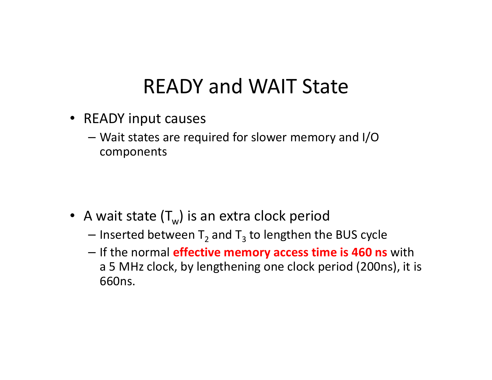

### 10.1 Why WAIT states are needed
Not all memory or I/O devices are fast enough to keep up with the CPU's normal bus-cycle timing. The **READY** input exists precisely to let a slow device tell the CPU "I'm not ready yet — please wait."

### 10.2 Definition of a WAIT state
A **wait state (Tw)** is an **extra clock period** inserted **between T2 and T3** to lengthen the bus cycle, giving a slow device more time to respond.

**Numerical illustration from the slide:** if the *normal* effective memory access time is **460 ns** with a 5 MHz clock, then inserting **one** extra wait-state clock period (**+200 ns**) lengthens the effective access time to **660 ns**.

### 10.3 How the CPU decides whether to insert Tw

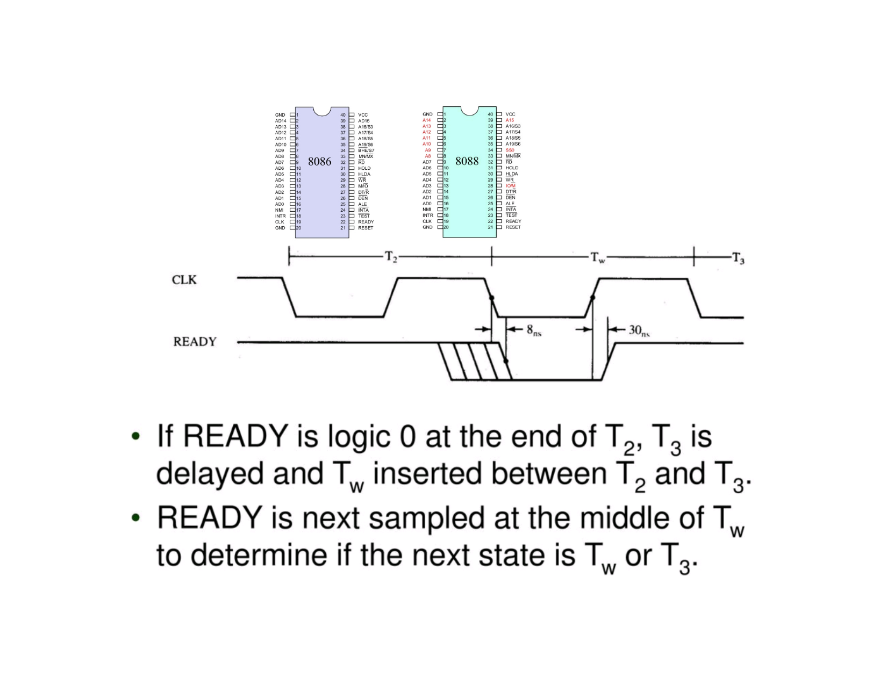

- **If READY is logic 0 at the end of T2**, then **T3 is delayed**, and a **Tw state is inserted** between T2 and T3.
- **READY is then re-sampled at the middle of each Tw**, to determine whether the *next* state should be **another Tw** (still not ready) or **T3** (device is now ready, proceed normally).
- This sampling can repeat for as many Tw cycles as needed until READY finally goes high.

---

## 11. Wait-State Generation Circuit

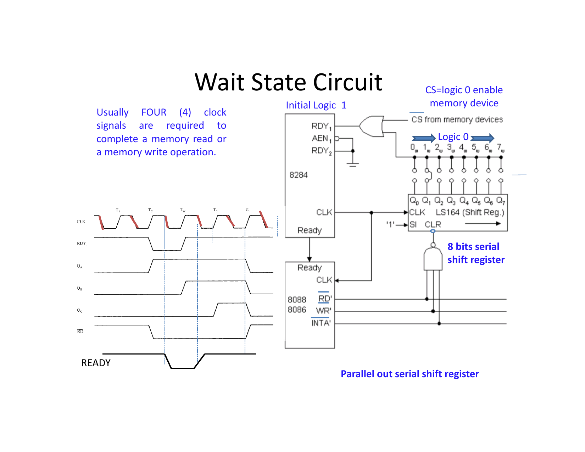

### 11.1 Purpose
This circuit shows a practical hardware method for **automatically inserting a fixed number of wait states**, useful when interfacing genuinely slow memory/IO devices that need a predictable, fixed delay every time they're accessed (rather than relying on the device itself to assert READY intelligently).

### 11.2 Components and method
- **Usually FOUR (4) clock signals are required** to complete a full memory read or memory write operation without any additional delay.
- A **CS̄ (Chip Select) signal from the memory device**, when **logic 0**, **enables the memory device**, and simultaneously feeds into the wait-generation logic.
- An **8-bit serial shift register (74LS164, "LS164")** is used as a **Parallel-Out Serial Shift Register**: it is clocked by the same `CLK` that drives the CPU, and its serial input is tied to logic **'1'**.
- As `CLK` pulses arrive, the shift register's outputs (Q0…Q7) sequentially go high, one bit position per clock — effectively **counting clock cycles**.
- These sequential outputs feed into the **RDY1** input of the 8284A (via the **AEN1̄** qualifier, initially held at logic 1), and are also gated with the CPU's **RD̄**, **WR̄**, and **INTĀ** signals.
- By choosing *which* shift-register output taps back into the READY logic, the designer can select **exactly how many wait states** are inserted for a given memory access — this is the "8 bits serial shift register" mechanism referenced in the diagram.
- The overall effect, shown at the bottom of the diagram: the **READY** line is held low across a controlled number of `Tw` cycles (visible as the `Q_A`, `Q_B`, `Q_C` waveforms staggering low-to-high) before finally allowing `T3`/`T4` to proceed.

---

## 12. Review Questions (from the slide deck)

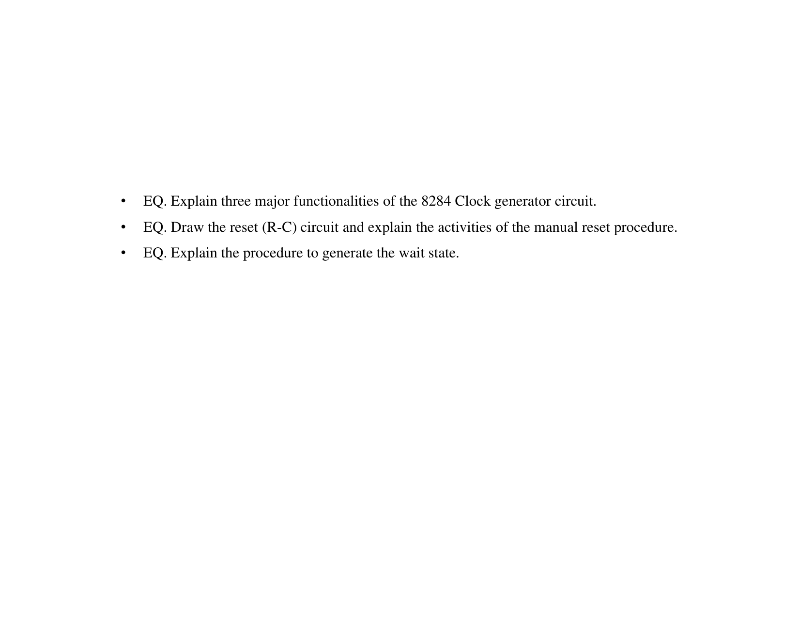

The lecture itself poses these as revision questions — restated here with pointers to where each is answered in this document:

1. **"Explain the purpose of the BHĒ, ALE, and A0 pins on the 8086 microprocessor."**
   *(This question appears earlier in the deck, around the Pin Connections / Even-Odd Address sections — not covered in this excerpt, which begins at slide 27, but is included here for completeness of the review list.)*
   - **BHĒ (Bus High Enable):** enables the most-significant data bus bits (D15–D8) during a read/write operation; used together with **A0** to select which byte bank(s) (odd/even) are being accessed.
   - **ALE (Address Latch Enable):** when **1**, indicates that the address/data bus currently contains a valid **memory or I/O address**, signalling external latches to capture it.
   - **A0:** the least-significant address line; **A0 = 0** selects the **Even** address bank, **A0 = 1** selects the **Odd** address bank.

2. **"Explain three major functionalities of the 8284 Clock generator circuit."** → See **Section 4**: the 8284A (a) generates the synchronized system **CLK**, (b) generates a synchronized **RESET**, and (c) generates a synchronized **READY** signal (from up to two multi-master RDY inputs).

3. **"Draw the reset (R-C) circuit and explain the activities of the manual reset procedure."** → See **Section 5.5** (Figure 9-4 / RC-Diode Filter Circuit) and **Section 5.3** (Power-on vs. Manual RESET).

4. **"Explain the procedure to generate the wait state."** → See **Sections 10 and 11** (READY/WAIT state logic and the hardware Wait-State Circuit using the 74LS164 shift register).

---

## 13. Worked Numerical Problems — RC Charging Circuit

### 13.1 The governing equation

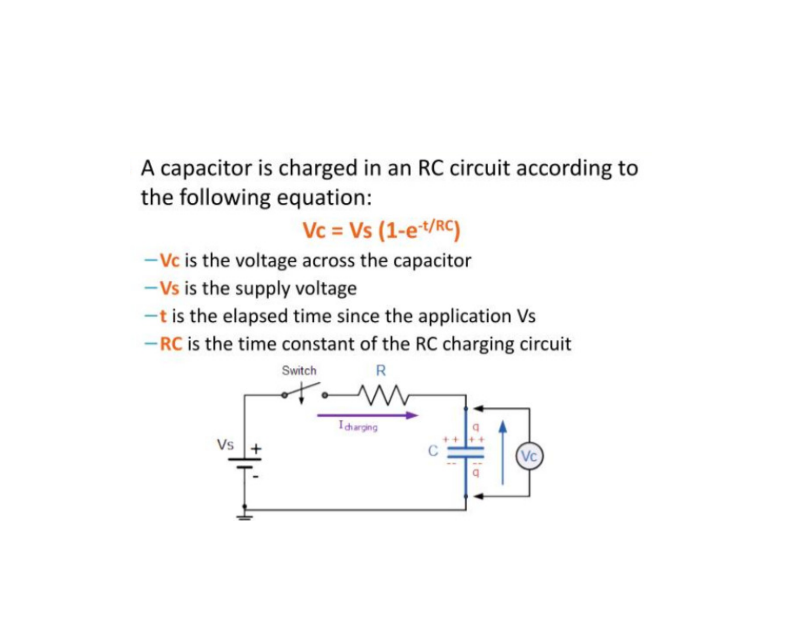

A capacitor charging in an RC circuit follows:

```
Vc = Vs (1 − e^(−t/RC))
```

Where:
- **Vc** = voltage across the capacitor (at time t)
- **Vs** = the DC supply voltage
- **t** = elapsed time since the supply was applied
- **RC** = the **time constant** of the charging circuit (τ = R × C)

### 13.2 The example problem

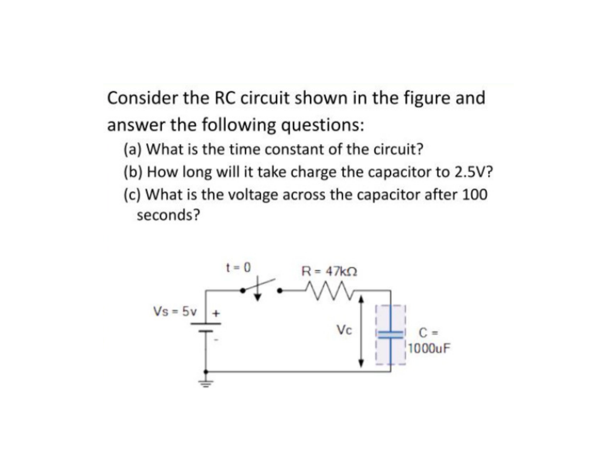

**Given circuit:** `Vs = 5 V`, `R = 47 kΩ`, `C = 1000 µF`, switch closes at `t = 0`.

**Questions:**
(a) What is the time constant of the circuit?
(b) How long will it take to charge the capacitor to 2.5 V?
(c) What is the voltage across the capacitor after 100 seconds?

---

### (a) Time constant

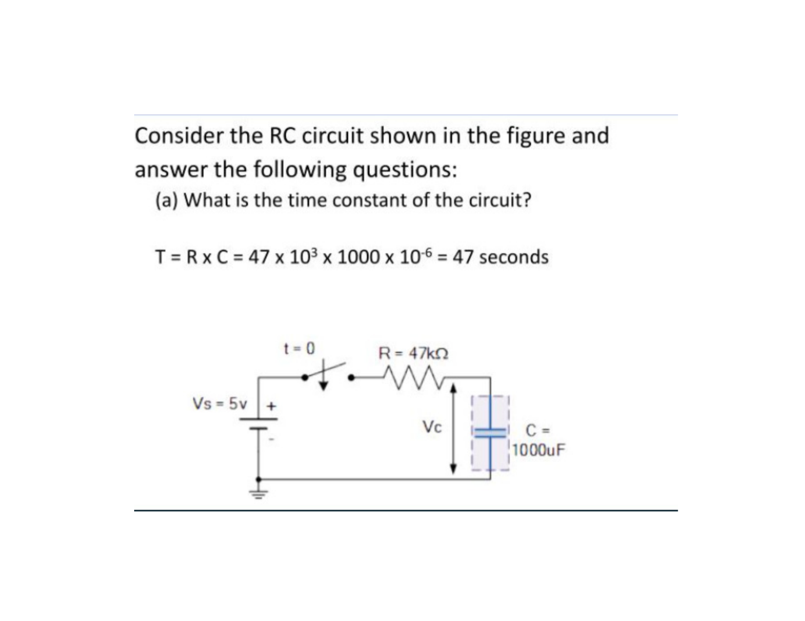

```
τ = R × C = (47 × 10³) × (1000 × 10⁻⁶) = 47 seconds
```

**τ = 47 seconds.**

---

### (b) Time to charge to 2.5 V

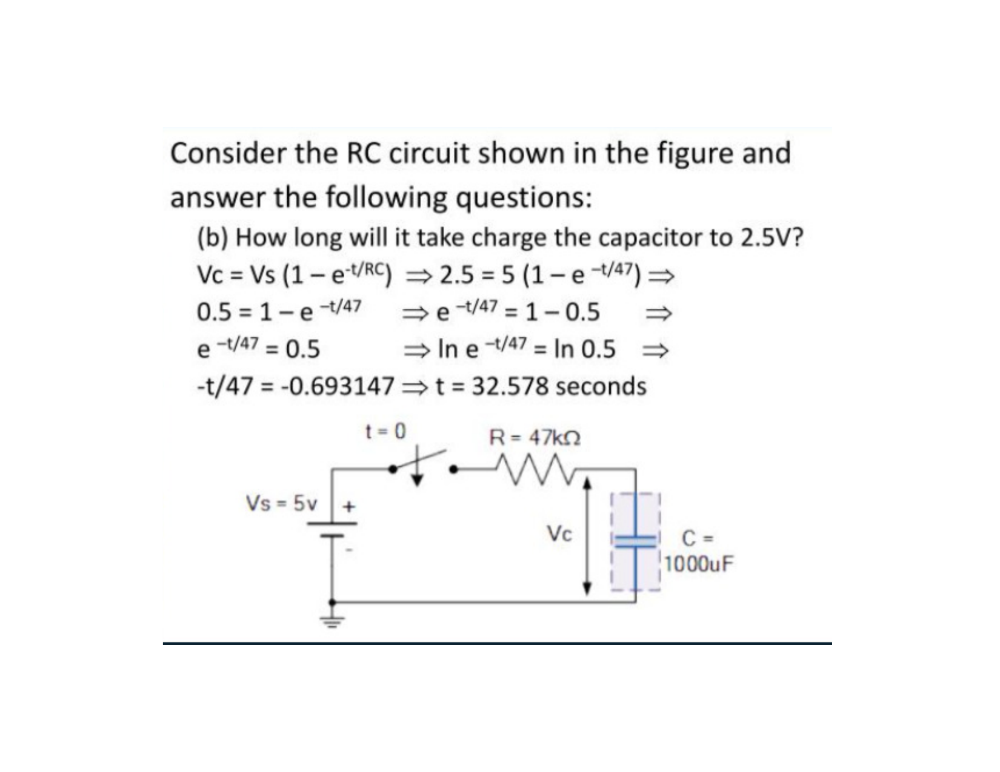

Starting from `Vc = Vs(1 − e^(−t/RC))`:

```
2.5 = 5(1 − e^(−t/47))
0.5 = 1 − e^(−t/47)
e^(−t/47) = 1 − 0.5 = 0.5
ln(e^(−t/47)) = ln(0.5)
−t/47 = −0.693147
t = 32.578 seconds
```

**t ≈ 32.578 seconds** for the capacitor to reach 2.5 V (i.e., exactly half of the 5 V supply — this checks out conceptually, since reaching 50% of final voltage should take noticeably *less* than one full time constant, and 32.578 s < 47 s = 1τ, consistent with the 63%-at-1τ milestone from Section 7.2).

---

### (c) Voltage after 100 seconds

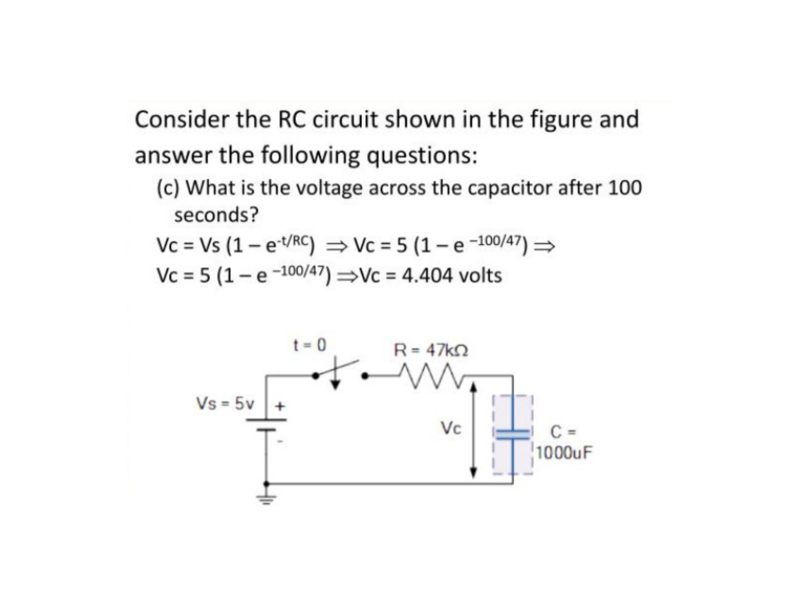

```
Vc = Vs(1 − e^(−t/RC)) = 5(1 − e^(−100/47))
Vc = 5(1 − e^(−2.1277))
Vc ≈ 4.404 volts
```

**Vc ≈ 4.404 V** after 100 seconds. This is consistent with the general RC-charging milestones from Section 7.2: 100 seconds is a little over **2τ** (2 × 47 = 94 s), and the curve should be well past the 63%-at-1τ point but not yet at the 98%-at-4τ point — 4.404 V out of 5 V (≈ 88%) fits neatly between those two milestones.

---

## 14. Consolidated Glossary of Terms

| Term | Meaning |
|---|---|
| **Maximum Mode** | 8086 operating mode (MN/MX̄ = 0) for multiprocessor systems; CPU outputs status bits, an external 8288 generates control signals. |
| **Minimum Mode** | 8086 operating mode (MN/MX̄ = 1) for single-processor systems; CPU generates control signals directly. |
| **8288 Bus Controller** | Decodes the 8086's S̄0–S̄2 status outputs into real memory/IO command and control signals. |
| **S̄0, S̄1, S̄2** | Status output pins (Maximum Mode) indicating the type of bus cycle in progress. |
| **RQ̄/GT̄0, RQ̄/GT̄1** | Bidirectional Request/Grant pins used to arbitrate DMA bus ownership. |
| **LOCK̄** | Signal preventing other bus masters from taking the bus during an atomic (e.g., Read-Modify-Write) operation. |
| **QS0, QS1** | Queue Status bits reporting the state of the internal instruction prefetch queue (used by the 8087). |
| **8284A** | The Clock Generator chip; produces synchronized CLK, RESET, and READY for the 8086/8088. |
| **CSYNC** | Clock Synchronization input on the 8284A, used with external frequency sources in multiprocessor setups. |
| **F/C̄** | Frequency/Crystal select pin — chooses between internal crystal and external EFI as the clock source. |
| **PCLK** | Peripheral Clock output of the 8284A (a divided-down version of the main clock, for slower peripheral chips). |
| **RES̄** | Manual/analog Reset input pin on the 8284A (active near 0 V), typically driven by an RC-diode network. |
| **Schmitt Trigger** | A circuit that converts a slow-changing analog input into a clean digital output, using two threshold voltages (VUT, VLT) with hysteresis. |
| **Time Constant (τ)** | τ = R × C; the characteristic charging/discharging time of an RC circuit, in seconds. |
| **Setup Time** | Minimum time a signal must be stable *before* a clock edge for reliable capture. |
| **Hold Time** | Minimum time a signal must remain stable *after* a clock edge for reliable capture. |
| **Bus Cycle** | The sequence of clock states (T1–T4, plus optional Tw) needed to complete one memory or I/O access. |
| **T1–T4 states** | The four standard clock periods making up one 8086 bus cycle. |
| **Wait State (Tw)** | An extra clock period inserted between T2 and T3 when the addressed device signals (via READY = 0) that it needs more time. |
| **READY** | Input signal from memory/IO telling the CPU whether it can proceed (1) or must wait (0). |
| **ALE** | Address Latch Enable — indicates the address/data bus currently carries a valid address, so it can be latched externally. |
| **DT/R̄** | Data Transmit/Receive — indicates the direction of data flow on the bidirectional data bus. |
| **DEN̄** | Data Bus Enable — activates the external data bus transceiver/buffer. |
| **HLDA** | Hold Acknowledge — output confirming the CPU has released the bus in response to a HOLD request. |

---

*End of notes (slide 27 through the final slide of Lecture 5).*
