# Memory Interfacing — RAM, ROM, Address Decoding, PLDs, and Error Correction

**Source:** *Memory Interfacing* — Prof. Dr. Shamim Akhter (Lecture 6), based on *The x86 Microprocessors: Architecture, Programming, and Interfacing (8086 to Pentium)*.
**Scope of this document:** The entire lecture, start to finish — memory fundamentals, ROM/RAM pin structure, SRAM vs DRAM internals, address decoding (NAND-gate and 74LS138/74LS139 decoders), Programmable Logic Devices (PLA/PLD), full worked memory-interfacing circuits for the 8088 and 8086/80286, odd/even bank selection, and closing with Hamming-code error detection/correction.

All original diagrams are preserved as images in the `attachments/` folder next to this file, referenced inline below.

---

## Table of Contents

1. [Objectives of This Lecture](#1-objectives-of-this-lecture)
2. [The Memory Unit — Core Definitions](#2-the-memory-unit--core-definitions)
3. [Memory (ROM/RAM) Pin Connections — General Model](#3-memory-romram-pin-connections--general-model)
4. [The 2716 — A Concrete EPROM Example](#4-the-2716--a-concrete-eprom-example)
5. [RAM Memory — The TMS4016 SRAM](#5-ram-memory--the-tms4016-sram)
6. [Static vs Dynamic RAM — Internal Cell Structure](#6-static-vs-dynamic-ram--internal-cell-structure)
7. [Reading and Writing with a DRAM Cell](#7-reading-and-writing-with-a-dram-cell)
8. [Why SRAM Is Faster, Why DRAM Is Denser](#8-why-sram-is-faster-why-dram-is-denser)
9. [SRAM Read and Write Operations in Detail](#9-sram-read-and-write-operations-in-detail)
10. [Address Decoding — The Core Problem](#10-address-decoding--the-core-problem)
11. [NAND-Gate Decoding — A Worked Example](#11-nand-gate-decoding--a-worked-example)
12. [The 3-to-8 Line Decoder (74LS138)](#12-the-3-to-8-line-decoder-74ls138)
13. [Worked Example — Addressing F0000H–FFFFFH with Eight 2764 EPROMs](#13-worked-example--addressing-f0000hfffffh-with-eight-2764-eproms)
14. [The Dual 2-to-4 Line Decoder (74LS139)](#14-the-dual-2-to-4-line-decoder-74ls139)
15. [A Complete Memory System Using the 74HCT139](#15-a-complete-memory-system-using-the-74hct139)
16. [The Programmable Logic Array (PLA)](#16-the-programmable-logic-array-pla)
17. [PLA — Internal Structure and Worked Implementation](#17-pla--internal-structure-and-worked-implementation)
18. [Programmable Logic Devices (PLDs) — General Concept](#18-programmable-logic-devices-plds--general-concept)
19. [ROM and RAM Interfacing Using a PLD (GAL22V10)](#19-rom-and-ram-interfacing-using-a-pld-gal22v10)
20. [Memory Interface — 8088/80188 (8-bit Data Bus)](#20-memory-interface--808880188-8-bit-data-bus)
21. [EPROM Interfacing With the 8088 — Full Worked Circuit](#21-eprom-interfacing-with-the-8088--full-worked-circuit)
22. [A Complete Buffered Memory Interface (Address/Data/Control Buffering)](#22-a-complete-buffered-memory-interface-addressdatacontrol-buffering)
23. [Memory Interface — 8086/80286 (16-bit Data Bus)](#23-memory-interface--808680286-16-bit-data-bus)
24. [Odd/Even Bank Selection with BHĒ and A0](#24-oddeven-bank-selection-with-bhē-and-a0)
25. [Separate Bank Decoders — A Worked 24-bit-Address Example](#25-separate-bank-decoders--a-worked-24-bit-address-example)
26. [Separate Bank Write Strobes (HWR̄, LWR̄)](#26-separate-bank-write-strobes-hwr-lwr)
27. [A Complete 16-bit-Wide Memory Interface (PLD-based)](#27-a-complete-16-bit-wide-memory-interface-pld-based)
28. [Error-Correcting Codes — Why and How](#28-error-correcting-codes--why-and-how)
29. [The Hamming Code — Choosing the Number of Check Bits](#29-the-hamming-code--choosing-the-number-of-check-bits)
30. [Layout of Data Bits and Check Bits](#30-layout-of-data-bits-and-check-bits)
31. [Worked Example — Single-Error-Correction (SEC)](#31-worked-example--single-error-correction-sec)
32. [Worked Example — Single-Error-Correction, Double-Error-Detection (SEC-DED)](#32-worked-example--single-error-correction-double-error-detection-sec-ded)
33. [The 74LS636 Error-Correcting Circuit](#33-the-74ls636-error-correcting-circuit)
34. [Consolidated Glossary of Terms](#34-consolidated-glossary-of-terms)

---

## 1. Objectives of This Lecture

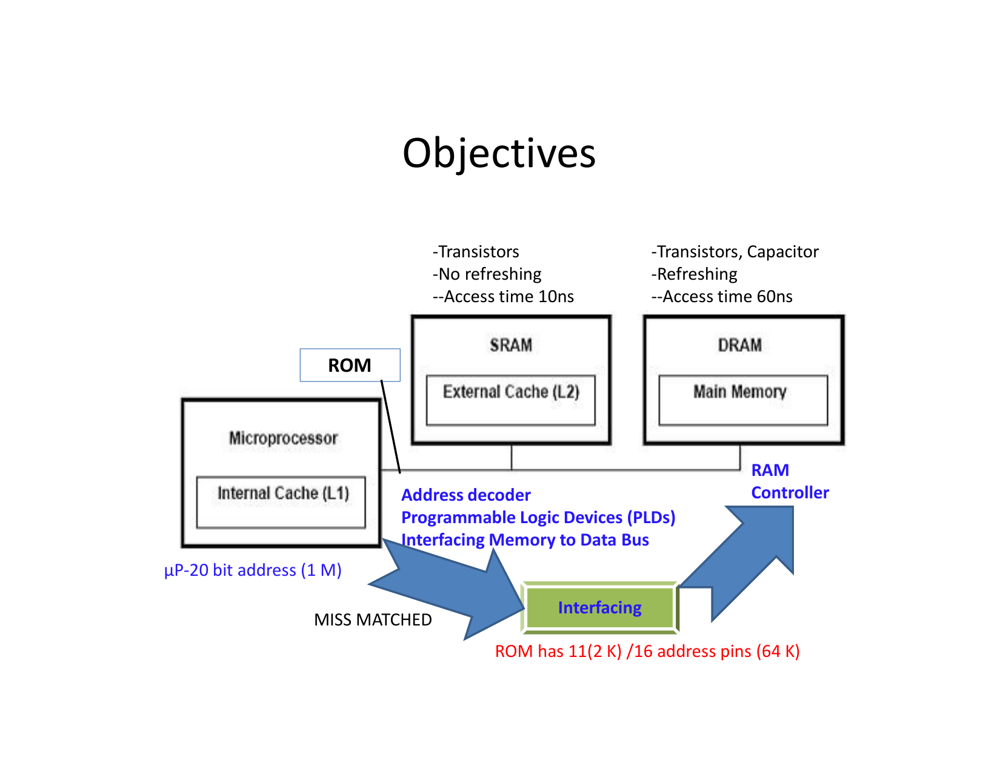

The lecture sets up a core practical problem before diving into details: a microprocessor has a **20-bit address bus** (able to address **1 MB = 1 M** locations), but the ROM/RAM chips available to build a system with are much smaller — e.g., a ROM might only have **11 address pins (2 K locations)** or **16 address pins (64 K locations)**. This is the **"MISS MATCHED"** problem the whole lecture solves.

**The four stated learning objectives are:**
1. **Address decoder** design — how to bridge the CPU's wide address bus down to a memory chip's narrower one, and how to give each chip its own unique address range.
2. **Programmable Logic Devices (PLDs)** — how a single reconfigurable chip can replace a handful of discrete decoder gates.
3. **Interfacing Memory to the Data Bus** — buffering and connecting the actual data lines.
4. **RAM Controller** — the block that manages the refresh and access logic for DRAM-type main memory.

**Quick reference — SRAM vs. DRAM as building blocks (from the objectives diagram):**

| | SRAM (used for **External Cache, L2**) | DRAM (used for **Main Memory**) |
|---|---|---|
| Built from | Transistors only | Transistors **+ capacitors** |
| Refreshing needed? | **No** | **Yes** |
| Typical access time | **10 ns** | **60 ns** |

The microprocessor's **Internal Cache (L1)** sits inside the CPU itself; **External Cache (L2)** is built from SRAM; **Main Memory** is built from DRAM; and **ROM** holds firmware/boot code. All of these connect to the CPU through the **Interfacing** block (address decoder + PLDs + bus interfacing), with a **RAM Controller** specifically managing the DRAM side.

---

## 2. The Memory Unit — Core Definitions

### 2.1 Definition
A **memory unit** is a collection of cells capable of storing a large quantity of **binary information**, together with the associated circuits needed to transfer information **in and out** of the device.

### 2.2 The two fundamental operations
- **Write operation:** storing **new** information into memory.
- **Read operation:** transferring the **stored** information **out of** memory (i.e., making it available for processing elsewhere).

### 2.3 The two major memory types

| Type | Full name | Capability |
|---|---|---|
| **RAM** | Random-Access Memory | **Read + Write** — accepts new information for storage, to be used again later. |
| **ROM** | Read-Only Memory | Performs **only** the read operation. |

---

## 3. Memory (ROM/RAM) Pin Connections — General Model

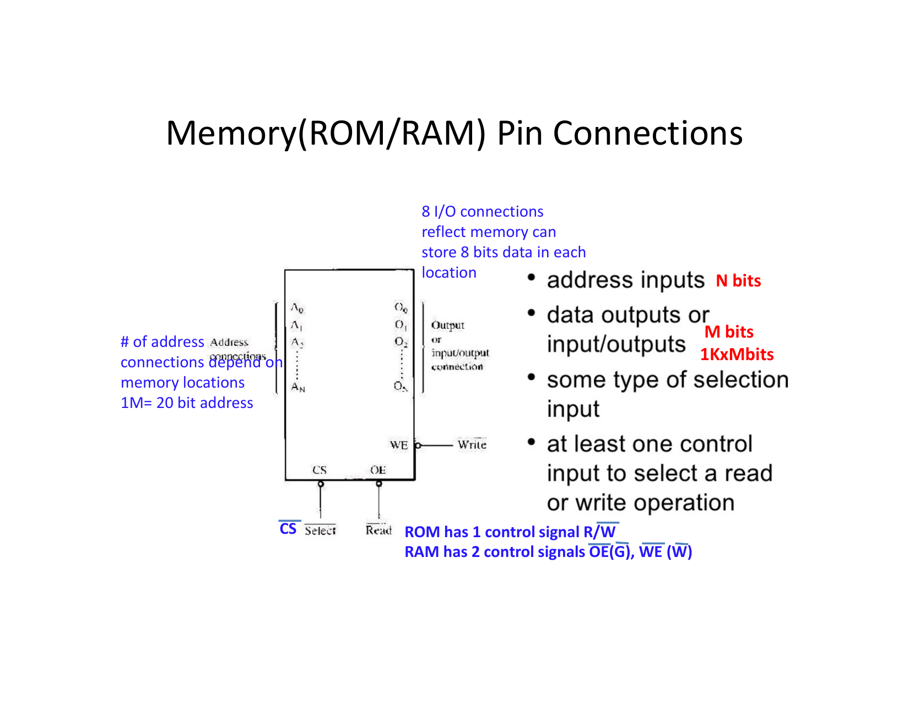

Every memory chip, whether ROM or RAM, shares the same basic pin categories:

| Pin group | Purpose |
|---|---|
| **Address inputs (A0…AN) — "N bits"** | Select *which* location inside the chip is being accessed. The **number of address pins depends directly on how many locations the chip has** — e.g., 1 MB of memory needs a **20-bit** address (2²⁰ = 1,048,576 locations). |
| **Data outputs, or input/outputs (O0…O — "M bits")** | Carry the actual stored data. The example shown is a **1K × M bits** organization: 1024 locations, each M bits wide. **8 I/O connections reflect a memory that can store 8 bits of data in each location.** |
| **Some type of selection input** | e.g. **CS̄ (Chip Select)** — enables/selects this particular chip among possibly many on the same bus. |
| **At least one control input to select a read or write operation** | Tells the chip whether the current bus cycle is a Read or a Write. |

### 3.1 Key asymmetry between ROM and RAM control pins
- **ROM has only 1 control signal: R/W̄** (or simply an output-enable, since it can never be written).
- **RAM has 2 control signals: OE̅ (Ḡ)** — Output Enable, and **WE̅ (W̅)** — Write Enable — because RAM genuinely needs independently-controllable read and write paths.

---

## 4. The 2716 — A Concrete EPROM Example

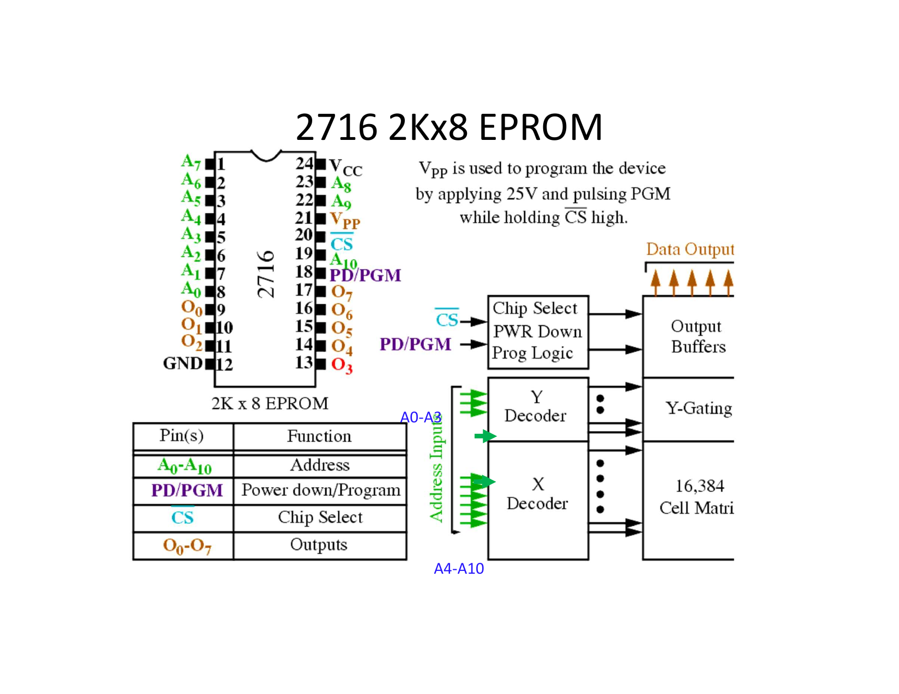

### 4.1 Definition
The **2716** is a **2K × 8 EPROM** (Erasable Programmable Read-Only Memory) — 2048 locations, each storing 8 bits.

### 4.2 Pin summary

| Pin(s) | Function |
|---|---|
| **A0–A10** | Address (11 lines → 2¹¹ = 2048 = **2 K** locations) |
| **PD/PGM** | Power Down / Program — used to place the chip in a low-power standby state, or (when combined with VPP) to actually program new data into it |
| **CS̄** | Chip Select |
| **O0–O7** | Outputs (the 8 data bits) |

### 4.3 Programming the device
**VPP is used to program the device** by applying **25 V** and pulsing **PGM**, while holding **CS̄ high**. (Normal *reading* uses only +5 V; the 25 V is only needed to actually burn new data into the EPROM's cells.)

### 4.4 Internal block structure
- **Address inputs** split into two groups feeding two decoders:
  - **A0–A3 → Y-Decoder**
  - **A4–A10 → X-Decoder**
- Together, the X and Y decoders select one cell out of the **16,384-cell matrix** (2048 locations × 8 bits = 16,384 total memory cells).
- **Chip Select / Power-Down / Program Logic** gates the **Output Buffers**, which drive the **Data Output** pins.

---

## 5. RAM Memory — The TMS4016 SRAM

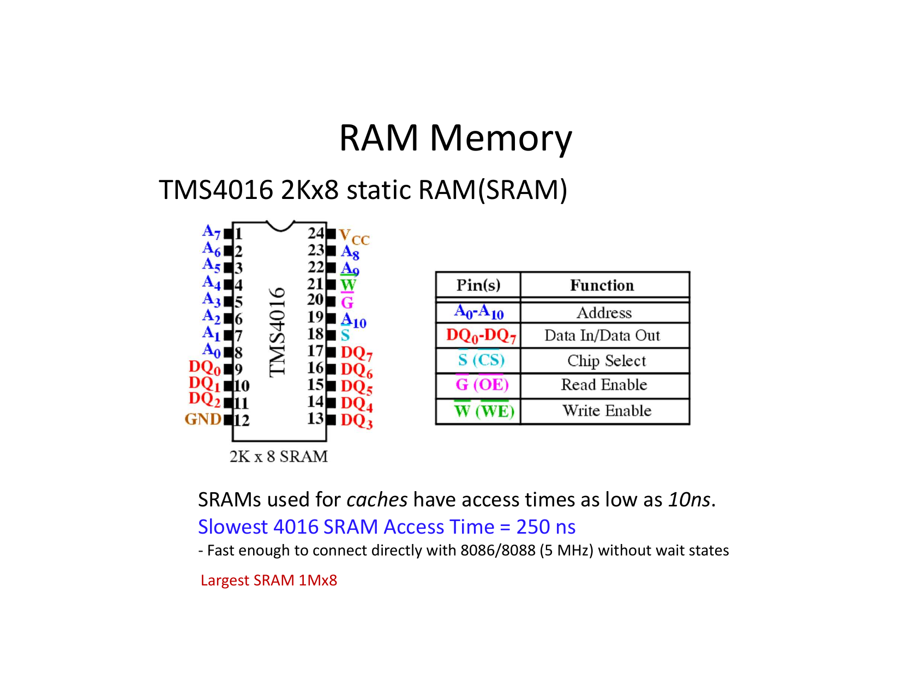

### 5.1 Pin summary

| Pin(s) | Function |
|---|---|
| **A0–A10** | Address |
| **DQ0–DQ7** | Data In / Data Out (bidirectional) |
| **S̄ (CS)** | Chip Select |
| **G̅ (OE)** | Read Enable (Output Enable) |
| **W̅ (WE)** | Write Enable |

### 5.2 Performance facts stated on the slide
- **SRAMs used for caches** have access times as low as **10 ns**.
- The **slowest 4016 SRAM access time = 250 ns**.
- This access time is **fast enough to connect directly to an 8086/8088 (running at 5 MHz) without needing any wait states**.
- **Largest SRAM organization mentioned: 1M × 8.**

---

## 6. Static vs Dynamic RAM — Internal Cell Structure

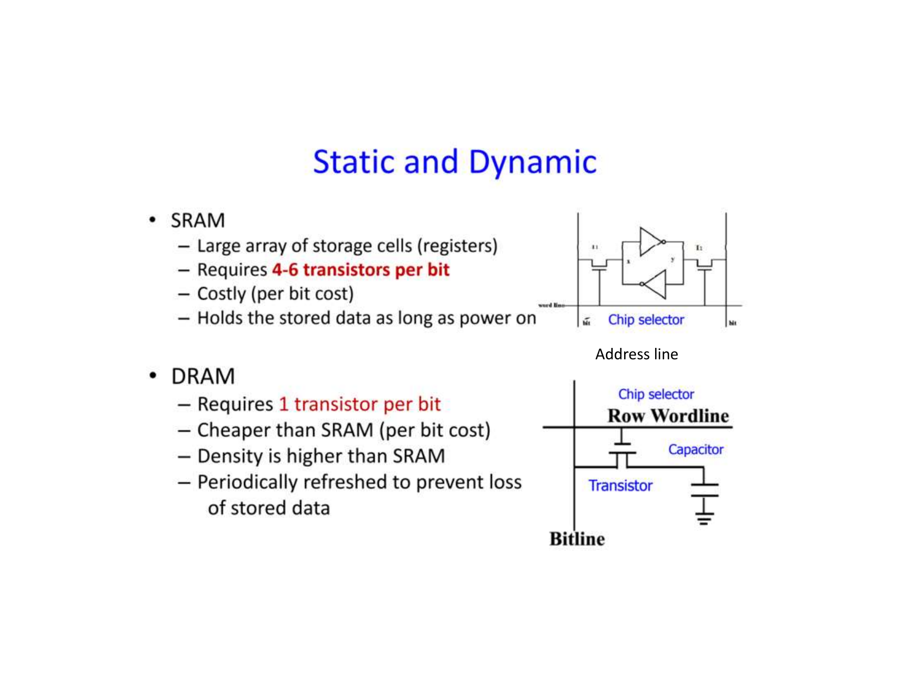

### 6.1 SRAM (Static RAM)
- Built as a **large array of storage cells (registers)**.
- **Requires 4–6 transistors per bit.**
- **Costly** on a per-bit basis.
- **Holds the stored data as long as power stays on** — no refresh needed (hence "static").
- Internally, each cell is essentially a small **latch** built from cross-coupled inverters, gated onto the bitlines by access transistors controlled by the **word line**.

### 6.2 DRAM (Dynamic RAM)
- **Requires only 1 transistor per bit** (plus one capacitor).
- **Cheaper than SRAM** per bit.
- **Density is higher than SRAM** (far more bits fit in the same silicon area).
- **Periodically refreshed** to prevent loss of stored data — hence "dynamic."
- Structurally: a **Row Wordline** controls a **Transistor**, which connects a storage **Capacitor** to the **Bitline** when activated; the **Chip Selector** ties into the row-wordline logic.

---

## 7. Reading and Writing with a DRAM Cell

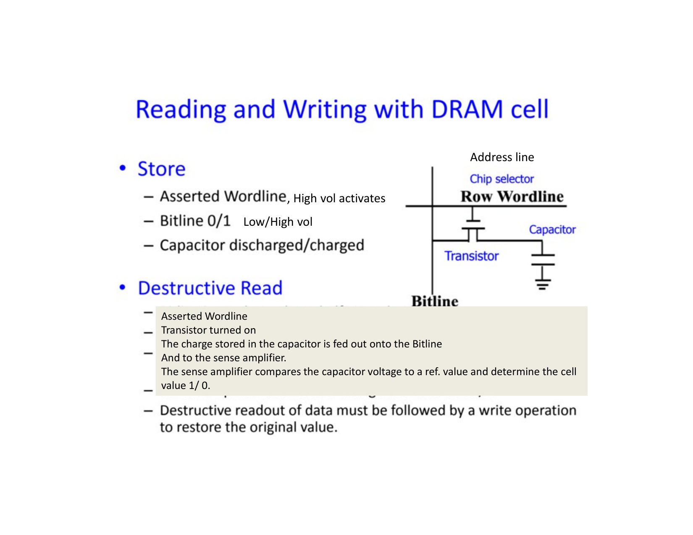

### 7.1 Store (Write) operation
- **Assert the Wordline** — a high voltage **activates** the access transistor for that row.
- The **Bitline is driven to 0 or 1** (low or high voltage), representing the bit to be stored.
- This **charges or discharges the capacitor** accordingly — a charged capacitor represents one logic state, a discharged one the other.

### 7.2 Destructive Read operation
The read process, step by step:
1. **Wordline is asserted.**
2. The access **transistor turns on.**
3. **The charge stored in the capacitor is fed out onto the Bitline** and to the **sense amplifier**.
4. **The sense amplifier compares the capacitor voltage to a reference value** and determines the cell's value (1 or 0).

### 7.3 Why it's called "destructive"
Reading a DRAM cell **drains** the capacitor's charge onto the bitline in the process of sensing it — the read operation itself **destroys** the stored value. Therefore, **destructive readout of data must always be followed by a write operation to restore the original value** (this restore is normally done automatically by the DRAM controller immediately after every read).

---

## 8. Why SRAM Is Faster, Why DRAM Is Denser

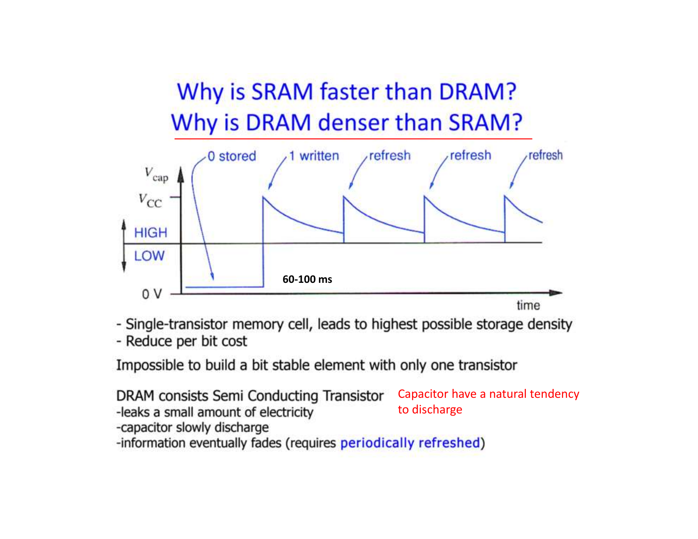

### 8.1 The DRAM refresh waveform
The graph shows a capacitor's voltage (Vcap) over time: a **0 is stored** (capacitor near 0 V), then a **1 is written** (capacitor charges up near VCC), and then it must be **refreshed** periodically — shown repeating every **60–100 ms** — because:

> **Capacitors have a natural tendency to discharge.**

### 8.2 Why DRAM is denser
- The **single-transistor memory cell leads to the highest possible storage density** and **reduces per-bit cost**.
- However: **it is impossible to build a bit-stable element with only one transistor** — a lone transistor+capacitor cannot hold its state indefinitely on its own.
- **DRAM's transistor is semiconducting**, and inherently **leaks a small amount of electricity**; consequently the **capacitor slowly discharges**, and the stored information **eventually fades** — which is precisely why it **requires periodic refreshing**.

### 8.3 Why SRAM is faster
By contrast, SRAM's cross-coupled-inverter latch structure **actively holds** its state with no leakage-driven decay, so it can be read (or written) immediately without needing a slow charge/sense/restore cycle — at the cost of needing 4–6 transistors instead of 1.

---

## 9. SRAM Read and Write Operations in Detail

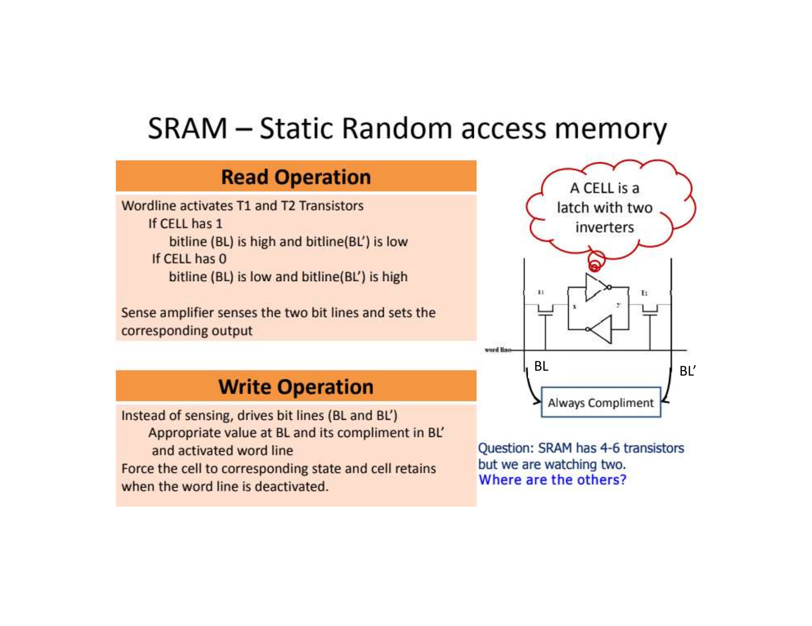

### 9.1 The SRAM cell model
> **A CELL is a latch with two inverters.**

Each cell connects to a pair of **complementary bitlines**: **BL** and **BL′** (BL′ is **always the complement** of BL).

### 9.2 Read Operation
1. The **wordline activates transistors T1 and T2** (the two access transistors connecting the latch to BL and BL′).
2. **If the CELL holds 1:** bitline **BL is high** and bitline **BL′ is low**.
3. **If the CELL holds 0:** bitline **BL is low** and bitline **BL′ is high**.
4. The **sense amplifier senses the two bitlines** and sets the corresponding output accordingly.

### 9.3 Write Operation
1. Instead of *sensing*, the write circuitry **drives** the bitlines (BL and BL′) — the appropriate value is forced onto BL, and its complement onto BL′.
2. The **word line is activated**, which **forces the cell into the corresponding state**.
3. The cell then **retains that state when the word line is deactivated** — the latch holds its new value on its own.

### 9.4 A stated exam-style question worth remembering
> *"SRAM has 4–6 transistors but we are only shown two (T1, T2 in the diagram). Where are the others?"*

**Answer (implied by the cell model):** T1 and T2 are only the **access transistors** connecting the cell to the bitlines. The **remaining 4 transistors** form the **two cross-coupled inverters** themselves (each CMOS inverter needs 2 transistors — one PMOS, one NMOS — and there are two inverters cross-coupled to form the latch), for a typical total of **6 transistors per bit**.

---

## 10. Address Decoding — The Core Problem

> - **Microprocessor: 20 address pins (1 MB addressable).**
> - **EPROM: 11 address pins (2 KB per chip).**
> - **The mismatch must be corrected — a Decoder corrects the mismatch.**

This is the central problem stated at the top of §1: since one small memory chip cannot cover the CPU's entire address range, **extra address decoding logic** is needed to (a) map each chip into its own distinct slice of the address space, and (b) generate that chip's **Chip Select (CS̄)** signal only when the CPU's address falls inside that chip's assigned range.

---

## 11. NAND-Gate Decoding — A Worked Example

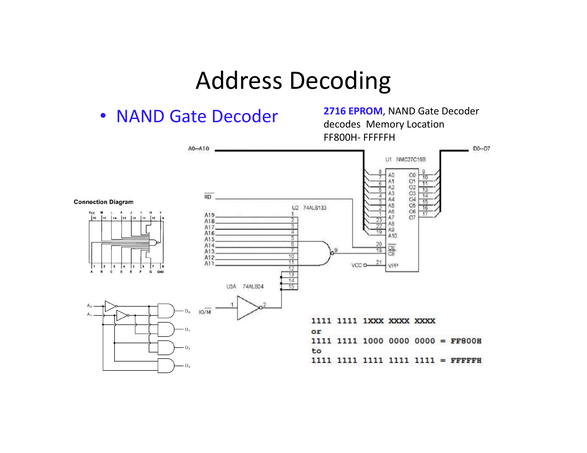

### 11.1 The goal
Design a decoder so that a **2716 EPROM** (2 K × 8, with **A0–A10** as its own address lines) responds **only** to the memory address range **FF800H – FFFFFH** (the very top 2 KB of the 8086's 1 MB address space — a common location for a boot ROM).

### 11.2 How the circuit works
- The CPU's **A0–A10** connect directly to the EPROM's own address pins (these are "used up" internally by the chip itself).
- The **remaining CPU address lines — A11 through A19 — must all be examined** to confirm the address is in the desired top-of-memory range.
- A **74ALS133** (a 13-input NAND gate) takes **A11–A19** (nine lines) as inputs.
- **A NAND gate output goes low only when *all* its inputs are high.** So this NAND's output goes active only when **A11 through A19 are all logic 1** — which is exactly the address pattern for the top 2 KB of memory.
- A **74ALS04 inverter**, combined with **IO/M̄**, ensures the decoder only responds during a **memory** access (not an I/O access).
- The final combined signal drives the EPROM's **CE̅/OĒ** (chip enable / output enable) pin.
- The result is connected together with **RD̄** to gate the correct read timing.

### 11.3 The resulting binary address range

```
1111 1111 1XXX XXXX XXXX     (the general pattern — top bit-group all 1s)
     or, spelled out as bounds:
1111 1111 1000 0000 0000  =  FF800H   (lower bound)
   to
1111 1111 1111 1111 1111  =  FFFFFH   (upper bound)
```

The **X's (A0–A10)** are "don't-care" from the decoder's point of view — they're handled internally by the EPROM's own 11 address pins.

---

## 12. The 3-to-8 Line Decoder (74LS138)

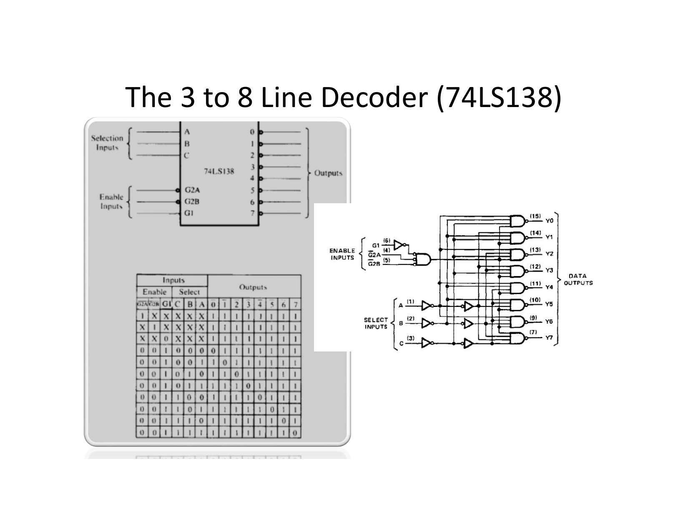

### 12.1 Pin groups
- **Selection Inputs: A, B, C** — the 3-bit binary code selecting which one of 8 outputs (0–7) is activated.
- **Enable Inputs: G2A̅, G2B̅ (active-low), G1 (active-high)** — **all three enable conditions must be satisfied simultaneously** for the decoder to produce any active output.
- **Outputs: 0–7** (all active-**low**).

### 12.2 Truth table logic (summarized)
- If **any** of the enable conditions is not met (**G2A̅=1** OR **G2B̅=1** OR **G1=0**), **all outputs are inactive (high)** — the decoder is disabled.
- When **properly enabled** (G2A̅=0, G2B̅=0, G1=1), exactly **one** output (chosen by A, B, C) goes **low**; all others stay high.

### 12.3 Internal structure
Internally, the enable inputs are combined through a small AND/inverter network; the A, B, C select lines (plus their complements, generated by internal inverters) feed a network of NAND gates, one per output line (Y0–Y7), so that each output NAND only pulls low when its unique combination of true/complemented select lines (and the enable condition) are all satisfied.

---

## 13. Worked Example — Addressing F0000H–FFFFFH with Eight 2764 EPROMs

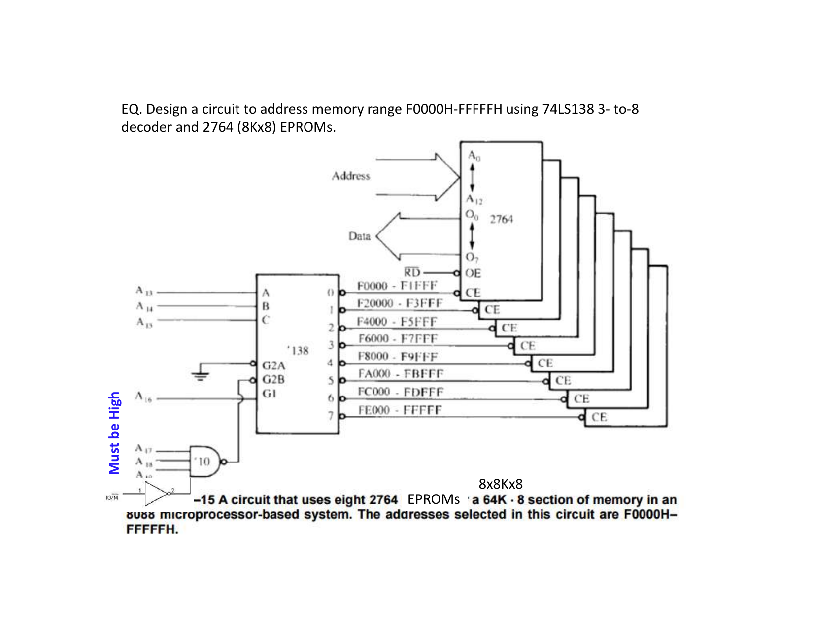

**Stated design question:**
> *"Design a circuit to address memory range F0000H–FFFFFH using a 74LS138 3-to-8 decoder and 2764 (8K×8) EPROMs."*

### 13.1 The design logic
- **2764 EPROMs are 8K × 8** each, so they use address lines **A0–A12** (2¹³ = 8192 = 8 K) internally.
- The **entire required range (F0000H–FFFFFH) is 64 KB**, and 64 KB ÷ 8 KB-per-chip = **8 chips** — hence "**8 × 8K × 8**" as noted on the slide.
- The '138 decoder's **select inputs A, B, C** are driven by address lines **A13, A14, A15** — these three bits select *which* of the 8 EPROMs (each covering an 8 KB sub-range) is currently addressed.
- **A16 must be tied to G2B̄** (**or equivalent — the slide marks this "Must be High"** logic requirement to properly qualify the decoder for this address range).
- **A17, A18, A19** feed into a NAND gate ('10), whose output (after being combined with **IO/M̄** via an inverter) drives **G1**, ensuring the decoder is active only when **A17=A18=A19=1** (i.e., only in the F0000H–FFFFFH region) **and** the cycle is a memory access.
- Each of the 8138 outputs (**Y0–Y7**) becomes the **CE̅ (Chip Enable)** for one specific 2764, and each EPROM's **OE̅** ties to the system **RD̄**.

### 13.2 Resulting address map (from the diagram)

| 138 Output | Address range |
|---|---|
| 0 | F0000 – F1FFF |
| 1 | F2000 – F3FFF |
| 2 | F4000 – F5FFF |
| 3 | F6000 – F7FFF |
| 4 | F8000 – F9FFF |
| 5 | FA000 – FBFFF |
| 6 | FC000 – FDFFF |
| 7 | FE000 – FFFFF |

**Caption from the source figure:** *"A circuit that uses eight 2764 EPROMs [to fill] a 64K·8 section of memory in an 8088 microprocessor-based system. The addresses selected in this circuit are F0000H–FFFFFH."*

---

## 14. The Dual 2-to-4 Line Decoder (74LS139)

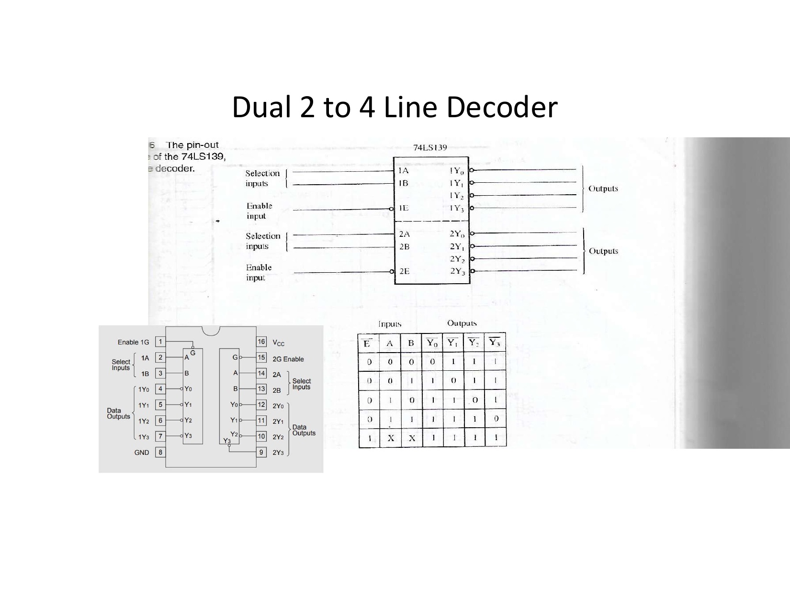

### 14.1 Structure
The 74LS139 contains **two independent 2-to-4 decoders** in a single package:
- **Decoder 1:** Selection inputs **1A, 1B**; Enable **1Ē**; Outputs **1Y0–1Y3**.
- **Decoder 2:** Selection inputs **2A, 2B**; Enable **2Ē**; Outputs **2Y0–2Y3**.

### 14.2 Truth table (per decoder)

| Ē | A | B | Y0 | Y1 | Y2 | Y3 |
|---|---|---|---|---|---|---|
| 0 | 0 | 0 | **0** | 1 | 1 | 1 |
| 0 | 0 | 1 | 1 | **0** | 1 | 1 |
| 0 | 1 | 0 | 1 | 1 | **0** | 1 |
| 0 | 1 | 1 | 1 | 1 | 1 | **0** |
| 1 | X | X | 1 | 1 | 1 | 1 |

(As with the 138, **outputs are active-low**, and setting the enable input **Ē = 1 disables** the decoder entirely — all outputs go high regardless of A, B.)

---

## 15. A Complete Memory System Using the 74HCT139

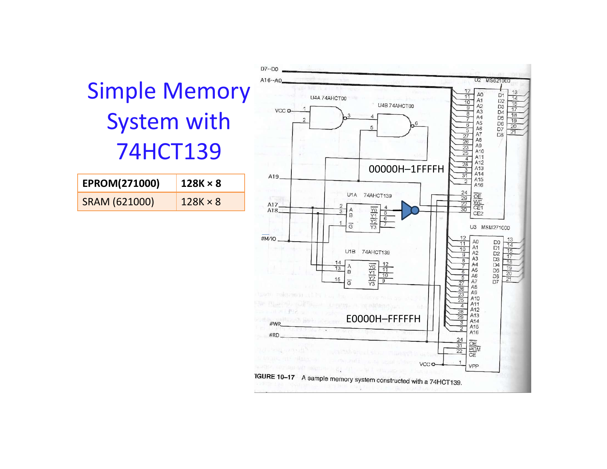

**Figure 10-17 caption:** *"A sample memory system constructed with a 74HCT139."*

### 15.1 The two memory chips used

| Chip | Type | Organization |
|---|---|---|
| **U3 — MSM271000 (EPROM 271000)** | EPROM | **128 K × 8** |
| **U2 — MS621000 (SRAM 621000)** | SRAM | **128 K × 8** |

### 15.2 How the decoding works
- Two NAND gates (**74AHCT00, U4A/U4B**) combine with the 74HCT139's outputs and the address lines **A17, A18, A19** to generate the **final chip-select logic**.
- **#M/IO** qualifies memory vs. I/O cycles.
- The resulting address map, as labeled directly on the schematic:
  - **SRAM (621000): 00000H – 1FFFFH**
  - **EPROM (271000): E0000H – FFFFFH**
- **#WR** and **#RD** feed the appropriate write/output-enable and chip-enable pins on each device.

---

## 16. The Programmable Logic Array (PLA)

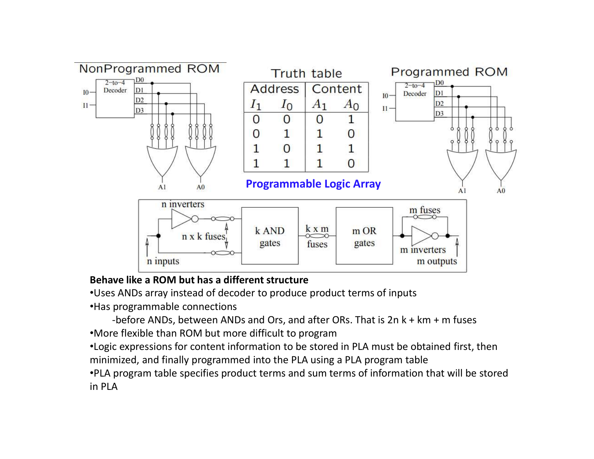

### 16.1 Concept — from ROM to PLA
The slide first shows a **2-to-4 decoder + fixed OR array**, which is essentially how a small ROM works: a **non-programmed ROM** has all possible connections present (every decoder output tied to every OR gate), while a **programmed ROM** has selectively **blown/kept fuses** so that each address decodes to a specific stored content — illustrated by the accompanying truth table (mapping inputs I1,I0 to stored content A1,A0).

### 16.2 What makes a PLA different
> **A PLA behaves like a ROM but has a different internal structure.**

- **Uses an AND array instead of a fixed decoder**, to produce arbitrary **product terms** of the inputs (rather than every possible minterm, as a full decoder/ROM would).
- **Has programmable connections** in **three** places: **before the AND gates**, **between the AND and OR arrays**, and **after the OR gates** — accounting for **2n·k + k·m + m fuses** in total (where *n* = number of inputs, *k* = number of AND-gate product terms, *m* = number of outputs).
- **More flexible than ROM, but more difficult to program.**
- **Design procedure:** the logic expressions for the content to be stored in the PLA must first be **obtained**, then **minimized**, and finally **programmed into the PLA using a PLA program table.**
- **The PLA program table specifies the product terms and sum terms** of the information to be stored.

### 16.3 Generic internal block view
```
n inputs → n inverters → (n × k fuses, programmable) → k AND gates → (k × m fuses, programmable) → m OR gates → m inverters (m fuses) → m outputs
```

---

## 17. PLA — Internal Structure and Worked Implementation

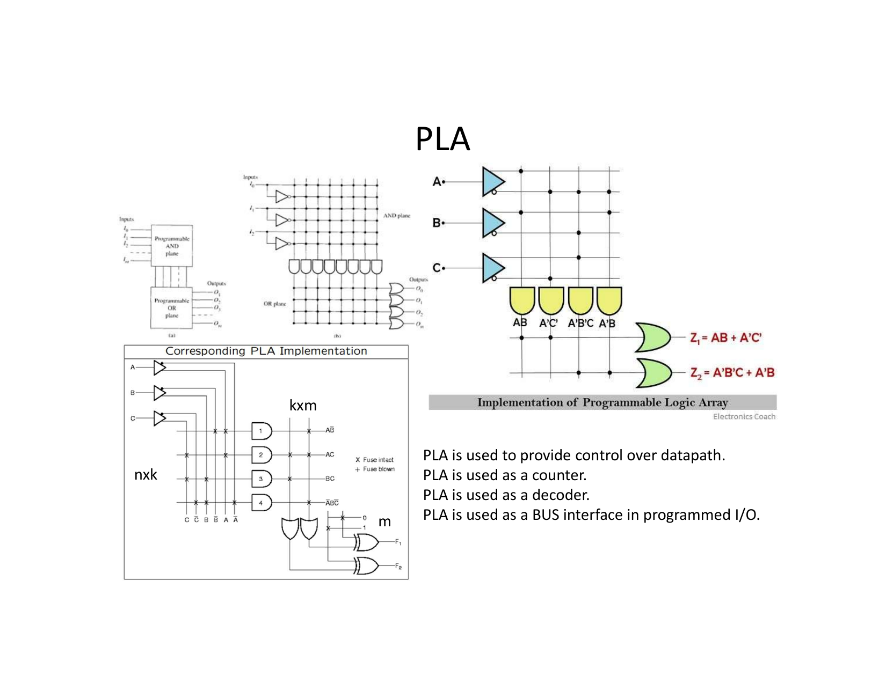

### 17.1 AND-plane / OR-plane view
- **Inputs (I0, I1, I2…)** pass through a **Programmable AND plane**, producing a set of **product terms**.
- Those product terms pass through a **Programmable OR plane**, producing the final **Outputs (O0, O1, O2…)**.

### 17.2 Worked 3-input example (A, B, C)
Given product terms **AB, A′C′, A′B′C, A′B** (formed in the AND plane), the OR plane combines a subset of them into two outputs:

```
Z1 = AB + A'C'
Z2 = A'B'C + A'B
```

The **"Corresponding PLA Implementation"** panel in the figure shows this same logic drawn as **inverting buffers** for A, B, C feeding a **fuse grid (n×k = 3×4)** into 4 AND-style product blocks (labeled 1–4: A B̄, AC, BC, A̅BC̅), which then feed a second **fuse grid (k×m)** into **XOR-based output stages** producing **F1, F2** — with **"×" marking an intact fuse and "+" marking a blown fuse** in that specific programmed configuration.

### 17.3 Real-world uses of a PLA (as listed on the slide)
- **PLA is used to provide control over a datapath.**
- **PLA is used as a counter.**
- **PLA is used as a decoder.**
- **PLA is used as a BUS interface in programmed I/O.**

---

## 18. Programmable Logic Devices (PLDs) — General Concept

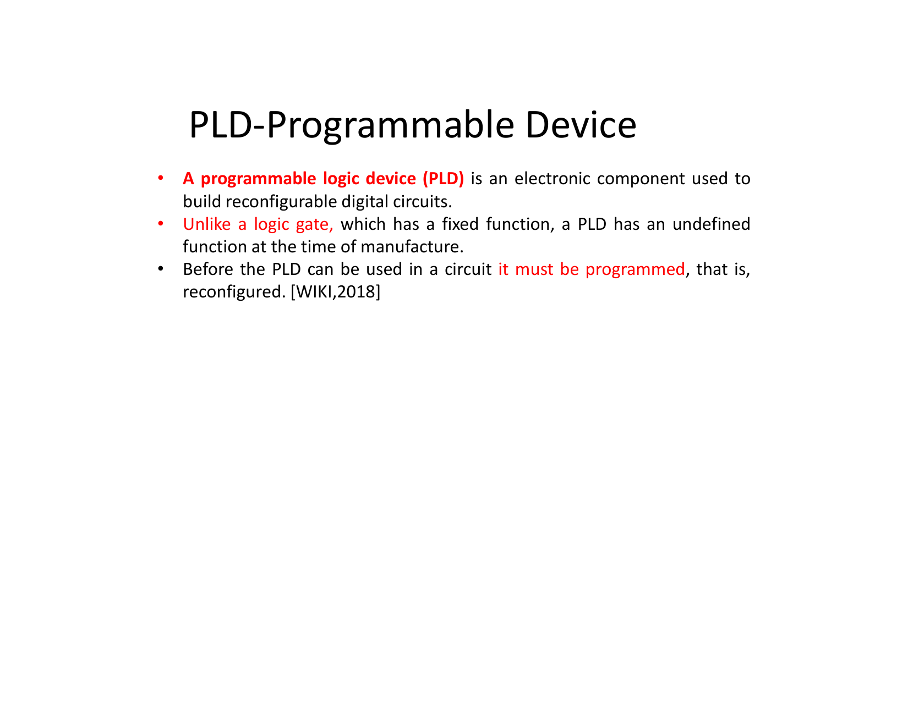

### 18.1 Definition
> **A programmable logic device (PLD) is an electronic component used to build reconfigurable digital circuits.**

### 18.2 Key distinguishing property
> **Unlike a logic gate, which has a fixed function, a PLD has an undefined function at the time of manufacture.** Before the PLD can be used in a circuit, **it must be programmed** — i.e., reconfigured to implement the specific logic the designer needs. *(Source cited on the slide: Wikipedia, 2018.)*

The PLA discussed in Sections 16–17 is one specific type of PLD; more modern examples (used later in this lecture) include devices like the **GAL22V10**.

---

## 19. ROM and RAM Interfacing Using a PLD (GAL22V10)

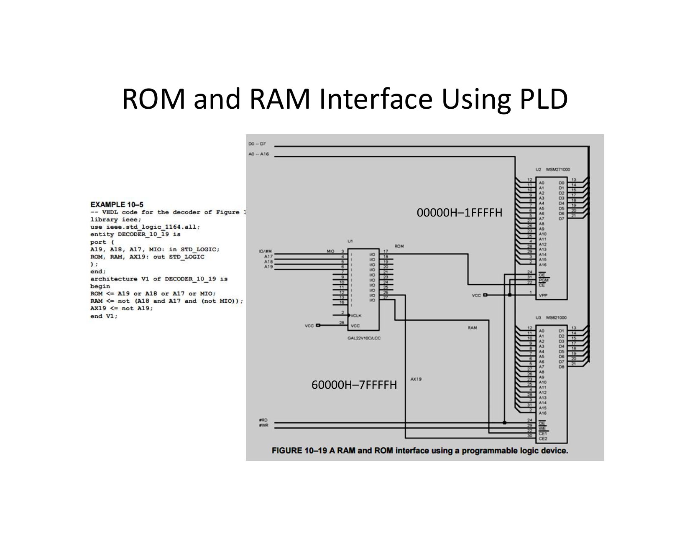

**Figure 10-19 caption:** *"A RAM and ROM interface using a programmable logic device."*

### 19.1 The circuit
- A single **GAL22V10CA/LCC** PLD (labeled U1) replaces what would otherwise require several discrete decoder chips.
- It reads address lines **A17, A18, A19** and the **IO/#M** signal, and produces two chip-select outputs: **ROM** and **RAM**.
- **U2 (MSM271000)** is enabled by **ROM**, covering **00000H – 1FFFFH**.
- **U3 (MSM621000)** is enabled by **RAM**, covering **60000H – 7FFFFH**.
- **AX19** is also generated (the inverse of A19), for use elsewhere in the address map.

### 19.2 The VHDL implementation (Example 10-5, from the figure)

```vhdl
-- VHDL code for the decoder of Figure 10-19
library ieee;
use ieee.std_logic_1164.all;
entity DECODER_10_19 is
port (
  A19, A18, A17, MIO: in STD_LOGIC;
  ROM, RAM, AX19: out STD_LOGIC
);
end;
architecture V1 of DECODER_10_19 is
begin
  ROM <= A19 or A18 or A17 or MIO;
  RAM <= not (A18 and A17 and (not MIO));
  AX19 <= not A19;
end V1;
```

This directly demonstrates the core advantage of a PLD over discrete gates: the **entire decode logic is expressed as simple Boolean/VHDL equations**, and the PLD's internal programmable AND/OR fuse array (as described in Section 17) is configured automatically from that description — no manual gate-by-gate wiring required.

---

## 20. Memory Interface — 8088/80188 (8-bit Data Bus)

This section (a worked, real-world design example) uses:
- An **8088 (5 MHz)** — **20 address connections (A19–A0)**, **8 data bus connections (AD7–AD0)**, and **3 control signals: IO/M̄, RD̄, WR̄**.
- A **74LS138 (3-to-8 line decoder)** plus **three 2732 (32 K × 8) EPROMs**.

### 20.1 Address map for this design

| Device | Address range |
|---|---|
| **EPROM 27256** — U1 | E8000H – EFFFFH |
| **EPROM 27256** — U2 | F0000H – F7FFFH |
| **EPROM 27256** — U3 | F8000H – FFFFFH |
| **RAM 62256 (32K×8, ×16 SRAM chips)** | 00000H – 7FFFFH |

*(Note: the text on the slide references "3 2732 EPROMs" in the description, while the accompanying figure — Figure 10-20 — actually uses three **27256** devices; both figures and the address ranges below are consistent with the 27256/32K-per-chip figure, which is what is diagrammed.)*

### 20.2 Why a wait state is required
> **"The EPROM will also require the generation of a wait state."**
- **The EPROM has an access time of 450 ns.**
- **The 74LS138 requires 8 ns to decode.**
- **The 8088 runs at 5 MHz and only allows 460 ns for memory to access data** (i.e., the *combined* EPROM + decoder delay, 450 + 8 = 458 ns, is dangerously close to the 460 ns budget, leaving essentially no margin).
- **A wait state adds 200 ns of additional time**, giving the system the safety margin it needs (see Lecture 5, Section 10, for the general theory of wait states).

---

## 21. EPROM Interfacing With the 8088 — Full Worked Circuit

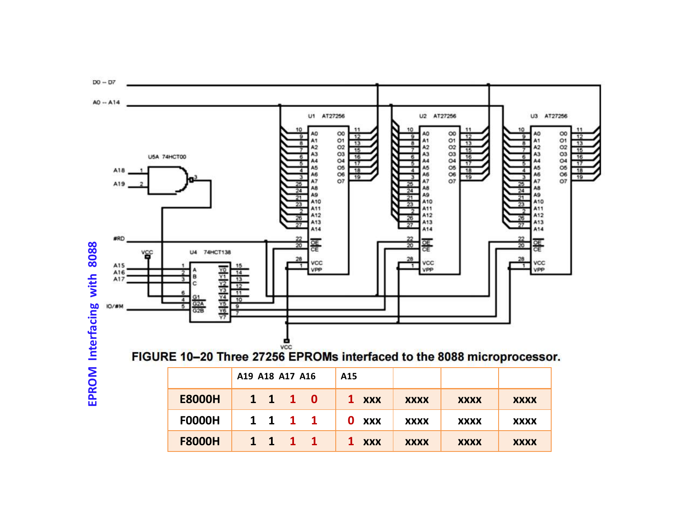

**Figure 10-20 caption:** *"Three 27256 EPROMs interfaced to the 8088 microprocessor."*

### 21.1 Circuit structure
- **U4 (74HCT138)** decodes address lines **A15, A16, A17** (as A, B, C select inputs), with **IO/#M** feeding its enable logic (**G2A, G2B**) and **#RD** gating the outputs.
- A **74HCT00 NAND gate (U5A)** combines **A18** and **A19**, feeding into the '138's **G1** enable — ensuring the decoder is only active for the correct upper portion of the address space.
- Each of the three **AT27256 EPROMs (U1, U2, U3)** uses address lines **A0–A14** directly (2¹⁵ = 32 K locations per chip) and receives its **OĒ**/**CĒ** from one of the '138's output lines.

### 21.2 The address-bit table (from the figure)

| Chip / range | A19 | A18 | A17 | A16 | A15 | (A14…A0) |
|---|---|---|---|---|---|---|
| **E8000H** | 1 | 1 | 1 | 0 | 1 | xxx xxxx xxxx xxxx |
| **F0000H** | 1 | 1 | 1 | 1 | 0 | xxx xxxx xxxx xxxx |
| **F8000H** | 1 | 1 | 1 | 1 | 1 | xxx xxxx xxxx xxxx |

Reading this table confirms the decoding logic: **A19=A18=A17=1** for *all three* chips (so the NAND-gated G1 condition holds throughout this entire block), while **A16 and A15 together** (as decoded by the 138) pick out which specific 32 KB chip (E8000H, F0000H, or F8000H range) is being addressed.

---

## 22. A Complete Buffered Memory Interface (Address/Data/Control Buffering)

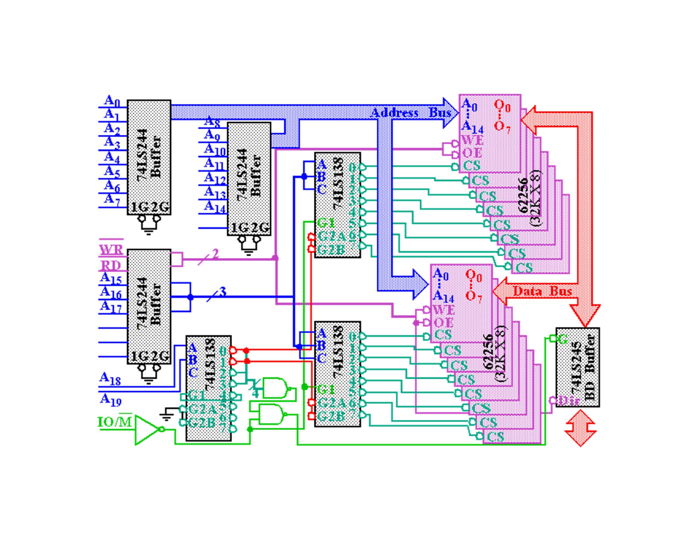

This larger, color-coded schematic shows a **complete, "production-style" memory subsystem**, illustrating how all the individual pieces discussed so far (decoders, RAM chips, and buffering) combine in one real design:

### 22.1 Address bus buffering
- **74LS244 buffers** (three of them) take the raw CPU address lines (**A0–A7**, **A8–A14**, and **A15–A19**) and drive a clean, buffered **Address Bus** — protecting the CPU's own address pins from excessive electrical loading by the many memory chips attached.

### 22.2 Decoding
- **Two 74LS138 decoders** (one per bank, working from different combinations of the buffered address lines, **IO/M̄**, and gating logic built from a couple of NAND gates) generate the individual **CS̄** lines for each **62256 (32 K × 8) SRAM** chip.
- **WR̄ and RD̄** are also buffered through a **74LS244** before being distributed to the memory chips' **WĒ**/**OĒ** pins.

### 22.3 Data bus buffering
- A **74LS245 bidirectional buffer** sits between the memory chips' data pins (**Q0–Q7**) and the system's **Data Bus**, with its **direction (DIR)** and **enable (G)** controlled appropriately so data flows the correct way during reads vs. writes.

### 22.4 Why this matters
This diagram is the practical answer to the lecture's stated objective #3 ("**Interfacing Memory to Data Bus**"): a real memory subsystem is never just "CPU wires directly to RAM chip" — it always needs **buffered, decoded, and direction-controlled** connections for the address bus, control signals, and data bus alike.

---

## 23. Memory Interface — 8086/80286 (16-bit Data Bus)

### 23.1 Key differences from the 8-bit (8088/80188) case

| Aspect | 8088/80188 (8-bit) | 8086/80286 (16-bit) |
|---|---|---|
| Data bus width | 8 bits | **16 bits** (24-bit address bus on 80286/80386SX) |
| Mode-select signal | (n/a in this context) | **M/IŌ** (8086, 80186) |
| Byte-enable signals | (n/a) | **BHĒ and A0**, or **BLĒ** |
| Write control | **RD̄, WR̄** | **MRDC̄, MWTC̄** (on 80286, 80386SX) instead of plain RD̄/WR̄ |

### 23.2 The core 16-bit challenge
> **The processor can work on 8-bit or 16-bit data.** To support both cleanly, memory must be organized into **separate 8-bit sections (banks)** — one handling the **even-addressed** bytes, one handling the **odd-addressed** bytes — exactly as introduced for the raw 8086 bus in Lecture 5 (Even/Odd address banks), but now examined specifically from the *memory interfacing* (chip-select and write-strobe) side.

---

## 24. Odd/Even Bank Selection with BHĒ and A0

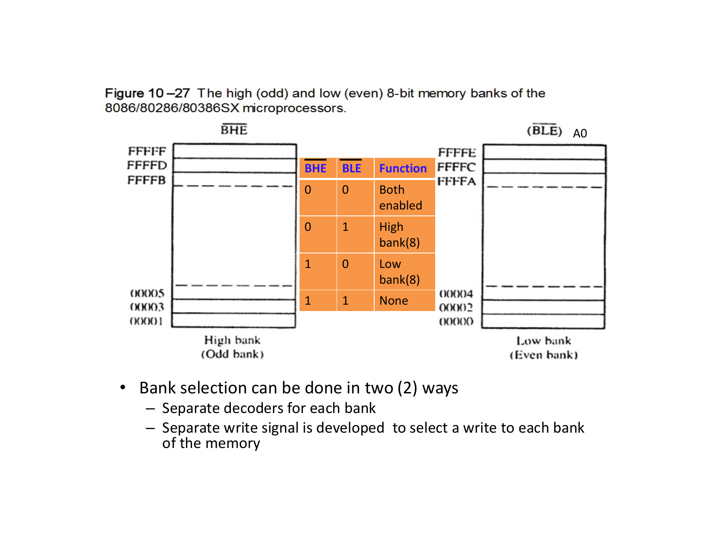

**Figure 10-27 caption:** *"The high (odd) and low (even) 8-bit memory banks of the 8086/80286/80386SX microprocessors."*

### 24.1 The two banks
- **High bank (Odd bank)** — selected by **BHĒ**, holds the odd-addressed bytes (e.g., FFFFF, FFFFD, FFFFB…).
- **Low bank (Even bank)** — selected by **A0** (acting like **BLĒ**, Bus Low Enable), holds the even-addressed bytes (e.g., FFFFE, FFFFC, FFFFA…).

### 24.2 The BHĒ/BLĒ (or BHĒ/A0) function table

| BHĒ | BLĒ (A0) | Function |
|---|---|---|
| 0 | 0 | **Both** banks enabled (a full 16-bit word access) |
| 0 | 1 | **High bank (8-bit)** only |
| 1 | 0 | **Low bank (8-bit)** only |
| 1 | 1 | **None** (neither bank selected) |

### 24.3 Two ways to implement bank selection
1. **Separate decoders for each bank** (Section 25).
2. **A separate write signal is developed to select a write to each bank** of memory (Section 26).

---

## 25. Separate Bank Decoders — A Worked 24-bit-Address Example

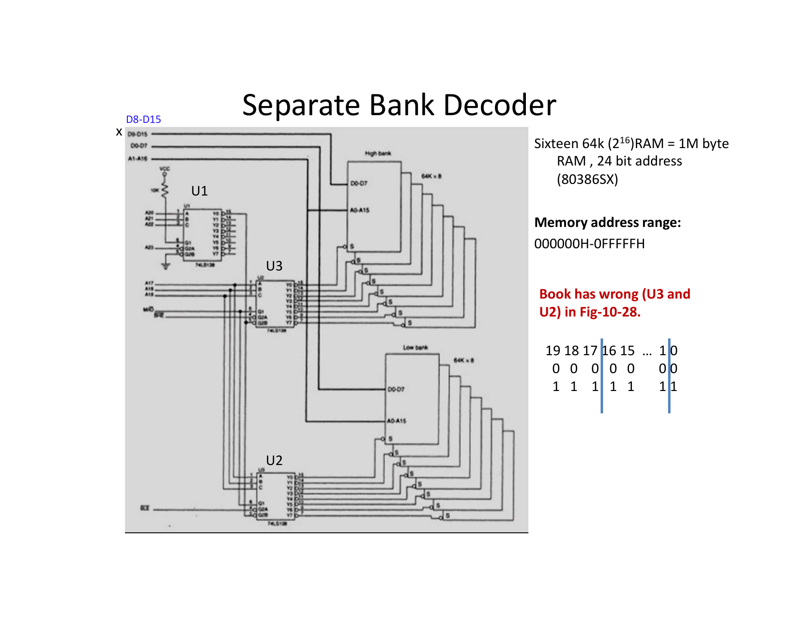

**Note included directly on the original slide:** *"Book has wrong (U3 and U2) in Fig-10-28"* — i.e., the source textbook figure mislabeled these two decoder chips; the lecture calls this out explicitly as a known errata.

### 25.1 System description
- **Sixteen 64 K (2¹⁶) RAM chips = 1 MB of RAM**, using a **24-bit address** (as used on the **80386SX**).
- **Memory address range covered: 000000H – 0FFFFFH.**

### 25.2 Decoder roles
- **U1 (74LS138):** decodes the top address bits (**A20–A23**, qualified by **A/G1/G2A/G2B** logic) to produce a broad chip-select region.
- **U2 and U3 (74LS138):** each decode a further set of address bits (**A17–A19**, qualified by **M/IŌ** and **BHĒ**) to select **individual 64 K chips within the High bank** and the **Low bank** respectively — eight chips per bank, sixteen chips total, matching the "Sixteen 64K RAM" description.
- **D8–D15** feed the **High bank**; **D0–D7** feed the **Low bank** — directly implementing the odd/even byte-bank split from Section 24.

### 25.3 Address pattern illustrated

```
 19 18 17 16 15 … 1 0
  0  0  0  0  0  …  0 0      (lowest address: 000000H)
  1  1  1  1  1  …  1 1      (highest address: 0FFFFFH)
```

---

## 26. Separate Bank Write Strobes (HWR̄, LWR̄)

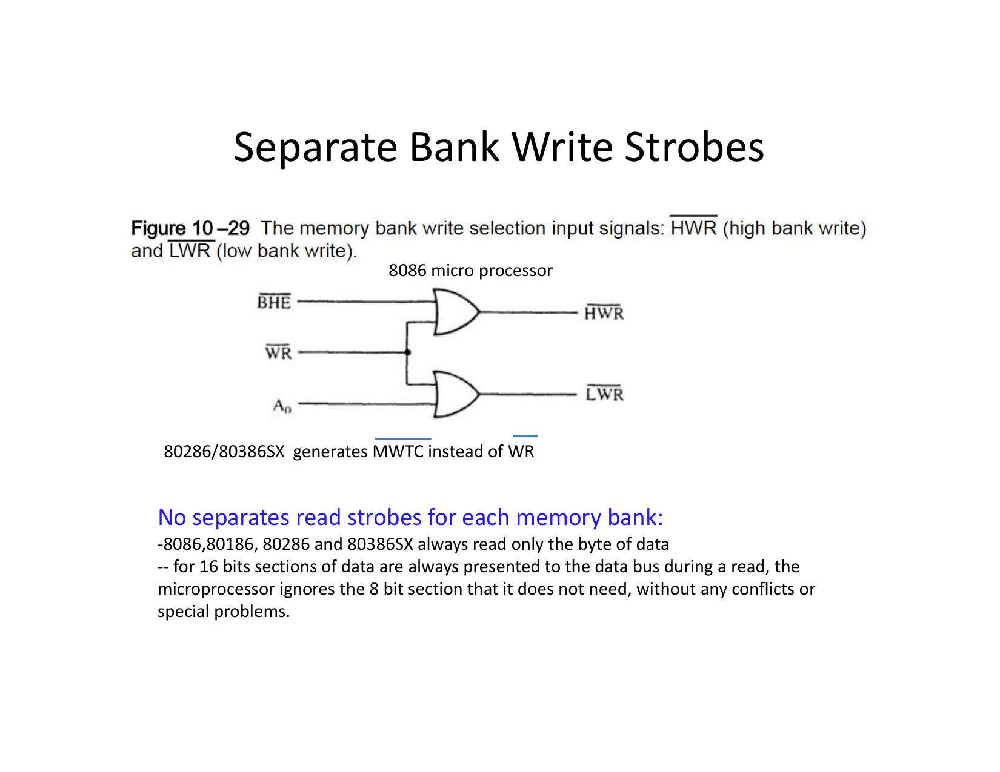

**Figure 10-29 caption:** *"The memory bank write selection input signals: HWR̄ (high bank write) and LWR̄ (low bank write)."*

### 26.1 The logic
Using two **OR gates**:

```
HWR̄ = BHĒ OR WR̄
LWR̄ = A0 OR WR̄
```

- On the **80286/80386SX**, the system **generates MWTC̄ instead of WR̄** as the base write-strobe signal feeding this same OR-gate logic.

### 26.2 Why there's no equivalent "separate read strobe"
> **There are no separate read strobes for each memory bank**, because:
> - **The 8086, 80186, 80286, and 80386SX always read the *full* word** — for 16-bit accesses, **both** 8-bit sections of data are always presented to the data bus during a read.
> - **The microprocessor itself simply ignores the 8-bit section it doesn't need**, without any bus conflicts or special handling required.

This asymmetry (separate write strobes needed, but a single unified read path) exists precisely because a **write** to only one byte-bank must *not* disturb the other bank's stored data, whereas a **read** can harmlessly fetch both bytes and just discard the unneeded one.

---

## 27. A Complete 16-bit-Wide Memory Interface (PLD-based)

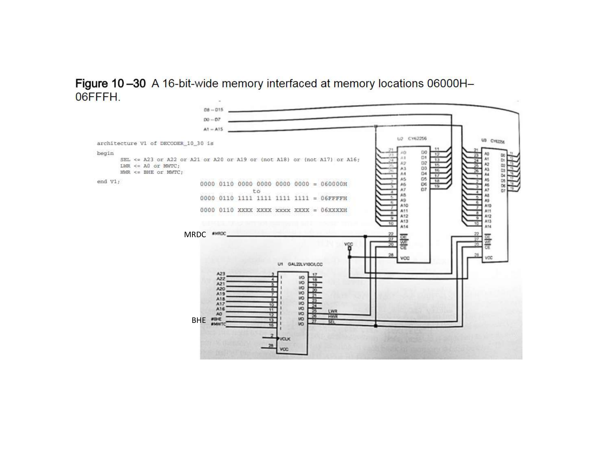

**Figure 10-30 caption:** *"A 16-bit-wide memory interfaced at memory locations 06000H–06FFFH."*

### 27.1 The PLD equations (VHDL, Architecture V1 of DECODER_10_30)

```vhdl
architecture V1 of DECODER_10_30 is
begin
  SEL  <= A23 or A22 or A21 or A20 or A19 or (not A18) or (not A17) or A16;
  LWR  <= A0 or MWTC;
  HWR  <= BHE or MWTC;
end V1;
```

### 27.2 The resulting address range

```
0000 0110 0000 0000 0000 0000  =  060000H
   to
0000 0110 1111 1111 1111 1111  =  06FFFFH
0000 0110 XXXX XXXX xxxx xxxx  =  06XXXXH   (general pattern)
```

### 27.3 The physical chips
Two **CY62256** (32 K × 8) SRAM chips — **U2** handling **D0–D7** (low bank) and **U3** handling **D8–D15** (high bank) — both driven by the shared address lines **A1–A15**, with **U1 (GAL22V10)** supplying the **SEL**, **LWR̄**, and **HWR̄** signals derived from the equations above, and **#MRDC** gating the chips' **OĒ**/read timing.

---

## 28. Error-Correcting Codes — Why and How

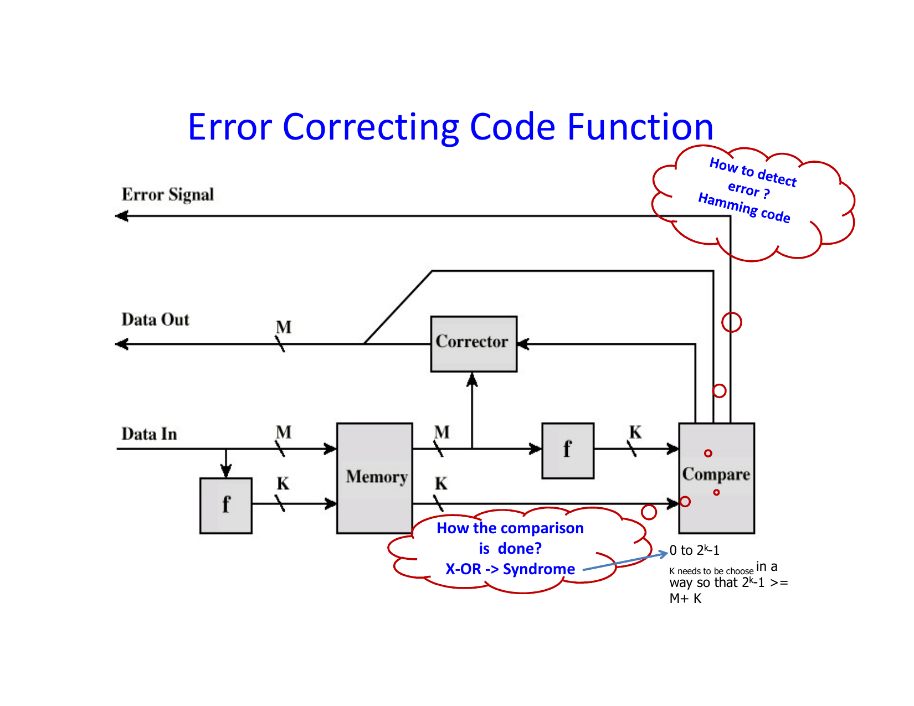

### 28.1 The problem being solved
Memory chips (particularly DRAM) can occasionally suffer **bit errors** — the stored value flips unintentionally. An **Error-Correcting Code (ECC)** scheme allows a memory system to **detect**, and often **automatically correct**, such errors.

### 28.2 The general block diagram
- **Data In (M bits)** is written both directly **into Memory** and through a function **f** that computes **K check bits**, which are *also* stored in Memory alongside the M data bits.
- On readback, **Data Out (M bits)** passes through the same function **f** again, and the freshly recomputed K check bits are sent to a **Compare** block, alongside the K check bits that were actually read back from memory.
- The **Corrector** block uses the outcome of that comparison to fix the M-bit data if needed, and the **Compare** block also raises an **Error Signal** if appropriate.

### 28.3 The two key open questions the slide poses (and answers)
> **"How to detect error? → Hamming code."**
> **"How is the comparison done? → X-OR → Syndrome."**

The comparison is performed with **XOR** operations between the stored and recomputed check bits; the resulting bit pattern is called the **syndrome**, and its value (from **0 to 2^k − 1**) directly encodes *where* (if anywhere) the error occurred.

### 28.4 Sizing the check bits
> **K must be chosen in a way such that 2^k − 1 ≥ M + K** — i.e., there must be *enough* distinct syndrome values to uniquely identify an error in any of the M data bits *or* any of the K check bits themselves (plus one "no error" state).

---

## 29. The Hamming Code — Choosing the Number of Check Bits

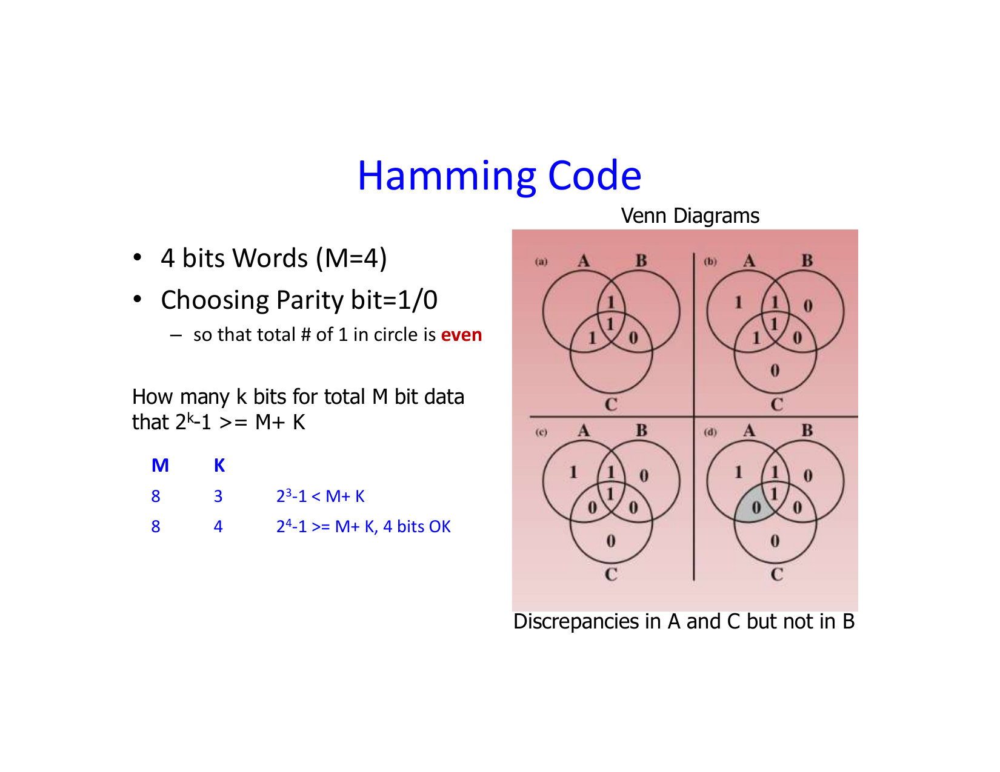

### 29.1 Worked sizing example
For **4-bit words (M = 4)**:
- **Choosing each parity (check) bit = 1 or 0** is done **so that the total number of 1s within its associated circle/group is always even.**

### 29.2 Determining how many check bits (K) are needed for a given M

| M | K | Check: 2^K − 1 vs. M + K | Result |
|---|---|---|---|
| 8 | 3 | 2³ − 1 = 7 **<** 8 + 3 = 11 | **Not enough** — 3 bits insufficient |
| 8 | 4 | 2⁴ − 1 = 15 **≥** 8 + 4 = 12 | **OK** — 4 check bits suffice |

### 29.3 The Venn-diagram intuition
The slide's four Venn diagrams (three overlapping circles **A, B, C**) illustrate how each data bit is covered by a specific *combination* of check-bit groups, and how a **discrepancy appearing in groups A and C, but not in B**, uniquely pinpoints exactly *which* bit is in error — because each bit position corresponds to a unique combination of which circles it falls inside.

---

## 30. Layout of Data Bits and Check Bits

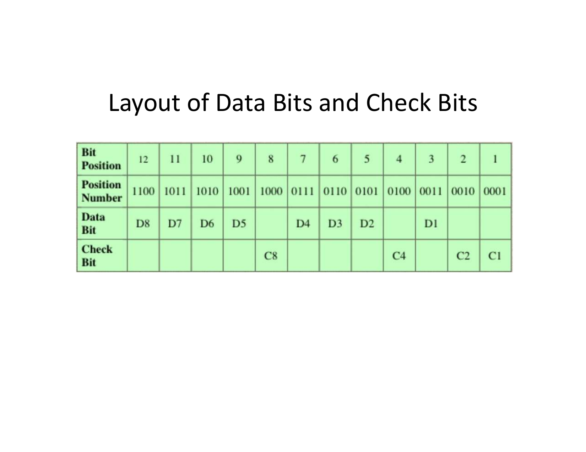

### 30.1 The layout convention
Check bits are always placed at **power-of-2 bit positions**; data bits fill in the remaining positions:

| Bit Position | 12 | 11 | 10 | 9 | 8 | 7 | 6 | 5 | 4 | 3 | 2 | 1 |
|---|---|---|---|---|---|---|---|---|---|---|---|---|
| **Position Number (binary)** | 1100 | 1011 | 1010 | 1001 | 1000 | 0111 | 0110 | 0101 | 0100 | 0011 | 0010 | 0001 |
| **Data Bit** | D8 | D7 | D6 | D5 | — | D4 | D3 | D2 | — | D1 | — | — |
| **Check Bit** | — | — | — | — | **C8** | — | — | — | **C4** | — | **C2** | **C1** |

### 30.2 Why this layout works
Position **1 = C1**, position **2 = C2**, position **4 = C4**, position **8 = C8** — each check bit's position number is itself a **single power of 2** in binary. Every **data-bit position's binary representation** shows exactly which check-bit groups it belongs to (e.g., position 11 = `1011` binary means that data bit is covered by C1, C2, and C8 — the bits set in `1011` — but *not* C4).

---

## 31. Worked Example — Single-Error-Correction (SEC)

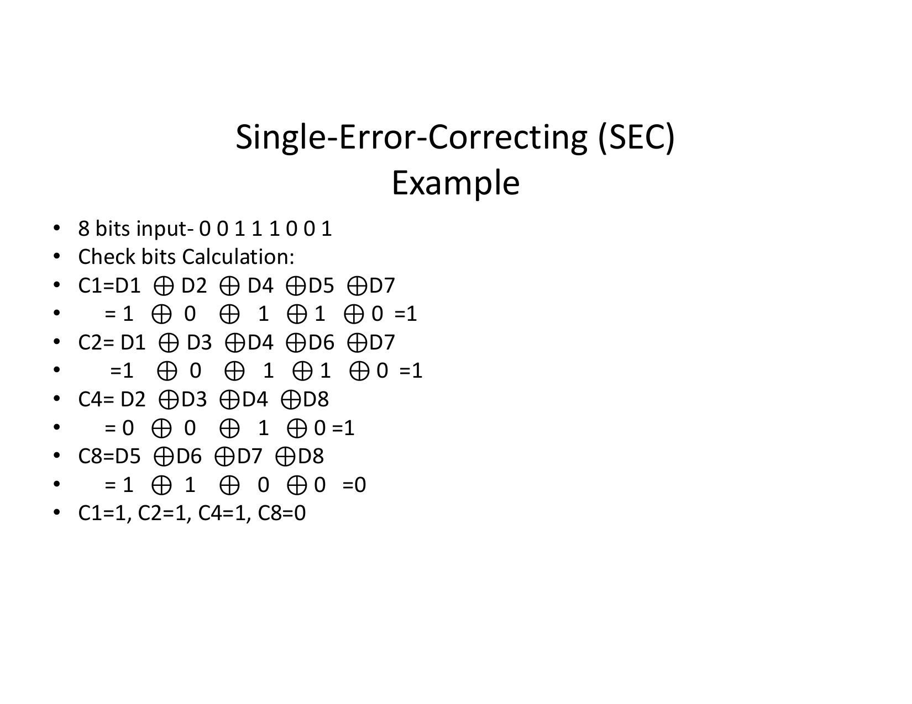

### 31.1 Setup
- **8-bit input:** `0 0 1 1 1 0 0 1` → so **D1..D8 = 0,0,1,1,1,0,0,1** (using the position-based numbering from Section 30).

### 31.2 Check-bit calculation (using XOR, denoted ⊕)

```
C1 = D1 ⊕ D2 ⊕ D4 ⊕ D5 ⊕ D7 = 1⊕0⊕1⊕1⊕0 = 1
C2 = D1 ⊕ D3 ⊕ D4 ⊕ D6 ⊕ D7 = 1⊕0⊕1⊕1⊕0 = 1
C4 = D2 ⊕ D3 ⊕ D4 ⊕ D8       = 0⊕0⊕1⊕0    = 1
C8 = D5 ⊕ D6 ⊕ D7 ⊕ D8       = 1⊕1⊕0⊕0    = 0
```

**Result: C1 = 1, C2 = 1, C4 = 1, C8 = 0.** These four check bits are what gets **written alongside the data** into memory (see the "Store" / "Write Check Word" mode in Section 33).

### 31.3 Detecting an error later (second part of the example)

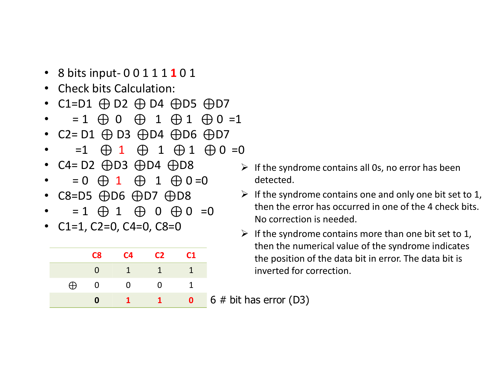

Suppose the data is later read back as `0 0 1 1 1 1 0 1` (**D6 has flipped** from 0 to 1 — shown highlighted in the source). Recomputing the check bits from this (possibly corrupted) data gives a *new* set (**C1=1, C2=0, C4=0, C8=0**), which is then **XORed against the originally-stored check bits** to form the **syndrome**:

```
        C8 C4 C2 C1
stored:  0  1  1  1
new:  ⊕  0  0  0  1
        ------------
syndrome: 0  1  1  0    →   binary 0110 = decimal 6  →  bit #6 has the error (D3, per the position table)
```

### 31.4 The three interpretation rules (stated explicitly on the slide)
> - **If the syndrome contains all 0s, no error has been detected.**
> - **If the syndrome contains one and only one bit set to 1, then the error has occurred in one of the 4 check bits — no correction (of the data) is needed.**
> - **If the syndrome contains more than one bit set to 1, then the numerical value of the syndrome indicates the *position* of the data bit in error. The data bit is inverted for correction.**

---

## 32. Worked Example — Single-Error-Correction, Double-Error-Detection (SEC-DED)

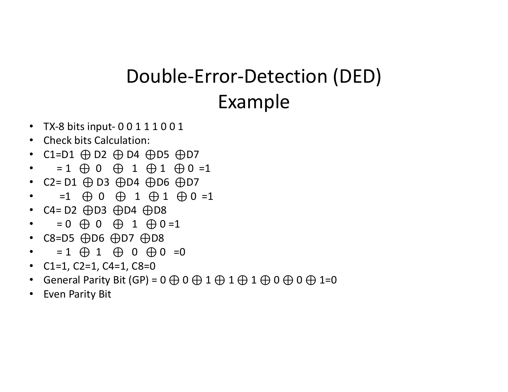

### 32.1 Why add a General Parity bit (GP)?
Plain Hamming SEC (Section 31) can correct any **single**-bit error, but it **cannot reliably distinguish a double-bit error from a single-bit error** using the syndrome alone — a double error can produce a syndrome that looks like a valid, correctable single-bit error, silently miscorrecting the data. Adding one extra **overall (general) parity bit** across the *entire* word fixes this ambiguity.

### 32.2 Transmit (TX) side — worked example
Using the same 8-bit input `0 0 1 1 1 0 0 1`:

```
C1 = 1,  C2 = 1,  C4 = 1,  C8 = 0     (identical calculation to Section 31)
General Parity Bit (GP) = D1⊕D2⊕D3⊕D4⊕D5⊕D6⊕D7⊕D8 = 0⊕0⊕1⊕1⊕1⊕0⊕0⊕1 = 0   (Even parity)
```

### 32.3 Receive (RX) side — worked example

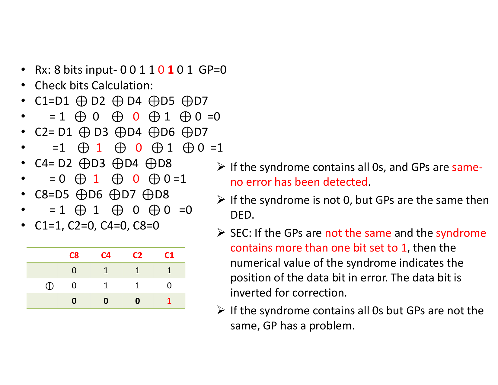

Suppose the received data is `0 0 1 1 0 1 0 1`, with received **GP = 0**.

```
C1 = D1⊕D2⊕D4⊕D5⊕D7 = 1⊕0⊕0⊕1⊕0 = 0
C2 = D1⊕D3⊕D4⊕D6⊕D7 = 1⊕1⊕0⊕1⊕0 = 1
C4 = D2⊕D3⊕D4⊕D8    = 0⊕1⊕0⊕0    = 1
C8 = D5⊕D6⊕D7⊕D8    = 1⊕1⊕0⊕0    = 0
→ C1=1(recomputed... shown as C1=1 in source), C2=0, C4=0, C8=0 [as listed for this branch]

        C8 C4 C2 C1
stored:  0  1  1  1
new:  ⊕  0  1  1  0
        ------------
syndrome:0  0  0  1
```

### 32.4 The four interpretation rules for SEC-DED (stated explicitly on the slide)
> - **If the syndrome contains all 0s, and the GPs are the same → no error has been detected.**
> - **If the syndrome is *not* 0, but the GPs are the same → Double-Error-Detection (DED)** — an uncorrectable double error has been detected.
> - **(SEC case) If the GPs are *not* the same, and the syndrome contains more than one bit set to 1 → the numerical value of the syndrome indicates the position of the data bit in error; that data bit is inverted for correction.**
> - **If the syndrome contains all 0s but the GPs are *not* the same → the GP bit itself has a problem** (the parity bit was the one that got corrupted).

---

## 33. The 74LS636 Error-Correcting Circuit

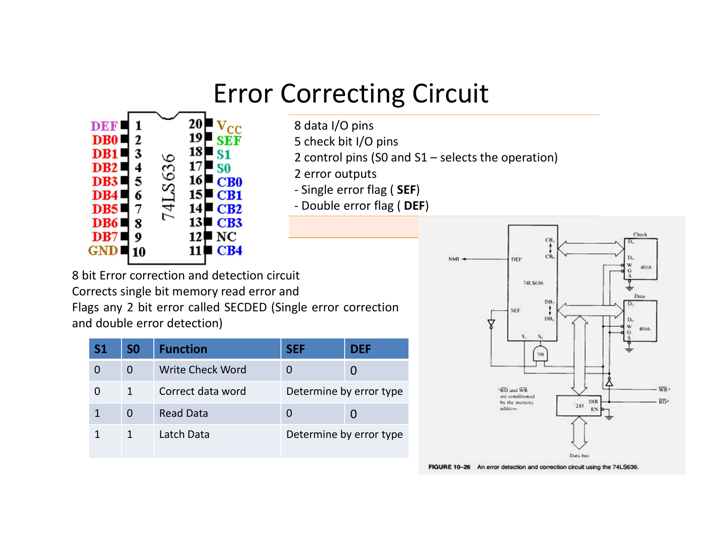

**Figure 10-26 caption:** *"An error detection and correction circuit using the 74LS636."*

### 33.1 What it is
> **An 8-bit error correction and detection circuit** that **corrects single-bit memory read errors** and **flags any 2-bit error** — this combined capability is called **SECDED (Single Error Correction and Double Error Detection)**, directly implementing the theory from Sections 31–32 in a single off-the-shelf chip.

### 33.2 Pin summary

| Pin group | Count | Purpose |
|---|---|---|
| **Data I/O (DB0–DB7)** | 8 pins | The actual data byte |
| **Check bit I/O (CB0–CB4)** | 5 pins | The check bits (note: 5, not 4 — likely including the general parity bit alongside C1/C2/C4/C8 for full SECDED capability) |
| **Control (S0, S1)** | 2 pins | Selects which operation the chip performs |
| **Error outputs (SEF, DEF)** | 2 pins | **SEF** = Single Error Flag; **DEF** = Double Error Flag |

### 33.3 The S1/S0 operation-select table

| S1 | S0 | Function | SEF | DEF |
|---|---|---|---|---|
| 0 | 0 | **Write Check Word** | 0 | 0 |
| 0 | 1 | **Correct data word** | Determined by error type | Determined by error type |
| 1 | 0 | **Read Data** | 0 | 0 |
| 1 | 1 | **Latch Data** | Determined by error type | Determined by error type |

### 33.4 System-level usage (from the accompanying figure)
- The 74LS636 sits between the CPU's **Data Bus** (via a **'245 transceiver**) and two memory chips (labeled **4016**, one for **Check** bits, one for **Data**).
- **RD̄ and WR̄ are "conditioned by the memory address"** before reaching the 74LS636 and the memory chips.
- **DEF** can be tied to the CPU's **NMI** (Non-Maskable Interrupt) line — so that a detected *uncorrectable* double-bit error can immediately interrupt the processor, since it represents data corruption the hardware cannot silently fix.

---

## 34. Consolidated Glossary of Terms

| Term | Meaning |
|---|---|
| **RAM** | Random-Access Memory — supports both read and write. |
| **ROM** | Read-Only Memory — read operation only. |
| **EPROM** | Erasable Programmable ROM — can be erased (typically via UV light) and reprogrammed; requires a high programming voltage (VPP) and a program pulse (PGM) to write. |
| **SRAM** | Static RAM — built from 4–6 transistors per bit; holds data as long as powered; no refresh needed; faster, costlier per bit. |
| **DRAM** | Dynamic RAM — built from 1 transistor + 1 capacitor per bit; needs periodic refresh (every 60–100 ms) because capacitors naturally discharge; denser and cheaper per bit. |
| **Destructive Read** | A DRAM read operation that drains the storage capacitor's charge, requiring the value to be rewritten immediately afterward. |
| **Word line** | The control line that activates (enables) an entire row of memory cells for access. |
| **Bit line (BL) / Bit line complement (BL′)** | The pair of complementary lines an SRAM cell is read from or written to. |
| **Chip Select (CS̄)** | Signal that enables a specific memory chip to respond to the bus. |
| **Output Enable (OĒ / G̅)** | Enables a memory chip's output drivers during a read. |
| **Write Enable (WĒ / W̅)** | Enables a memory chip to accept new data during a write. |
| **Address Decoder** | Logic that maps a CPU's wide address bus down onto individual memory chips' narrower address ranges, generating each chip's CS̄. |
| **74LS138** | A 3-to-8 line active-low decoder, commonly used for memory/IO address decoding. |
| **74LS139** | A dual 2-to-4 line active-low decoder. |
| **PLA (Programmable Logic Array)** | A ROM-like device using a programmable AND array (product terms) feeding a programmable OR array (sum terms), more flexible than a fixed decoder-based ROM. |
| **PLD (Programmable Logic Device)** | Any electronic component with an undefined function at manufacture time, which must be programmed/configured before use; the PLA is one type. |
| **GAL22V10** | A specific, commonly-used PLD, programmable via a hardware description (e.g., VHDL/Boolean equations), used here to implement memory address decoders. |
| **BHĒ (Bus High Enable)** | Enables the high (odd) 8-bit memory bank on 16-bit-bus 8086-family systems. |
| **BLĒ / A0** | Enables the low (even) 8-bit memory bank; on the 8086, A0 itself serves this role. |
| **HWR̄ / LWR̄** | Separately-generated write strobes for the high bank and low bank respectively, needed because a 16-bit write to only one byte-bank must not disturb the other bank. |
| **MRDC̄ / MWTC̄** | Memory Read Command / Memory Write Command — the 80286/80386SX equivalents of RD̄/WR̄. |
| **ECC (Error-Correcting Code)** | A scheme that adds extra check bits to data so that bit errors can be detected, and often automatically corrected. |
| **Hamming Code** | A specific, widely-used ECC scheme; check bits are placed at power-of-2 bit positions, and computed via XOR over specific overlapping subsets of the data bits. |
| **Syndrome** | The XOR comparison result between originally-stored and freshly-recomputed check bits; its numeric value indicates whether — and where — an error occurred. |
| **SEC** | Single Error Correction — the basic Hamming-code capability: any single-bit error can be located (via the syndrome) and automatically corrected (by inverting that bit). |
| **SEC-DED** | Single Error Correction, Double Error Detection — SEC plus one extra overall parity bit, which allows the system to reliably tell a correctable single-bit error apart from an uncorrectable double-bit error. |
| **General Parity (GP) bit** | The extra overall parity bit added for DED capability, computed as the XOR of all data bits. |
| **74LS636** | A commercial 8-bit SECDED error-detection-and-correction IC, with Single Error Flag (SEF) and Double Error Flag (DEF) outputs. |

---

*End of notes — full coverage of Lecture 6 ("Memory Interfacing"), slide 1 through the final slide.*
